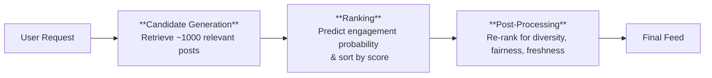
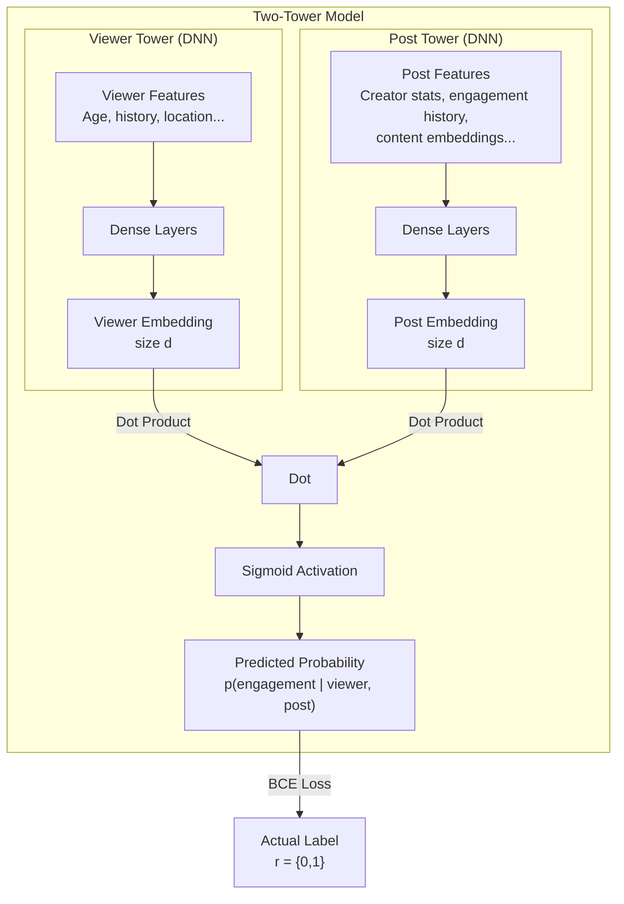

> [!info] **Interview Context**
> This note summarizes a mock ML system design interview for a Senior Machine Learning Engineer position at Meta. The problem: design a ranking model for the Instagram feed, specifically focusing on **suggested posts** from non-connected or tangentially connected creators.

## 1. Problem Framing & Requirements

### 1.1. Core Objective
Design a system that ranks suggested posts in a user's Instagram feed to maximize **individual engagement**, which is correlated with high-level business metrics like **Daily Active Users (DAU)** and session length.

### 1.2. Key Actors & Actions
- **Actors:** The viewer (user), content creators, posts (items).
- **User Actions (Signals):**
  - Viewing the post.
  - Liking the post.
  - Commenting on the post.
  - (Implicitly) *Not* engaging.

### 1.3. Functional Requirements
The ML system's primary function is to improve individual engagement by ranking posts according to the likelihood of user interaction (view, like, comment).

### 1.4. Non-Functional Requirements
- **Scalability:** Must handle ~500 million DAUs globally.
- **Availability:** Low-latency inference for a seamless user experience.
- **Operability (MLOps):**
  - Debuggability & monitoring.
  - Alerts for feature coverage drops or model performance degradation.
  - Analytics tooling (e.g., trending content, popular creators per geography).

## 2. The 3-Stage Recommendation Pipeline

A production feed ranking system is not a single model, but a pipeline:

- **Candidate Generation:** Narrow down from millions of posts to ~1,000 candidates quickly. Uses [[#5.2 Candidate Generation with Approximate Nearest Neighbors (ANN)]].
- **Ranking:** Precisely score each of the 1,000 candidates using a [[#5.3 The Two-Tower Model for Ranking]].
- **Post-Processing:** Modify the ranked list without adding new items. Examples:
  - **Diversity:** Boost posts from underrepresented content categories.
  - **Fairness:** Ensure certain creators get visibility.
  - **Freshness:** Promote recent posts.
  - **Re-shuffling:** Move item #10 up to position #3 based on business rules.

## 3. Data & Feature Engineering
The model learns from historical interactions. A training example is a tuple (X, a, r, p):
- `X`: Feature vector (viewer + post).
- `a`: Action recommended (which post was shown).
- `r`: Reward (1 if user engaged, 0 otherwise).
- `p`: Probability of the model recommending that action (for counterfactual evaluation).

### 3.1. Feature Categories

### 4.1. Offline Metrics (Model Evaluation)
- Binary Cross-Entropy (BCE) Loss: The loss function during training.- AUC-ROC (Area Under the ROC Curve): Primary offline metric. Compares the model's predicted probability of engagement to the true binary label.
  - > 0.5 (random coin flip) is necessary.
  - Target range: 0.6 - 0.8 depending on problem difficulty and team standards.

4.2. Online Metrics (A/B Testing)
- Treatment: Users see the new ranking model.
- Control: Users see the existing (baseline) system.
- Success Metrics (Tied to Business Objectives):
  - User engagement (likes, comments, shares).
  - Daily Active Users (DAU).
  - Session length / number of sessions.
- Safeguard Metrics (Critical for launch):
  - Rate of content reports.
  - Rate of users blocking creators.
  - If these increase, the model has learned harmful biases.
5. Model Architecture Deep Dive

The core of the solution is learning low-dimensional embeddings for both users and posts to predict the probability of engagement.

5.1. Collaborative Filtering (CF) for Embeddings

- Concept: Factorize the sparse user-item interaction matrix A (size M x N) into two smaller matrices: User Matrix U (size M x d) and Item Matrix V (size N x d), where d is the embedding dimension.
- Row of U = User embedding for user i.
- Row of V = Item embedding for post j.
- Prediction = Dot product of U_i and V_j (passed through a sigmoid).
- Pros: Simple, interpretable.
- Cons: Hard to scale to billions of users/items, cannot easily incorporate new user/item features (cold start), requires expensive Alternating Least Squares (ALS) optimization.

5.2. Two-Tower Network (Preferred Modern Approach)
This is the recommended architecture for large-scale recommendation.

- **Binary Cross-Entropy (BCE) Loss:** The loss function during training.
- **AUC-ROC (Area Under the ROC Curve):** Primary offline metric. Compares the model's predicted probability of engagement to the true binary label.
  - > 0.5 (random coin flip) is necessary.
  - Target range: **0.6 - 0.8** depending on problem difficulty and team standards.

### 4.2. Online Metrics (A/B Testing)
- **Treatment:** Users see the new ranking model.
- **Control:** Users see the existing (baseline) system.
- **Success Metrics (Tied to Business Objectives):**
  - User engagement (likes, comments, shares).
  - Daily Active Users (DAU).
  - Session length / number of sessions.
- **Safeguard Metrics (Critical for launch):**
  - Rate of content reports.
  - Rate of users blocking creators.
  - If these increase, the model has learned harmful biases.

## 5. Model Architecture Deep Dive

The core of the solution is learning low-dimensional **embeddings** for both users and posts to predict the probability of engagement.

### 5.1. Collaborative Filtering (CF) for Embeddings

- **Concept:** Factorize the sparse user-item interaction matrix `A` (size `M x N`) into two smaller matrices: **User Matrix U** (size `M x d`) and **Item Matrix V** (size `N x d`), where `d` is the embedding dimension.
- **Row of U =** User embedding for user `i`.
- **Row of V =** Item embedding for post `j`.
- **Prediction =** Dot product of `U_i` and `V_j` (passed through a sigmoid).
- **Pros:** Simple, interpretable.
- **Cons:** Hard to scale to billions of users/items, cannot easily incorporate new user/item features (cold start), requires expensive Alternating Least Squares (ALS) optimization.

### 5.2. Two-Tower Network (Preferred Modern Approach)

This is the recommended architecture for large-scale recommendation.

#### Training Details
- **Loss Function:** Binary Cross-Entropy.
- **Optimizer:** Adam or SGD.
- **Data Sampling:** Crucial to balance positive and negative examples.
  - *Positive:* Posts a user engaged with.
  - *Negative:* **Hard negatives** - posts that were *shown* to the user but received *no engagement*. Avoid random un-shown posts (which could be irrelevant or unseen).

### 5.3. Inference & Serving Pipeline

Now the trained model is deployed:

1.  **Pre-compute Post Embeddings:** Run all active posts through the **Post Tower** once every few hours. Store these `N x d` embeddings in a vector database for fast retrieval.
2.  **Live User Embedding:** When a user opens Instagram, compute their `d`-dimensional embedding on-the-fly by passing their real-time features through the **Viewer Tower**.
3.  **Candidate Generation (ANN):** Use **Approximate Nearest Neighbors** (e.g., FAISS, ScaNN) to find the top 1,000 post embeddings most similar to the user's embedding.
4.  **Ranking:** For these 1,000 candidates, compute the exact dot product between the *live user embedding* and each *pre-computed post embedding*, apply sigmoid, and sort by the resulting probability.
5.  **Post-Processing:** Apply re-ranking rules (diversity, fairness).
6.  **Serve:** Return the final ordered list to the client.

## 6. Advanced Topics & Deployment Considerations

### 6.1. Cold Start Problem
New users or new posts have no interaction history.

- **For new users:** Show globally popular or trending posts (exploration phase) and quickly learn from their initial clicks/views.
- **For new posts:** Use content-based features (embeddings from video/audio/text) to find similar existing posts. Bootstrap with creator's historical performance.

### 6.2. Online Learning & Non-Stationarity
User preferences change over time (e.g., new hobbies, trends).

- **Challenge:** A model trained on last month's data is stale.
- **Solution:** Continuously update the model using a streaming pipeline. Frequent, small-batch updates (e.g., hourly) using new impression-engagement pairs. This can be done by fine-tuning the Two-Tower model online.

### 6.3. Serving at Scale
- **Model Partitioning:** Serve different models for different user geographies or tiers.
- **Caching:** Cache popular post embeddings and frequent user embeddings in a distributed cache (e.g., Memcached/Redis).
- **Asynchronous Inference:** Pre-compute candidate sets for very active users in the background.

## 7. Summary of Interview Feedback

**What went well:**
- Explicitly connecting ML objective (engagement) to business metrics (DAU).
- Defining the 3-stage pipeline (Candidate Gen → Ranking → Post-Processing).
- Discussing feature types (aggregated, delayed, embeddings).
- Using Two-Tower model for scalable similarity learning.
- Online evaluation with A/B testing and safeguard metrics.

**Areas for improvement (from interviewer's perspective):**
- **Pace:** Move faster through foundational concepts.
- **Serving architecture:** More detail on the real-time serving pipeline, distribution, and load balancing.
- **Online learning:** How to handle non-stationarity with continuous model updates.
- **Cold start:** Explicit strategies for new users/items.

## 8. Key Takeaways for ML System Design Interviews

1.  **Start with "Who, What, Why":** Identify actors, user actions, & business goals before writing a single line of "model" code.
2.  **Pipeline > Single Model:** Always frame your solution as a multi-stage pipeline (Generation → Ranking → Post-processing).
3.  **Distinguish Offline vs. Online Metrics:** Know the difference: AUC-ROC for offline validation, DAU/engagement for A/B tests.
4.  **Embrace the Two-Tower:** For large-scale ranking, this is the industry standard. Be ready to draw and explain it.
5.  **Feature Richness is Key:** Discuss time-aggregated, delayed, and content embedding features.
6.  **Don't Forget Negatives:** Explain how you sample negative examples (impression but no click).
7.  **Safeguard Metrics:** Mentioning them shows an understanding of real-world product impact beyond just optimizing a single number.
