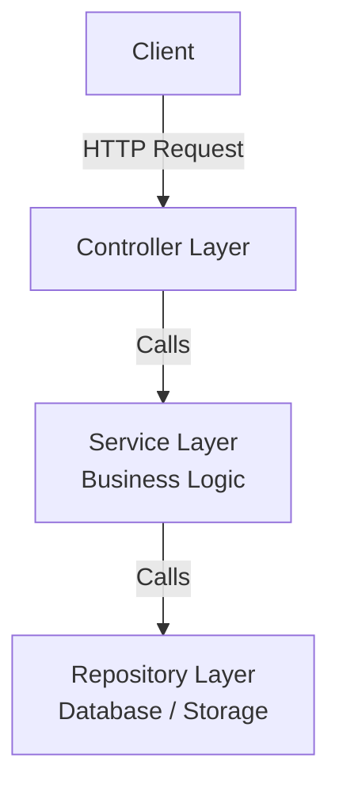

## Core Idea
Validate and transform **all incoming data** (JSON payload, query parameters, path parameters, headers) **at the entry point** of your server (Controller layer) **before** any business logic or database operations.

This ensures **data integrity**, **security**, and prevents unexpected failures.

## Typical Backend Layers (Simplified)




- **Controller Layer**: Handles HTTP stuff (request/response, status codes). **Validations & transformations happen here.**
- **Service Layer**: Business logic, may call multiple repositories, send emails, webhooks, etc.
- **Repository Layer**: Database interactions (queries, inserts).

## Why Validate at Entry Point?

Without validation → malformed data reaches service/repository → database error (e.g., type mismatch) → returns `500 Internal Server Error` (bad UX).

With validation → malformed data rejected immediately → returns `400 Bad Request` with clear error messages.

## Types of Validation

### 1. Syntactic Validation
Checks if data **follows a specific structure/pattern**.

| Field   | Example Validation                       |
|---------|------------------------------------------|
| Email   | Must contain `@`, domain, TLD            |
| Phone   | Country code + valid digits              |
| Date    | Matches `YYYY-MM-DD` format              |

### 2. Semantic Validation
Checks if data **makes logical sense**.

- Date of birth cannot be in the future.
- Age must be between 1 and 120.
- Page number > 0 and < 500.

### 3. Type Validation
Checks if data **matches the expected data type**.

- `string`, `number`, `boolean`, `array`, `object`, etc.
- Example: `page` query param is a string by default – we want a number.

## Transformation
Convert incoming data into a **desirable format** before validation or after validation.

**Common use case**: Query parameters are always strings. Transform them to numbers:

```javascript
// Incoming: page = "2", limit = "20" (strings)
// After transformation: page = 2, limit = 20 (numbers)
// Then validate (greater than 0, less than max)
```

**Other examples**:
- Normalize email to lowercase.
- Add `+` prefix to phone numbers.
- Reformat dates.

## Validation & Transformation Pipeline

A **single pipeline** (middleware or utility) that:
1. Takes a **schema** (expected fields, types, constraints)
2. Transforms raw incoming data (e.g., string → number)
3. Validates against the schema
4. Returns errors or clean, typed data to the controller

## Complex Validation Examples

- **Password confirmation**: `password` field must equal `confirmPassword`.
- **Conditional fields**: If `married = true`, then `partner` field is required.

## Frontend vs Backend Validation

| Aspect               | Frontend Validation               | Backend Validation (this topic)     |
|----------------------|------------------------------------|--------------------------------------|
| **Purpose**          | User experience (UX)               | Security & data integrity            |
| **When**             | Before API call (in browser)       | At server entry point (always)       |
| **Can be bypassed?** | Yes (via API client like Insomnia) | No – final line of defense           |
| **Dependency**       | None – nice to have                | **Mandatory** for every API          |

> [!important]
> **Never rely on frontend validation alone.** Always implement strict server-side validation and transformation.

## Example API Responses

### Syntactic validation error
```json
{
  "errors": [
    "email: invalid email format",
    "phone: expected string, received number",
    "date: required"
  ]
}
```

### Semantic validation error
```json
{
  "errors": [
    "date_of_birth: cannot be in the future",
    "age: must be less than or equal to 120"
  ]
}
```

### Type validation error
```json
{
  "errors": [
    "number_field: expected number, received string",
    "array_field: expected array, received string"
  ]
}
```

## Best Practices Summary

- Validate **everything** coming from the client (body, query, params, headers).  
-  Place validation **as early as possible** (Controller layer).  
-  Use **syntactic, semantic, and type** validations where appropriate.  
-  **Transform** data to expected types before validation (e.g., string → number).  
-  Return **clear `400 Bad Request`** messages for validation failures.  
-  Keep validation logic **centralized** (pipeline/middleware).  
-  Never trust frontend validation – **always validate on the backend**.
