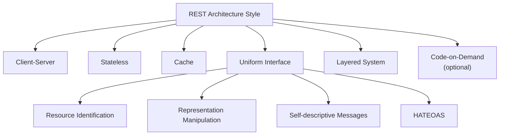
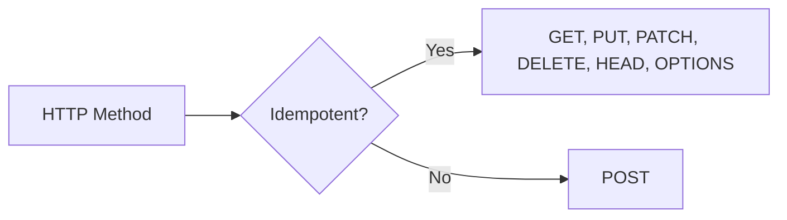
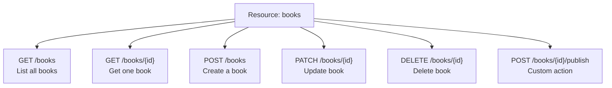
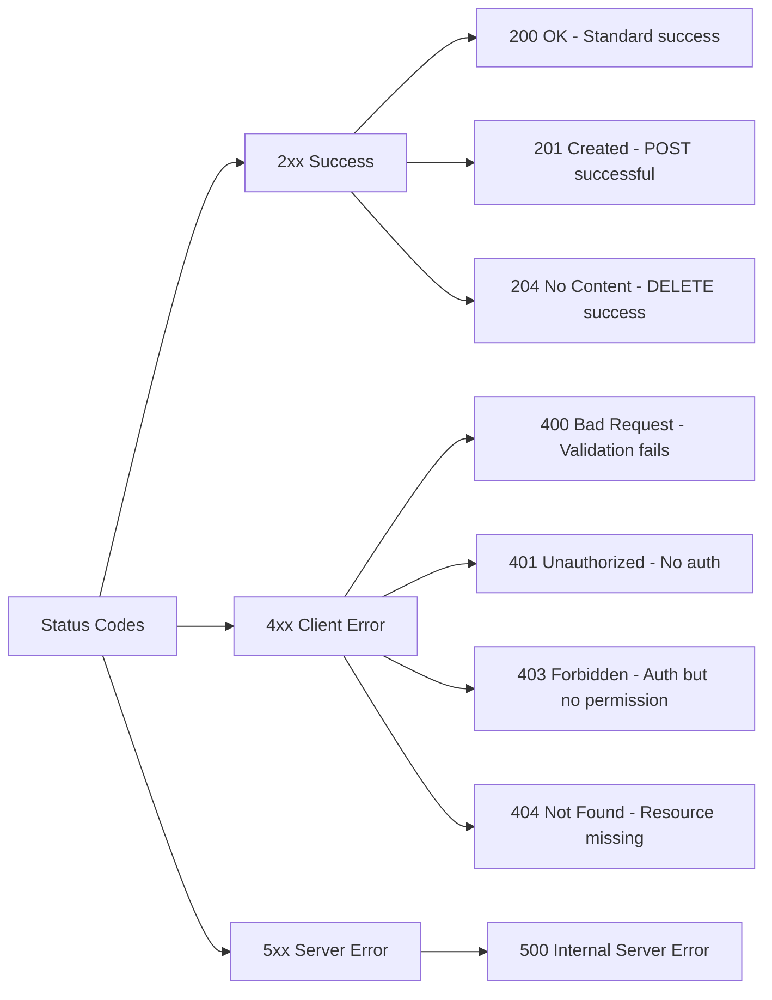
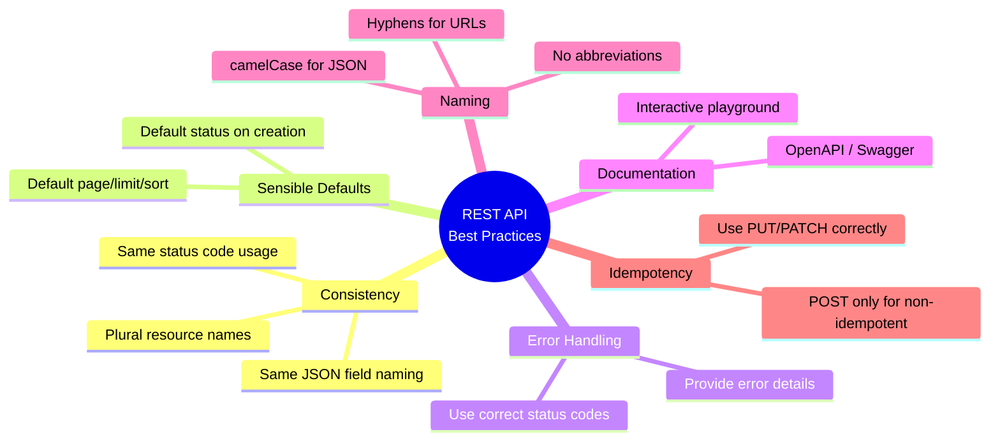
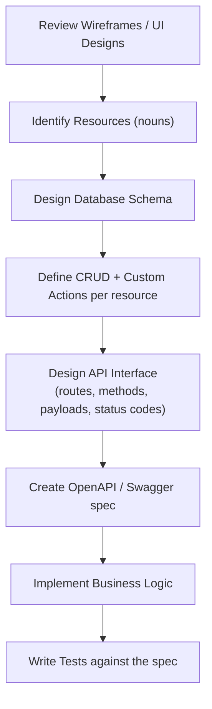

## Table of Contents

1. [Why REST API Design Matters](#why-rest-api-design-matters)
2. [Historical Context](#historical-context)
3. [The Six REST Constraints](#the-six-rest-constraints)
4. [What Does "REST" Actually Mean?](#what-does-rest-actually-mean)
5. [URL Structure and Naming Conventions](#url-structure-and-naming-conventions)
6. [HTTP Methods and Idempotency](#http-methods-and-idempotency)
7. [CRUD Operations - Design Patterns](#crud-operations---design-patterns)
8. [Pagination, Filtering and Sorting](#pagination-filtering-and-sorting)
9. [Custom Actions (Non-CRUD)](#custom-actions-non-crud)
10. [HTTP Status Codes - Quick Reference](#http-status-codes---quick-reference)
11. [Best Practices Summary](#best-practices-summary)
12. [API Design Workflow](#api-design-workflow)
13. [Example Walkthrough: Project Management Platform](#example-walkthrough-project-management-platform)
14. [Final Checklist and Study Tips](#final-checklist-and-study-tips)

---
## Why REST API Design Matters

As a backend engineer, you will spend a lot of time designing APIs. A well-designed REST API:

- Eliminates guesswork for consumers (other developers)
- Reduces bugs and integration time
- Lets creator and consumer rely on a common standard
- Makes your API intuitive and pleasant to use

> [!important]
> Design first, code later. Before writing business logic, design the API interface (routes, payloads, status codes) using tools like Insomnia, Postman, or Swagger.

---

## The Six REST Constraints



| Constraint                    | Description                                                                                         |
| ----------------------------- | --------------------------------------------------------------------------------------------------- |
| **Client-Server**             | Separation of concerns: UI (client) vs data and logic (server).                                     |
| **Stateless**                 | Each request includes all required context; server stores no client session state between requests. |
| **Cache**                     | Responses are marked cacheable or non-cacheable to reduce load and latency.                         |
| **Uniform Interface**         | Standard communication model: resource IDs, representations, self-descriptive messages, HATEOAS.    |
| **Layered System**            | Intermediary layers (proxies, load balancers) can sit between client and server.                    |
| **Code-on-Demand (optional)** | Server can extend client behavior by sending executable code (for example, JavaScript).             |

---

## What Does "REST" Actually Mean?

**RE**presentational **S**tate **T**ransfer:

1. **Representational** - Resources can be represented as JSON, HTML, XML, etc.
2. **State** - The current condition/attributes of a resource.
3. **Transfer** - Resource representations move between client and server via HTTP methods.

> [!note]
> REST is not a protocol. It is an architectural style built on top of HTTP.

---

## URL Structure and Naming Conventions

A typical API URL:

```text
https://api.example.com/v1/books/123?limit=10&page=2#reviews
```

### Best Practices for API Routes

- Use clear, predictable, lowercase plural nouns for resources (`/books`, `/users`).
- Use hyphenated slugs for public-friendly identifiers when needed (`/books/harry-potter-and-the-sorcerers-stone`).
- Version from day one (`/v1/...`).

---

## HTTP Methods and Idempotency

Idempotency means repeating the same operation yields the same final server state.



| Method | Idempotent | Use Case | Success Status |
|---|---|---|---|
| `GET` | Yes | Fetch resource(s) | `200 OK` |
| `POST` | No | Create resource or run custom action | `201 Created` / `200 OK` |
| `PUT` | Yes | Full replacement | `200 OK` / `204 No Content` |
| `PATCH` | Yes | Partial update | `200 OK` |
| `DELETE` | Yes | Remove resource | `204 No Content` |

> [!tip]
> **PUT vs PATCH**  
> PUT sends the full object; PATCH sends only changed fields. In modern SPAs, PATCH is more common.

---

## CRUD Operations - Design Patterns

For a resource like `books`, common endpoints:



| Operation | Method | Route | Request Body | Success Response | Status Code |
|---|---|---|---|---|---|
| List | `GET` | `/books` | none (query params only) | `{ data: [], total, page, totalPages }` | `200 OK` |
| Create | `POST` | `/books` | `{ title, author, year }` | Created entity | `201 Created` |
| Get one | `GET` | `/books/{id}` | none | Resource object | `200 OK` |
| Update | `PATCH` | `/books/{id}` | Partial payload | Updated resource | `200 OK` |
| Delete | `DELETE` | `/books/{id}` | none | Empty body | `204 No Content` |
| Custom action | `POST` | `/books/{id}/archive` | Optional | Action-specific | `200 OK` / `201 Created` |

> [!note]
> For `DELETE`, prefer `204 No Content` with an empty body.

---

## Pagination, Filtering and Sorting

All list endpoints should support pagination, filtering, and sorting via query parameters.

| Parameter | Type | Default | Description |
|---|---|---|---|
| `page` | integer | `1` | Page number (1-indexed) |
| `limit` | integer | `10` or `20` | Number of items per page |
| `sort_by` | string | `created_at` | Sort field |
| `sort_order` | string | `desc` | `asc` or `desc` |
| `{field}` | any | none | Exact-match filter, e.g. `status=active` |

Example request:

```http
GET /organizations?page=2&limit=10&sort_by=name&sort_order=asc&status=active
```

Example response:

```json
{
  "data": [
    { "id": 1, "name": "Alpha", "status": "active" },
    { "id": 2, "name": "Beta", "status": "active" }
  ],
  "total": 42,
  "page": 2,
  "totalPages": 5,
  "limit": 10
}
```

> [!tip]
> Use sensible defaults. Never return all rows by default.  
> If no records match, return `200 OK` with an empty array (not `404`).

---

## Custom Actions (Non-CRUD)

For operations like archive/clone/approve:

```text
POST /resource/{id}/action-name
```

Example:

```text
POST /organizations/5/archive
```

- Use `POST` for non-CRUD actions.
- Keep the action on the specific resource route.
- Return status by behavior:
  - Creates something: `201 Created`
  - Changes state and returns payload: `200 OK`
  - No payload: `204 No Content`

> [!warning]
> Use verbs only for custom actions, not for standard CRUD routes.  
> Good: `POST /orders/123/cancel`  
> Avoid: `POST /cancelOrder/123`

---

## HTTP Status Codes - Quick Reference



| Code | Meaning | When to Use |
|---|---|---|
| `200 OK` | Success | GET, PATCH, PUT, custom POST without creation |
| `201 Created` | New resource created | POST create |
| `204 No Content` | Success, empty body | DELETE (and sometimes PUT/PATCH) |
| `400 Bad Request` | Invalid request | JSON/schema/required field errors |
| `401 Unauthorized` | Missing/invalid authentication | No valid token/key |
| `403 Forbidden` | Authenticated but disallowed | Permission denied |
| `404 Not Found` | Resource missing | Specific resource not found |
| `409 Conflict` | State conflict | Duplicate key or conflicting state |
| `422 Unprocessable Entity` | Business-rule violation | Semantically invalid operation |
| `500 Internal Server Error` | Unhandled server fault | Unexpected backend failure |

> [!note]
> Never return `404` for empty list/filter results; return `200` with an empty collection.

---

## Best Practices Summary



- Always use plural nouns in routes.
- Version your API (`/v1`).
- Keep naming and status-code behavior consistent.
- Use sensible defaults for pagination and sorting.
- Use correct methods and status codes.
- Keep JSON fields in `camelCase`.
- Document with OpenAPI/Swagger.

---

## API Design Workflow



> [!tip]
> Steps A-F can be done before backend coding starts.

---

## Example Walkthrough: Project Management Platform

Resources: **Organization**, **Project**, **Task**.

| Resource | List | Create | Get One | Update | Delete | Custom Action |
|---|---|---|---|---|---|---|
| Organization | `GET /organizations` | `POST /organizations` | `GET /organizations/{id}` | `PATCH /organizations/{id}` | `DELETE /organizations/{id}` | `POST /organizations/{id}/archive` |
| Project | `GET /projects` | `POST /projects` | `GET /projects/{id}` | `PATCH /projects/{id}` | `DELETE /projects/{id}` | `POST /projects/{id}/clone` |
| Task | `GET /tasks` | `POST /tasks` | `GET /tasks/{id}` | `PATCH /tasks/{id}` | `DELETE /tasks/{id}` | `POST /tasks/{id}/complete` |

### Create Organization - Example

**Request**

```http
POST /organizations
Content-Type: application/json

{
  "name": "Acme Inc",
  "status": "active",
  "description": "Main org"
}
```

**Response (`201 Created`)**

```json
{
  "id": 101,
  "name": "Acme Inc",
  "status": "active",
  "description": "Main org",
  "createdAt": "2026-05-01T10:00:00Z",
  "updatedAt": "2026-05-01T10:00:00Z"
}
```

### List with Pagination and Filtering

```http
GET /projects?page=2&limit=5&status=planned&sort_by=name&sort_order=asc
```

**Response**

```json
{
  "data": [],
  "total": 42,
  "page": 2,
  "totalPages": 9,
  "limit": 5
}
```

### Custom Action - Archive an Organization

```http
POST /organizations/101/archive
```

**Response (`200 OK`)**

```json
{
  "id": 101,
  "name": "Acme Inc",
  "status": "archived",
  "description": "Main org",
  "archivedAt": "2026-05-01T11:00:00Z"
}
```

---

## Final Checklist and Study Tips

### Before you start coding an API

- [ ] Identified all resources from wireframes
- [ ] Chosen plural, lowercase, hyphen-separated routes
- [ ] Defined standard CRUD endpoints per resource
- [ ] Separated non-CRUD actions as `POST /resource/{id}/action`
- [ ] Added `page`, `limit`, `sort_by`, `sort_order`, and filters to list endpoints
- [ ] Set sensible defaults (`page=1`, `limit=10`, `sort_by=created_at`, `sort_order=desc`)
- [ ] Kept JSON fields in camelCase
- [ ] Documented endpoints in Swagger/OpenAPI
- [ ] Returned proper status codes (`201` create, `204` delete, `200` general success)
- [ ] Reserved `404` for missing specific resources only

### Interview / Exam Questions

1. What is idempotency, and which methods are idempotent?
2. When should you use PATCH instead of PUT?
3. Why paginate lists, and what defaults do you choose?
4. How do you design a custom action like "approve order" in REST?
5. What status code do you return for an empty list, and why not 404?
6. What is the difference between 401 and 403?
7. What does HATEOAS stand for, and why is it uncommon in many modern APIs?

---

> [!success]
> Good API design is invisible: it behaves exactly how developers expect.
