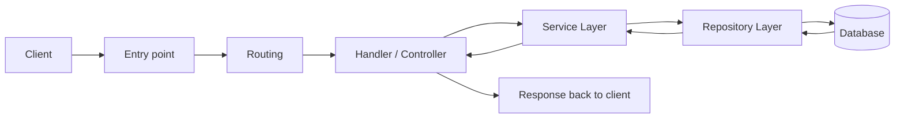

## Overview
Three closely related backend topics explained together:
- **Handler (Controller) / Service / Repository** – pattern for separating concerns.
- **Middleware** – reusable functions that run in the request/response lifecycle.
- **Request Context** – per‑request shared state (storage, cancellation, deadlines).

These patterns improve scalability, maintainability, and testability.

---

## 1. Handlers, Services & Repositories

### Request Lifecycle (Inside the Server)



### Responsibilities

| Layer        | Responsibilities                                                                                   | Typical inputs / outputs                                            |
|--------------|----------------------------------------------------------------------------------------------------|----------------------------------------------------------------------|
| **Handler / Controller** | – Extract data from request (body, query, params)<br/>– Deserialize (bind) JSON → native object<br/>– Validate & transform data<br/>– Call service layer<br/>– Set HTTP status code & send response | Receives `request` & `response` objects. Returns HTTP response.     |
| **Service**  | – Business logic (e.g., orchestrate multiple repositories, send emails, call external APIs)<br/>– No HTTP‑related code (no status codes, no request/response objects)<br/>– Returns plain data (or error) to handler | Takes validated/transformed data. Returns result data or error.     |
| **Repository** | – Single responsibility: one database operation per method (fetch, insert, update, delete)<br/>– Constructs and executes database queries<br/>– Returns raw data from DB (no business logic) | Takes query parameters. Returns database result (e.g., list of books). |

### Step‑by‑Step Flow

1. **Request arrives** → routing maps to a handler.
2. **Handler**:
   - Binds (deserializes) JSON body to native struct/object.
   - If binding fails → `400 Bad Request`.
   - Runs **validation & transformation** (see [[API Validations & Transformations]]).
3. Handler calls **service layer**, passing validated/transformed data.
4. **Service layer**:
   - May call one or more **repository methods**.
   - May call external services (email, webhooks, etc.).
   - Orchestrates results.
   - Returns processed data to handler.
5. **Repository**:
   - Executes a single database operation.
   - Returns result to service.
6. **Handler** receives service result:
   - On success → sets `2xx` status (200, 201, 204) and sends response.
   - On failure → sets `4xx` (client error) or `5xx` (server error).

> [!tip] Good practice
> - Keep HTTP logic **only** in the handler.
> - Repository methods should do **one thing** (no optional parameters that change behaviour).
> - Service methods should be **indistinguishable** from ordinary functions (no `req`/`res` objects).

---

## 2. Middleware

Middleware are functions that run **in the middle** of the request lifecycle. They receive:
- `request` object
- `response` object  
- `next` function – passes execution to the **next** middleware/handler.


### Why Use Middleware?

- **Code reuse** – common operations applied to many (or all) routes.
- Can **modify** request/response, or **short‑circuit** (send response early).
- Order matters – executed in the sequence they are registered.

### Common Middleware Examples

**CORS**  
- **Purpose:** Check `Origin` header, add `Access-Control-Allow-*` headers if allowed. Short‑circuit if not.  
- **Typical position:** First  

**Security Headers**  
- **Purpose:** Add `Content-Security-Policy`, `X-Content-Type-Options`, etc.  
- **Typical position:** Early  

**Logging / Monitoring**  
- **Purpose:** Log path, method, duration, status code for every request.  
- **Typical position:** Early  

**Authentication**  
- **Purpose:** Extract & verify token (JWT, session ID). On success → store user info in **request context**. On failure → `401 Unauthorized`.  
- **Typical position:** Before business logic  

**Rate Limiting**  
- **Purpose:** Track client IP, reject with `429 Too Many Requests` if limit exceeded.  
- **Typical position:** After auth, before handler  

**Compression**  
- **Purpose:** Compress response body (e.g., gzip) if client supports it.  
- **Typical position:** Late (near response)  

**Global Error Handling**  
- **Purpose:** Catches any error from downstream middlewares/handlers, sends structured error response.  
- **Typical position:** **Last**  

> [!warning] Order of middleware is critical  
> - CORS should be **first** – reject unauthorised origins early.  
> - Global error handler must be **last** – it can only catch errors from middleware that run before it.  
> - Authentication after logging (to log even failed auth attempts).

### Example: Authentication Middleware

```javascript
function authMiddleware(req, res, next) {
  const token = req.headers.authorization;
  if (!token) return res.status(401).json({ error: "Missing token" });
  
  try {
    const payload = verifyToken(token);
    // Store user info in request context (see next section)
    req.context.userId = payload.userId;
    req.context.role = payload.role;
    next(); // continue to next middleware / handler
  } catch (err) {
    res.status(401).json({ error: "Invalid token" });
  }
}
```

---

## 3. Request Context

A **per‑request shared storage** (key‑value) accessible by all middleware and the handler for the duration of that single request.

### Why Use a Request Context?

- **Avoid tight coupling** – pass data without adding extra parameters to every function.
- **Store authentication metadata** – user ID, role, permissions.
- **Tracing** – generate a unique request ID (UUID) and log it everywhere.
- **Cancellation & deadlines** – propagate cancellation signals to downstream services (e.g., database calls, HTTP requests).

### Typical Usage Flow

1. **Early middleware** (e.g., request ID generator) creates a UUID and stores it in `context.requestId`.
2. **Authentication middleware** verifies token and stores `userId` and `role` in context.
3. **Handler** reads `context.userId` instead of trusting client‑supplied ID – prevents privilege escalation.
4. **Service / Repository** can also read from context (e.g., for soft‑delete filtering by tenant).
5. If a timeout/cancellation occurs, the context signals all listeners.

> [!danger] Never trust client‑supplied user identifiers
> Always take `userId` from the **authenticated context**, not from request body/params. Otherwise a malicious client could impersonate another user.

### Example (Pseudocode)

```javascript
// Middleware: set request ID
app.use((req, res, next) => {
  req.context = { requestId: uuid() };
  console.log(`[${req.context.requestId}] Request started`);
  next();
});

// Authentication middleware
app.use((req, res, next) => {
  const token = req.headers.authorization;
  const payload = verify(token);
  req.context.userId = payload.userId;
  next();
});

// Handler
app.post("/books", (req, res) => {
  const { title } = req.body;
  const { userId } = req.context;   // ✅ safe
  db.insert({ title, user_id: userId });
  res.status(201).json({ success: true });
});
```

---
## Summary

| Concept                     | Key takeaway                                                                                     |
|-----------------------------|--------------------------------------------------------------------------------------------------|
| **Handler**                 | HTTP layer – binds, validates, transforms, calls service, sends response.                       |
| **Service**                 | Business logic – no HTTP, uses repositories, returns plain data.                                |
| **Repository**              | One database operation per method, returns raw DB results.                                      |
| **Middleware**              | Reusable, order‑sensitive functions that can modify request/response or short‑circuit.          |
| **Request Context**         | Per‑request shared storage for metadata, tracing, cancellation. Never trust client IDs – use context. |

> [!quote] Design principle
> *“Controller deals with data formats – input/output. Service deals with **what** to do. Repository deals with **how** to store/fetch.”*

