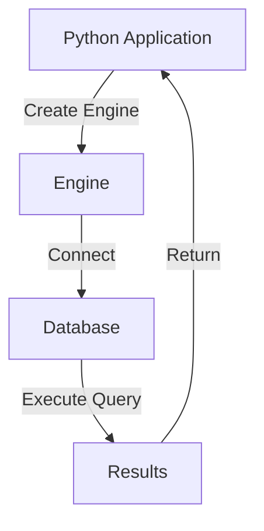
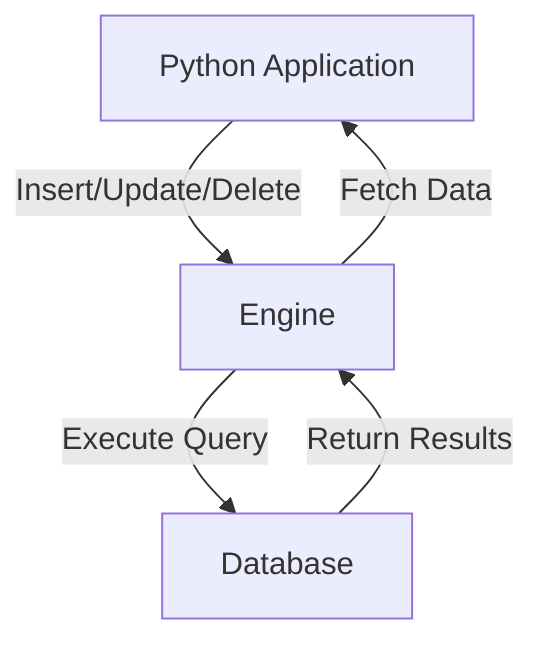
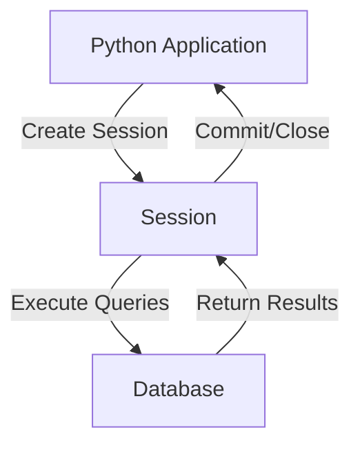
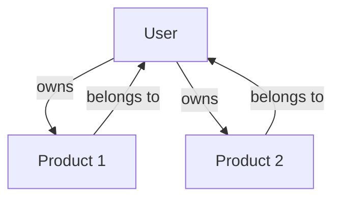
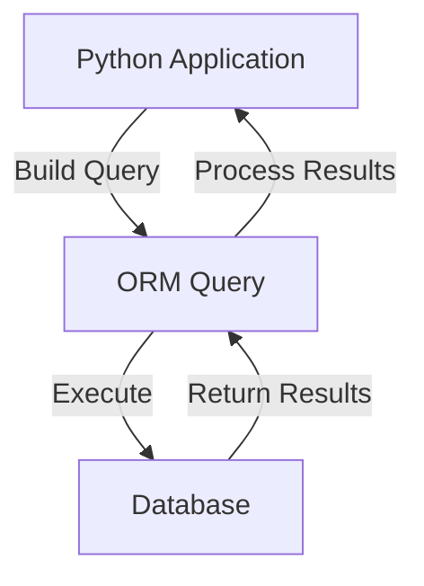

# SQLAlchemy Study Notes

This guide covers the basics of using SQLAlchemy for database operations in Python, including connecting to a database, creating tables, executing SQL queries, and using the Object-Relational Mapping (ORM) approach. It includes code examples and explanations for study purposes.

## 1. Connecting to a Database

SQLAlchemy provides a way to connect to a database using the `create_engine` function. A connection can be established to various database types (e.g., SQLite, PostgreSQL).

- **Key Components**:
    - `create_engine`: Creates an engine object for database connectivity.
    - `engine.connect()`: Establishes a connection to the database.
    - `text()`: Used to execute raw SQL queries.

**Example**: Connecting to an SQLite database and executing a simple query.

```python
from sqlalchemy import create_engine, text
from contextlib import contextmanager

DATABASE_URL = "sqlite:///./test.db"

engine = create_engine(DATABASE_URL) #create connection engine to your DB

#this creates single engine object that manages:
# - DB connections
# - Connection Pooling
# - Executing SQL

@contextmanager
def get_db_connection():
    with engine.connect() as conn:
        yield conn
    
#opens a new connection from the engine
#return a connection object which you can use to run queries

if __name__ == "__main__":
    with get_db_connection() as conn:
        res = conn.execute(text("SELECT 'Hello, SQLAlchemy!'"))
        print(res.scalar())
```

Context Managers are a python feature that auto handle setup,cleanup
Especially:
- Opening,Closing DB connections
- Opening,Closing files
- Releasing Locks

A **context manager** is something that:
- Does some setup **before** the block starts (`__enter__`)
- Does some cleanup **after** the block ends (`__exit__`)

Even if an error happens inside the block, the cleanup still run

**Diagram**: Database Connection Flow


##### Difference between the result objects
| Category          | Function               | Meaning                   |
| ----------------- | ---------------------- | ------------------------- |
| Single value      | `scalar()`             | First column of first row |
|                   | `scalar_one()`         | Must return exactly one   |
|                   | `scalar_one_or_none()` | One or None               |
| Rows              | `fetchone()`           | One row                   |
|                   | `first()`              | First row                 |
|                   | `fetchall()` / `all()` | All rows                  |
|                   | `fetchmany(n)`         | n rows                    |
| Iteration         | `__iter__()`           | Loop over rows            |
|                   | `partitions(n)`        | Yield chunks              |
| Row access        | `row[key]`             | Access value              |
|                   | `row.attr`             | Attribute access          |
| Dict-like         | `mappings()`           | Rows as dicts             |
| Single-row strict | `one()`                | Exactly one row           |
|                   | `one_or_none()`        | Optional row              |
| Metadata          | `keys()`               | Column names              |
|                   | `columns`              | Column objects            |
| ORM               | `unique()`             | De-duplicate ORM objects  |
|                   | `tuples()`             | Return raw tuples         |
| Result control    | `freeze()`             | Cache results             |
|                   | `close()`              | Close cursor              |

## 2. Creating Tables

Tables are defined using the `Table` class and `MetaData` to manage schema definitions. Columns are defined with types like `Integer`, `String`, and `Float`.

- **Key Components**:
    - `MetaData`: Container for table definitions.
    - `Table`: Defines a table with columns and constraints (e.g., primary key, unique).
    - `create_all`: Creates tables in the database based on the metadata.

**Example**: Defining and creating `products` and `users` tables.

```python
from sqlalchemy import Table, Column, Integer, String, Float, MetaData
from sqlalchemy import create_engine

DATABASE_URL = "sqlite:///./test.db"
engine = create_engine(DATABASE_URL)
metadata = MetaData()

products_table = Table(
    "products",
    metadata,
    Column("id", Integer, primary_key=True, index=True),
    Column("name", String, primary_key=True, index=True),
    Column("description", String),
    Column("price", Float)
)

user_table = Table(
    "users",
    metadata,
    Column("id", Integer, primary_key=True, index=True),
    Column("username", String, unique=True, index=True),
    Column("email", String, unique=True)
)

metadata.create_all(engine)
```

## 3. Executing SQL Queries

SQLAlchemy allows executing CRUD (Create, Read, Update, Delete) operations using raw SQL or table constructs.

- **Key Functions**:
    - `insert`: Add new records.
    - `select`: Retrieve records.
    - `update`: Modify existing records.
    - `delete`: Remove records.
    - `commit`: Save changes to the database.

**Example**: CRUD operations on the `products` table.

```python
from sqlalchemy import insert, select, update, delete

def create_product(name: str, description: str, price: float):
    with engine.connect() as conn:
        stmt = insert(products_table).values(
            name=name, description=description, price=price
        )
        result = conn.execute(stmt)
        conn.commit()
        return result.lastrowid

def get_product(product_id: int):
    with engine.connect() as conn:
        stmt = select(products_table).where(products_table.c.id == product_id)
        return conn.execute(stmt).fetchone()

def get_all_products():
    with engine.connect() as conn:
        stmt = select(products_table)
        return conn.execute(stmt).fetchall()

def update_product(product_id: int, name: str, price: float, description: str):
    with engine.connect() as conn:
        stmt = update(products_table).where(products_table.c.id == product_id).values(
            name=name, price=price, description=description
        )
        conn.execute(stmt)
        conn.commit()

def delete_product(product_id: int):
    with engine.connect() as conn:
        stmt = delete(products_table).where(products_table.c.id == product_id)
        conn.execute(stmt)
        conn.commit()

if __name__ == "__main__":
    metadata.create_all(engine)
    
    product_id = create_product("Laptop", "Powerful laptop", 1200.00)
    print(f"Created product with ID: {product_id}")
    
    product = get_product(product_id)
    print(f"Retrieved product: {product}")
    
    update_product(product_id, "Laptop", 1150.00, "Powerful laptop")
    product = get_product(product_id)
    print(f"Updated product: {product}")
    
    all_products = get_all_products()
    print("All products:", [p for p in all_products])
    
    delete_product(product_id)
    print(f"Product after deletion: {get_product(product_id)}")
```

**Diagram**: CRUD Operations Flow



## 4. Object-Relational Mapping (ORM)

SQLAlchemy ORM maps database tables to Python classes, allowing object-oriented interaction with the database.

- **Key Components**:
    - `declarative_base`: Base class for ORM models.
    - `Column`: Defines table columns.
    - `relationship`: Defines relationships between tables (e.g., one-to-many).
    - `ForeignKey`: Links tables for relationships.

**Example**: Defining `User` and `Product` models with a one-to-many relationship.

```python
from sqlalchemy import create_engine, Column, Integer, String, Float, ForeignKey
from sqlalchemy.ext.declarative import declarative_base
from sqlalchemy.orm import sessionmaker, relationship

DATABASE_URL = "sqlite:///./test.db"
engine = create_engine(DATABASE_URL)
Base = declarative_base()

class User(Base):
    __tablename__ = "users"
    id = Column(Integer, primary_key=True, index=True)
    username = Column(String, unique=True, index=True)
    email = Column(String, unique=True)
    
    #the "products" here as a word and the back populates "owner"
    products = relationship("Product", back_populates="owner")

    def __repr__(self):
        return f"<User(id={self.id}, username={self.username}, email={self.email})>"

class Product(Base):
    __tablename__ = "products"
    id = Column(Integer, primary_key=True, index=True)
    name = Column(String, unique=True, index=True)
    description = Column(String)
    price = Column(Float)
    owner_id = Column(Integer, ForeignKey('users.id'))
    
    #the "owner" here as a word and the back populates "products"
    owner = relationship("User", back_populates="products")

    def __repr__(self):
        return f"<Product(id={self.id}, name={self.name}, price={self.price})>"

Base.metadata.create_all(engine)
```

## 5. Sessions

Sessions manage database transactions in the ORM, providing a scope for operations.

- **Key Components**:
    - `sessionmaker`: Creates a session factory.
    - `Session`: Manages transactions and database interactions.
    - `commit`: Saves changes.
    - `refresh`: Updates an object with the latest database state.

**Example**: Setting up a session for ORM operations.

```python
SessionLocal = sessionmaker(autocommit=False, autoflush=False, bind=engine)

def get_db():
    db = SessionLocal()
    try:
        yield db
    finally:
        db.close()
```

**Diagram**: Session Workflow



## 6. Basic CRUD with ORM

Using the ORM, you can perform CRUD operations by interacting with model objects instead of raw SQL.

**Example**: CRUD operations with `User` and `Product` models.

```python
from sqlalchemy.orm import Session
from models_orm import User, Product, Base, engine
from database_orm import SessionLocal

Base.metadata.create_all(engine)

def create_user(db: Session, username: str, email: str):
    db_user = User(username=username, email=email)
    
    db.add(db_user)
    db.commit()
    db.refresh(db_user)
    
    return db_user

def get_user(db: Session, user_id: int):
    return db.query(User).filter(User.id == user_id).first()

def get_user_by_email(db: Session, email: str):
    return db.query(User).filter(User.email == email).first()

def get_users(db: Session, skip: int = 0, limit: int = 10):
    return db.query(User).offset(skip).limit(limit).all()

def create_product_for_user(db: Session, product_name: str, description: str, price: float, user_id: int):
    db_product = Product(name=product_name, description=description, price=price, owner_id=user_id)
    
    db.add(db_product)
    db.commit()
    db.refresh(db_product)
    
    return db_product

def get_products(db: Session, skip: int = 0, limit: int = 10):
    return db.query(Product).offset(skip).limit(limit).all()

if __name__ == "__main__":
    db = SessionLocal()
    
    try:
        user1 = create_user(db, "alice", "alice@example.com")
        user2 = create_user(db, "bob", "bob@example.com")
        print(f"Created users: {user1}, {user2}")
        
        product1 = create_product_for_user(db, "Keyboard", "Mechanical keyboard", 120.0, user1.id)
        product2 = create_product_for_user(db, "Mouse", "Gaming mouse", 50.0, user1.id)
        product3 = create_product_for_user(db, "Monitor", "4K Monitor", 300.0, user2.id)
        print(f"Created products: {product1}, {product2}, {product3}")
        
        retrieved_user1 = get_user(db, user1.id)
        print(f"\n{retrieved_user1.username}'s products:")
        
        for p in retrieved_user1.products:
            print(f"  - {p.name}")
            
        all_products = get_products(db)
        print("\nAll products:")
        for p in all_products:
            print(f"  - {p.name} (Owner: {p.owner.username})")
            
    finally:
        db.close()
```

## 7. Relationships (One-to-Many, Many-to-Many)

SQLAlchemy ORM simplifies managing relationships between tables.

- **One-to-Many**:
    - A `User` can own multiple `Product` objects, but each `Product` belongs to one `User`.
    - Defined using `relationship` and `ForeignKey`.
    - Example: `User.products` accesses all products owned by a user, and `Product.owner` accesses the user who owns a product.

**Example**: Navigating relationships.

```python
# Access a user's products
retrieved_user = get_user(db, user_id=1)
for product in retrieved_user.products:
    print(product.name)

# Access a product's owner
product = db.query(Product).filter(Product.id == 1).first()
print(product.owner.username)
```

**Diagram**: One-to-Many Relationship



## 8. Querying Data

SQLAlchemy ORM supports advanced querying with filters, joins, and more.

**Example**: Advanced queries.

```python
# Get products with price > 100
expensive_products = db.query(Product).filter(Product.price > 100).all()

# Get users with username starting with 'a'
users_starting_with_a = db.query(User).filter(User.username.startswith('a')).all()

# Join users and products
users_with_keyboards = db.query(User).join(Product).filter(Product.name == "Keyboard").all()
```

**Diagram**: Query Execution


## 9.Many -to- Many 
This is **not a simple many-to-many table**.
It is an **association object pattern**.

Why?
- You want **many-to-many** (Team ↔ Player)
- BUT you also want **extra data** about the relationship (`last_changed_date`)
### Why composite primary key?
`primary_key=True on (team_id, player_id)`

This enforces:
- A player **cannot appear twice** in the same team
- `(team_id, player_id)` is **globally unique**

This is your **real uniqueness constraint** in the schema
```python
class TeamPlayer(Base):
    __tablename__ = "team_player"

    team_id = Column(Integer, ForeignKey("team.team_id"), primary_key=True)
    player_id = Column(Integer, ForeignKey("player.player_id"), primary_key=True)
    last_changed_date = Column(DATETIME, nullable=False)
```

---
## (Many-to-Many Mapping)

```python
teams = relationship(
    "Team",
    secondary="team_player",
    back_populates="players"
)
```
and
```python
players = relationship(
    "Player",
    secondary="team_player",
    back_populates="teams"
)
```
### Concept
This tells SQLAlchemy:

> “To go from Player → Team, use the `team_player` table as a bridge.”

Under the hood:
`Player → team_player → Team`
`Team → team_player → Player`

This allows:
`player.teams`
`team.players`

without manually joining tables.

----
## The `back_populates` vs `backref`

You used `back_populates` in the main tables but `backref` in the `TeamPlayer` table.
### The Concept
These handle **Relationship Symmetry**.
### The Explanation

- **`back_populates`**: Requires you to define the relationship on **both** classes. It is more explicit and considered better for large projects because it's easier to see how tables connect just by looking at the class code.
    
- **`backref`**: Only requires a definition on **one** class. It "automagically" creates the inverse relationship on the other class for you.
---
## Key Takeaways

- **Connection**: Use `create_engine` and `engine.connect()` for database access.
- **Table Creation**: Define tables with `Table` and `MetaData`, create with `create_all`.
- **SQL Queries**: Use `insert`, `select`, `update`, `delete` for CRUD operations.
- **ORM**: Map tables to Python classes with `declarative_base` and `relationship`.
- **Sessions**: Use `sessionmaker` for transactional database operations.
- **Relationships**: Manage one-to-many relationships with `ForeignKey` and `relationship.
- **Querying**: Leverage ORM for advanced filtering and joins.
