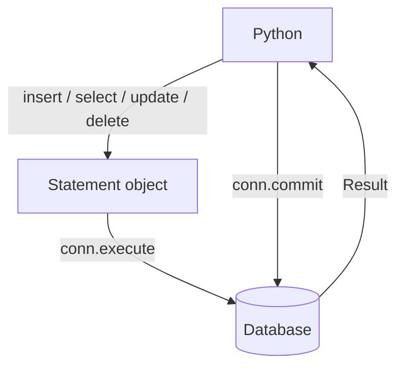

# 03 — Core CRUD (insert, select, update, delete)

> [!info] Source
> README §4 "Executing SQL Queries" + "CRUD Operations with Core". Back to [[00 - Index]] · Previous: [[02 - Core Tables with MetaData]]

## The one-sentence version

Build a statement with `insert()` / `select()` / `update()` / `delete()`, execute it on a connection, and **`conn.commit()` if it wrote anything**.

## Why not f-strings?

> This is more robust and safer than f-strings for building queries, as it handles proper escaping and parameter binding.

`insert(t).values(name=name)` becomes `INSERT INTO products (name) VALUES (?)` with `name` sent as a **bound parameter**. The DB never sees user input as SQL text → no injection, and the DB can cache the query plan.

## The code

```python
# crud_core.py
from sqlalchemy import insert, select, update, delete
from database import engine
from models_core import products_table, users_table, metadata

def create_product(name: str, description: str, price: float):
    with engine.connect() as conn:
        stmt = insert(products_table).values(
            name=name, description=description, price=price
        )
        result = conn.execute(stmt)
        conn.commit()
        return result.inserted_primary_key[0]   # README; your note used result.lastrowid

def get_product(product_id: int):
    with engine.connect() as conn:
        stmt = select(products_table).where(products_table.c.id == product_id)
        return conn.execute(stmt).fetchone()

def get_all_products():
    with engine.connect() as conn:
        stmt = select(products_table)
        return conn.execute(stmt).fetchall()

def update_product(product_id: int, name: str, price: float, description: str):
    with engine.connect() as conn:
        stmt = (
            update(products_table)
            .where(products_table.c.id == product_id)
            .values(name=name, price=price, description=description)
        )
        conn.execute(stmt)
        conn.commit()

def delete_product(product_id: int):
    with engine.connect() as conn:
        stmt = delete(products_table).where(products_table.c.id == product_id)
        conn.execute(stmt)
        conn.commit()

if __name__ == "__main__":
    metadata.create_all(engine)

    product_id = create_product("Laptop", "Powerful laptop", 1200.00)
    print(f"Created product with ID: {product_id}")

    product = get_product(product_id)
    print(f"Retrieved product: {product}")

    update_product(product_id, "Laptop", 1150.00, "Powerful laptop")
    print(f"Updated product: {get_product(product_id)}")

    all_products = get_all_products()
    print("All products:", [p for p in all_products])

    delete_product(product_id)
    print(f"Product after deletion: {get_product(product_id)}")   # -> None
```

## The four statement builders

| Builder | SQL | Chain with |
|---|---|---|
| `insert(table).values(**cols)` | `INSERT INTO … VALUES …` | `.returning(table.c.id)` (Postgres/SQLite ≥3.35) |
| `select(table)` or `select(table.c.a, table.c.b)` | `SELECT … FROM …` | `.where()`, `.order_by()`, `.limit()`, `.offset()`, `.join()` |
| `update(table).where(cond).values(**cols)` | `UPDATE … SET … WHERE …` | **Always** add `.where()` or you update every row |
| `delete(table).where(cond)` | `DELETE FROM … WHERE …` | **Always** add `.where()` or you delete every row |

Conditions use the column namespace: `products_table.c.price > 100`, `users_table.c.username.like("a%")`, `.in_([1,2,3])`, `.is_(None)`. Combine with `and_()`, `or_()`, `not_()` from `sqlalchemy`.

## Getting the inserted id

| Expression | Notes |
|---|---|
| `result.inserted_primary_key[0]` | **Portable.** Tuple of PK values (one per PK column). What the README uses. |
| `result.lastrowid` | SQLite/MySQL cursor attribute; **not reliable on Postgres**. What your note used. |
| `insert(t).values(...).returning(t.c.id)` then `.scalar_one()` | Best on Postgres; SQLite ≥ 3.35 also supports `RETURNING`. |

Prefer `inserted_primary_key`.

## `conn.commit()` is mandatory for writes

SQLAlchemy 2.x connections use "commit as you go": a transaction opens on the first statement and stays open until you `commit()` or the `with` block exits — and **exiting without commit = rollback**. Forgetting `commit()` is the #1 reason "my insert didn't save".

Alternative: `with engine.begin() as conn:` — opens a transaction that **auto-commits on success** and rolls back on exception. Cleaner for single-purpose functions:

```python
def create_product(...):
    with engine.begin() as conn:
        result = conn.execute(insert(products_table).values(...))
        return result.inserted_primary_key[0]
```

## Printing a statement

```python
print(stmt)                                          # generic SQL with :params
print(stmt.compile(engine, compile_kwargs={"literal_binds": True}))  # with values inlined
```

## Flow



## When Core is the right tool

> SQLAlchemy Core is ideal when you need fine-grained control over your SQL queries or when working with existing database schemas that don't map cleanly to an ORM approach.

Also: bulk inserts (`conn.execute(insert(t), [dict, dict, dict])`), reporting queries, and anywhere you'd otherwise write raw SQL. Full comparison in [[11 - Core vs ORM — when to use which]].

## Next

→ [[04 - ORM Models (declarative_base)]]
