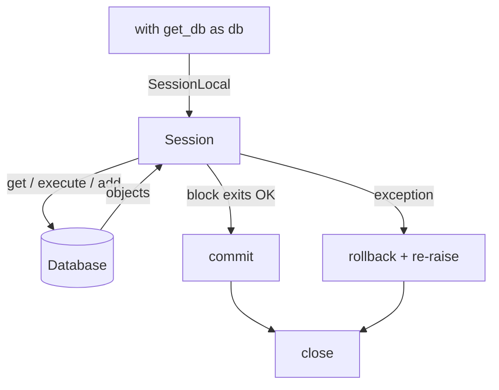

# 05 — Sessions and `sessionmaker`

> [!info] Source
> README §5 "Session Management", upgraded to the recommended **commit-on-exit** pattern.
> Back to [[00 - Index]] · Previous: [[04 - ORM Models (declarative_base)]]
> FastAPI angle: [[Backend/Deployment/Integrating FastAPI, Pydantic, and SQLAlchemy/02 - Database Session Dependency (get_db)|Integrating › 02 - Database Session Dependency]].

## The one-sentence version

A `Session` is the ORM's **unit of work** — it tracks objects you load/add/change and turns them into SQL at `commit()`. `sessionmaker` is the factory; `get_db` is the helper that opens one, commits if everything went fine, rolls back if not, and always closes.

## The recommended database.py

```python
# database.py  — engine + session factory + the ONE helper you use everywhere
from contextlib import contextmanager
from sqlalchemy import create_engine
from sqlalchemy.orm import Session, sessionmaker

from config import get_settings

settings = get_settings()

engine = create_engine(
    settings.DATABASE_URL,
    pool_pre_ping=True,                        # survive idle-dropped connections
    echo=settings.SQL_ECHO,                    # True while learning/debugging
    # SQLite only: connect_args={"check_same_thread": False}
)

SessionLocal = sessionmaker(bind=engine, autoflush=False, expire_on_commit=False)


@contextmanager
def get_db():
    """ORM session — commits on success, rolls back on error, always closes."""
    with SessionLocal() as session:
        try:
            yield session
            session.commit()
        except Exception:
            session.rollback()
            raise
```

Usage:

```python
with get_db() as db:
    db.add(User(username="ada", email="ada@x.com"))
    # no commit here — get_db commits when the block exits cleanly
```

Async version (identical shape, `async` everywhere) is in [[10 - Async SQLAlchemy]].

### Why commit-on-exit is the best default

| Manual commit everywhere | Commit-on-exit |
|---|---|
| Easy to forget → silent data loss | Impossible to forget |
| Each function decides its own transaction boundary | The `with` block **is** the transaction — obvious scope |
| Rollback on error is often missed → `PendingRollbackError` | Rollback handled once, centrally |
| Fine-grained control | Still available: call `db.commit()` mid-block if you need a checkpoint, or `db.flush()` to get ids without committing |

## sessionmaker(...) arguments

| Arg | Recommended | Why |
|---|---|---|
| `bind=engine` | required | Which engine sessions use. |
| `autoflush` | `False` | You control when SQL is sent. Default `True` flushes before every query, which can surprise you (and hide the N+1 cost of a query you didn't expect). Either is defensible; the README picks `False`. |
| `expire_on_commit` | **`False`** | After `commit()` the default expires every loaded attribute, so the next access re-SELECTs. With `False`, objects you return from a `with get_db()` block stay readable (no `DetachedInstanceError`) and async code doesn't hit `MissingGreenlet`. Trade-off: you won't see changes made by *other* transactions until you `refresh()`. |
| `autocommit` | — | Removed in 2.x. Don't pass it. |

## Session lifecycle

```
SessionLocal()        open (borrows a pooled connection lazily on first use)
   |
   v
db.get / execute / add / obj.x = y      objects tracked in the identity map
   |
   v
db.flush()            SQL sent, transaction still open (implicit before commit; call it to get ids early)
   |
   v
db.commit()           transaction committed
   |        \
   |         db.rollback()   on error: undo everything since last commit
   v
db.close()            connection returned to pool; objects become "detached"
```

### Object states

| State | Meaning | How you get there |
|---|---|---|
| Transient | plain Python object, no session | `User(...)` |
| Pending | added, not yet flushed | `db.add(user)` |
| Persistent | has a row and a session | after `flush()`/`commit()`, or loaded by a query |
| Detached | has a row, no session | after `close()` — safe to read only if `expire_on_commit=False` or you `refresh`ed |

## The FastAPI dependency is a different shape — don't mix them up

This is the exact bug from `raaaaag/ingest.py` (`db = get_db()` → got a context-manager object, not a session).

| Use case | Decorator | How you consume it |
|---|---|---|
| Scripts, background jobs, anything you call yourself | `@contextmanager` / `@asynccontextmanager` | `with get_db() as db:` / `async with get_db() as db:` |
| FastAPI endpoint | **no decorator** — plain generator | `db: Session = Depends(get_db)`; FastAPI drives the generator |

```python
# scripts / jobs
@contextmanager
def get_db():
    with SessionLocal() as s:
        try:
            yield s; s.commit()
        except Exception:
            s.rollback(); raise

# FastAPI
def get_db_dep():
    with SessionLocal() as s:
        try:
            yield s; s.commit()
        except Exception:
            s.rollback(); raise
```

Same body, different wrapper. Keep **both** in `database.py` if your project has both scripts and endpoints (name them `get_db` and `get_db_dep`, or `session_scope` and `get_db`). Calling a `@contextmanager` function bare (`db = get_db()`) never gives you a session.

## Other scoping options (know them, default to `get_db`)

```python
# SQLAlchemy's built-in: commit on success, rollback on error, close always
with SessionLocal.begin() as db:
    db.add(User(...))

# bare context manager — closes, does NOT commit
with SessionLocal() as db:
    ...
    db.commit()

# manual (legacy scripts)
db = SessionLocal()
try:
    ...; db.commit()
finally:
    db.close()
```

`SessionLocal.begin()` is essentially `get_db` without the custom name; use it if you don't want to write the helper.

## Rules of thumb

- **One engine per process; one session per unit of work** (request, job, CLI command). Never a module-level global session.
- **One `with get_db()` block per logical operation.** Don't open a session per row in a loop — open it once around the loop.
- **Let `get_db` commit.** Call `db.commit()` yourself only for mid-block checkpoints.
- **`db.flush()`** when you need an autogenerated id *before* the block ends (e.g. to use as a FK for a child row).
- Sessions are **not thread-safe** and **not task-safe** (asyncio) — never share one across concurrent work.

## Workflow diagram



## Next

→ [[06 - ORM CRUD]]
