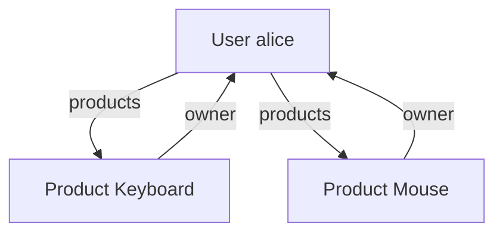

# 07 — Relationships: One-to-Many

> [!info] Source
> README §5 "Relationships (One-to-Many, Many-to-Many)" — the one-to-many half. Many-to-many is in [[08 - Many-to-Many and Association Objects]].
> Back to [[00 - Index]] · Previous: [[06 - ORM CRUD]]

## The one-sentence version

A `ForeignKey` column on the "many" side plus a `relationship()` on **both** classes linked by `back_populates` lets you walk `user.products` and `product.owner` as plain Python attributes.

## What the README says

> `relationship("Product", back_populates="owner")` in `User` tells SQLAlchemy that a `User` can have multiple `Product` objects, and these products will have an `owner` attribute that points back to the `User`.
>
> `relationship("User", back_populates="products")` in `Product` tells SQLAlchemy that a `Product` belongs to one `User`, and that user can be accessed via the `owner` attribute.

## The declaration (from [[04 - ORM Models (declarative_base)]])

```python
class User(Base):
    ...
    products = relationship("Product", back_populates="owner")     # one -> many (list)

class Product(Base):
    ...
    owner_id = Column(Integer, ForeignKey("users.id"))             # the actual FK column
    owner = relationship("User", back_populates="products")        # many -> one (single object)
```

How SQLAlchemy knows which side is which: it finds the `ForeignKey` (`products.owner_id → users.id`). The class **holding** the FK is the "many" side, so `Product.owner` is a scalar and `User.products` is a list. You don't tell it; it infers from the FK.

## Navigating

```python
# user -> products (list)
retrieved_user = get_user(db, user_id=1)
for product in retrieved_user.products:
    print(product.name)

# product -> owner (single object)
product = db.query(Product).filter(Product.id == 1).first()
print(product.owner.username)
```

## Assigning through relationships

All of these are equivalent and keep both sides in sync thanks to `back_populates`:

```python
p = Product(name="Mouse", price=50)

# A. set the FK column
p.owner_id = user.id

# B. set the relationship
p.owner = user

# C. append to the collection
user.products.append(p)

db.add(p); db.commit()
```

With B or C you don't even need to `db.add(p)` if `user` is already in the session — it's added by **cascade** (`save-update` is on by default).

## Diagram



## Lazy loading and the N+1 problem

By default `relationship()` is **lazy**: `user.products` is not loaded until you touch it, and then it runs one extra `SELECT`. Fine for one user. For a list:

```python
for u in db.query(User).all():        # 1 query
    print(u.products)                 # +1 query PER USER  -> N+1
```

Fix by telling the query to load the relationship up front:

```python
from sqlalchemy.orm import selectinload, joinedload

users = db.query(User).options(selectinload(User.products)).all()   # 2 queries total
users = db.query(User).options(joinedload(User.products)).all()     # 1 query with JOIN
```

| Strategy | SQL | Use when |
|---|---|---|
| `lazy="select"` (default) | extra SELECT on access | you rarely touch the relationship |
| `selectinload` | 1 extra `SELECT … WHERE id IN (…)` | loading collections (lists) — usually best |
| `joinedload` | single LEFT OUTER JOIN | loading many-to-one (single objects) |
| `lazy="raise"` | raises on access | to catch accidental lazy loads in async code |

Set per-relationship (`relationship(..., lazy="selectin")`) or per-query (`.options(...)`).

> [!warning] Async sessions cannot lazy-load
> `await`-less attribute access can't run a query. In async code, always eager-load (`selectinload`) or use `expire_on_commit=False` — see [[10 - Async SQLAlchemy]].

## Cascade and orphan handling

```python
products = relationship("Product", back_populates="owner", cascade="all, delete-orphan")
```

- `all` = save-update, merge, refresh-expire, expunge, **delete**.
- `delete-orphan` = a `Product` removed from `user.products` gets deleted, not just un-linked.

Without this, deleting a user leaves orphan products (SQLite) or raises (Postgres).

## Next

→ [[08 - Many-to-Many and Association Objects]]
