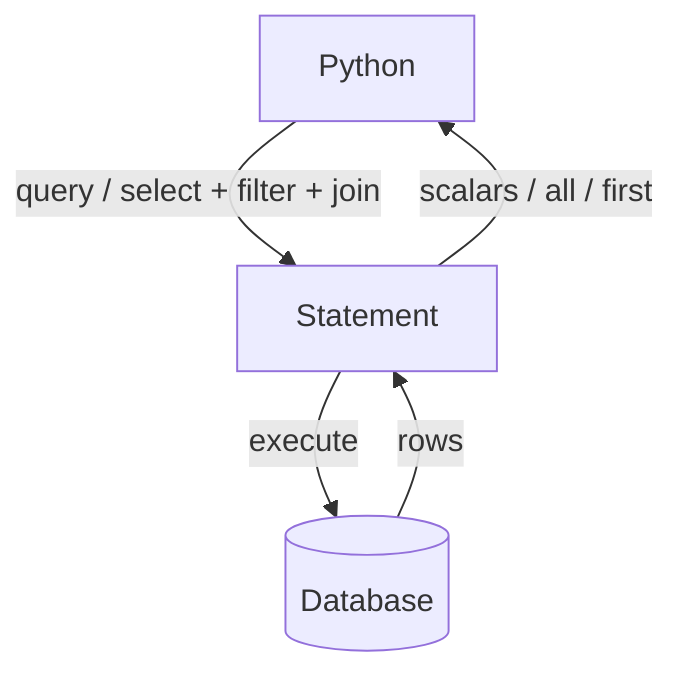

# 09 — Querying Data

> [!info] Source
> README §5 "Querying Data", expanded with the 2.0 `select()` style. Back to [[00 - Index]] · Previous: [[08 - Many-to-Many and Association Objects]]

## The one-sentence version

Start with `db.query(Model)` (legacy) or `select(Model)` (2.0), chain `filter`/`where`, `join`, `order_by`, `offset`, `limit`, then finish with `.all()` / `.first()` / `.scalars().all()`.

## The README examples

```python
# Products with price > 100
expensive_products = db.query(Product).filter(Product.price > 100).all()

# Users whose username starts with 'a'
users_starting_with_a = db.query(User).filter(User.username.startswith('a')).all()

# Join users and products, filter on the product
users_with_keyboards = db.query(User).join(Product).filter(Product.name == "Keyboard").all()
```

`join(Product)` with no ON clause works because SQLAlchemy finds the single FK between `users` and `products`. If there were two FKs you'd write `join(Product, Product.owner_id == User.id)`.

## Filter operators

| Python | SQL |
|---|---|
| `Product.price > 100` | `price > 100` |
| `Product.price.between(10, 50)` | `price BETWEEN 10 AND 50` |
| `User.username == "ada"` | `username = 'ada'` |
| `User.username != "ada"` | `username != 'ada'` |
| `User.username.startswith("a")` | `username LIKE 'a%'` |
| `User.username.endswith("a")` | `LIKE '%a'` |
| `User.username.contains("da")` | `LIKE '%da%'` |
| `User.username.like("A%")` / `.ilike("a%")` | case-sensitive / insensitive |
| `User.id.in_([1, 2, 3])` | `id IN (1,2,3)` |
| `User.id.not_in([1])` | `id NOT IN (1)` |
| `Product.description.is_(None)` | `description IS NULL` |
| `Product.description.is_not(None)` | `IS NOT NULL` |
| `and_(a, b)` or `.filter(a, b)` or `.filter(a).filter(b)` | `a AND b` |
| `or_(a, b)` | `a OR b` |
| `not_(a)` / `~a` | `NOT a` |

Import `and_, or_, not_` from `sqlalchemy`.

## Ordering, paging, counting, aggregates

```python
from sqlalchemy import func, desc

db.query(Product).order_by(Product.price.desc()).all()
db.query(Product).order_by(desc(Product.price), Product.name).all()
db.query(Product).offset(20).limit(10).all()
db.query(Product).count()
db.query(func.avg(Product.price)).scalar()
db.query(User.username, func.count(Product.id)).join(Product).group_by(User.id).all()
db.query(Product).filter(Product.price > 100).first()      # or None
db.query(Product).filter(Product.id == 1).one()            # raises if 0 or >1
db.query(Product).filter(Product.id == 1).one_or_none()
```

## Legacy query() vs 2.0 select()

`db.query()` still works in SQLAlchemy 2.x but is "legacy". New code (and all async code) uses `select()`:

| Legacy | 2.0 |
|---|---|
| `db.query(User).filter(User.id == 1).first()` | `db.execute(select(User).where(User.id == 1)).scalar_one_or_none()` |
| `db.query(User).all()` | `db.execute(select(User)).scalars().all()` |
| `db.query(User).get(1)` | `db.get(User, 1)` |
| `db.query(User).count()` | `db.execute(select(func.count()).select_from(User)).scalar()` |
| `db.query(User).join(Product).filter(...)` | `select(User).join(Product).where(...)` |
| `db.query(User).options(selectinload(User.products))` | `select(User).options(selectinload(User.products))` |
| `db.query(User.username, User.email).all()` | `db.execute(select(User.username, User.email)).all()` → rows |

Same README examples in 2.0 style:

```python
from sqlalchemy import select

expensive_products = db.execute(
    select(Product).where(Product.price > 100)
).scalars().all()

users_starting_with_a = db.execute(
    select(User).where(User.username.startswith("a"))
).scalars().all()

users_with_keyboards = db.execute(
    select(User).join(Product).where(Product.name == "Keyboard")
).scalars().all()
```

Remember the `.scalars()` — without it you get rows of one-element tuples. Full result-method table in [[01 - Engine and Connections#Reading results — the full table]].

## Loading relationships efficiently

```python
from sqlalchemy.orm import selectinload, joinedload

users = db.execute(
    select(User).options(selectinload(User.products))
).scalars().all()          # 2 queries total, no N+1
```

Why this matters: [[07 - Relationships One-to-Many#Lazy loading and the N+1 problem]].

## Seeing the SQL

```python
engine = create_engine(URL, echo=True)     # logs every statement
print(select(User).where(User.id == 1))    # prints the SQL with :param placeholders
```

## Flow



## Next

→ [[10 - Async SQLAlchemy]]
