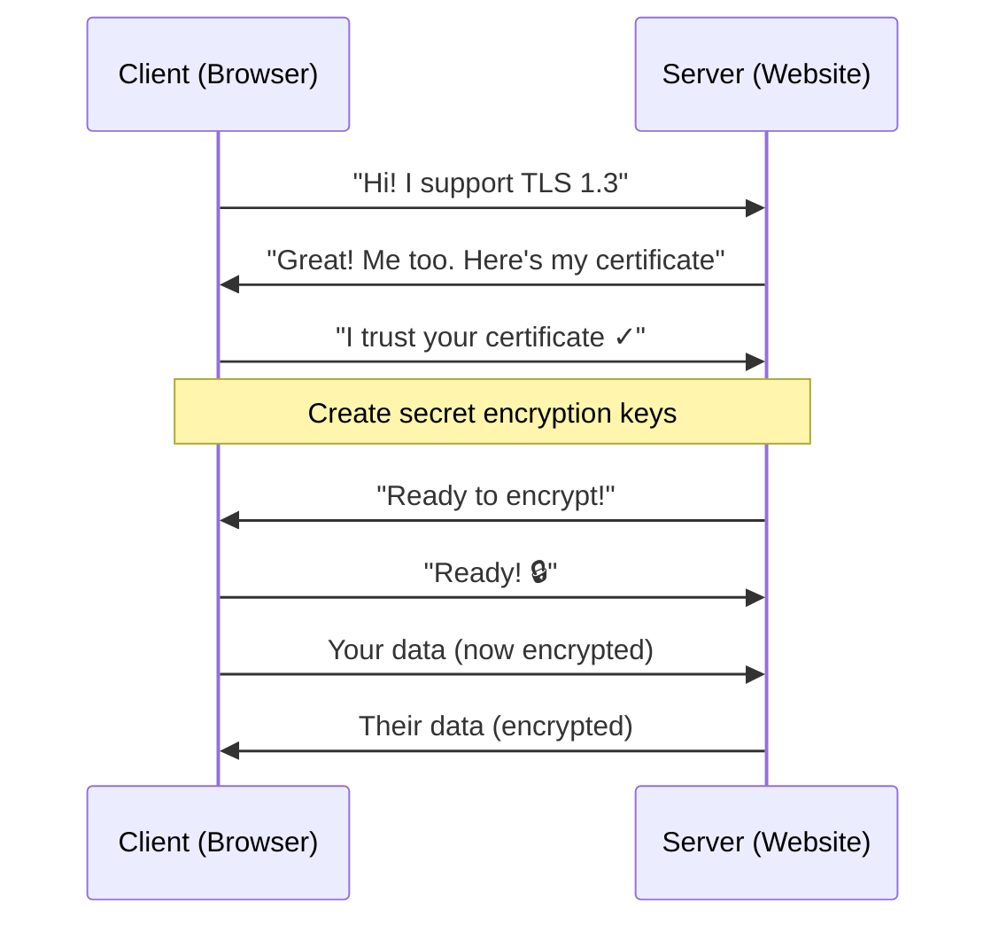

# SSL/TLS Simplified Guide

## What is SSL/TLS?
**SSL** (old) and **TLS** (new version) are protocols that **encrypt** internet traffic to keep it **private** and **safe**.

**Think of it like**: Sealed envelopes in the mail vs. open postcards.

## Main Goals
1. **Privacy** 🔒 - Encrypt data so no one can read it
2. **Trust** ✅ - Verify you're talking to the real server
3. **No Tampering** 🛡️ - Detect if someone changes your data

## TLS Versions
- **SSL 2.0/3.0**: ❌ **DEAD** (broken, don't use)
- **TLS 1.0/1.1**: ❌ **Old** (avoid)
- **TLS 1.2**: ✅ **Good** (still used)
- **TLS 1.3**: 🚀 **Best** (fastest, most secure)

## How TLS Works - The Handshake

### Simple Flow


### Step by Step

1. **Client Says Hello** 
   - "I support TLS 1.3"
   - "I can use these encryption methods"
   - Sends random number

2. **Server Says Hello Back**
   - "I'll use TLS 1.3 + this encryption"
   - Sends its certificate (like ID card)
   - Sends random number

3. **Client Checks Certificate**
   - Is this from a trusted company? (CA)
   - Does the domain match? (google.com)
   - Not expired?

4. **Create Secret Keys** 
   - Use math magic (Diffie-Hellman) 
   - Both create same secret key
   - This key encrypts ALL future data

5. **Both Say "Finished"**
   - Send encrypted test message
   - "Everything works! Let's chat securely"

## Encryption in Action

### Plain Data → Encrypted Data
```
Before TLS:    "Hi, my credit card is 1234-5678"
After TLS:     "x7K9pL2mQ8vN4jR5tY..."
```

### Record Layer
Every message gets wrapped:
```
[Type: Data] [Length: 128 bytes] [Encrypted Blob 🔒]
```

## Cipher Suites (Encryption Recipes)

**Example**: `TLS_AES_256_GCM_SHA384`
- **AES-256**: Strong encryption (256-bit key)
- **GCM**: Fast + secure mode  
- **SHA384**: Check data wasn't changed

**Modern = Good**: Uses ECDHE (ephemeral keys) for extra security

## Why TLS 1.3 is Better

| TLS 1.2 | TLS 1.3 |
|---------|---------|
| ❌ Weak ciphers allowed | ✅ Only strong ones |
| ❌ No forward secrecy by default | ✅ Always forward secrecy |
| ⏳ 2 round trips | ⚡ 1 round trip (faster) |
| 🔓 Some handshake visible | 🔒 Most encrypted |

## Common Attacks

| Attack | What It Does | Fix |
|--------|-------------|-----|
| **MITM** | Fake server intercepts | ✅ Check certificates |
| **POODLE** | Break old SSLv3 | ✅ Use TLS 1.2+ |
| **Heartbleed** | Steal server memory | ✅ Update software |
| **Weak DH** | Guess encryption keys | ✅ Use strong parameters |

## Real World Example

### HTTPS Connection
```
1. Browser → Server: GET https://bank.com
2. TLS Handshake (1 second)
3. Server → Browser: Your balance: $1,234.56 🔒
4. Browser shows: Green padlock + secure connection
```

## Quick Testing

```bash
# Test a website's TLS
openssl s_client -connect google.com:443 -tls1_3

# Check what ciphers they support
nmap --script ssl-enum-ciphers google.com
```

## Best Practices

### Server Config
```nginx
# Simple secure config
ssl_protocols TLSv1.2 TLSv1.3;
ssl_ciphers ECDHE-AESGCM:ECDHE-CHACHA20;
```

### Browser Tells Server
- **HSTS**: "Always use HTTPS here"
- **SNI**: "I want bank.com, not mail.com"

## Key Terms to Know

- **CA** (Certificate Authority): Trusted company that signs certificates
- **Public Key**: Can encrypt, everyone sees it
- **Private Key**: Can decrypt, server keeps secret
- **PFS** (Perfect Forward Secrecy): Even if private key stolen later, old sessions safe
- **Handshake**: The "hello" process to agree on encryption
