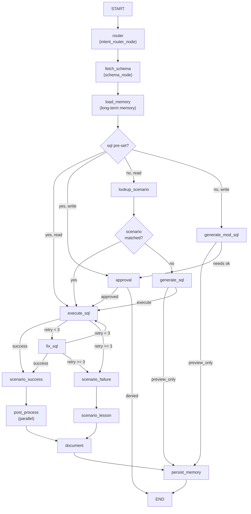
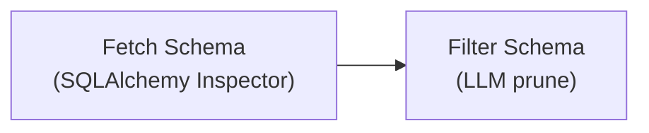
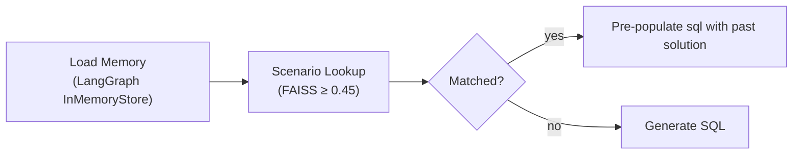
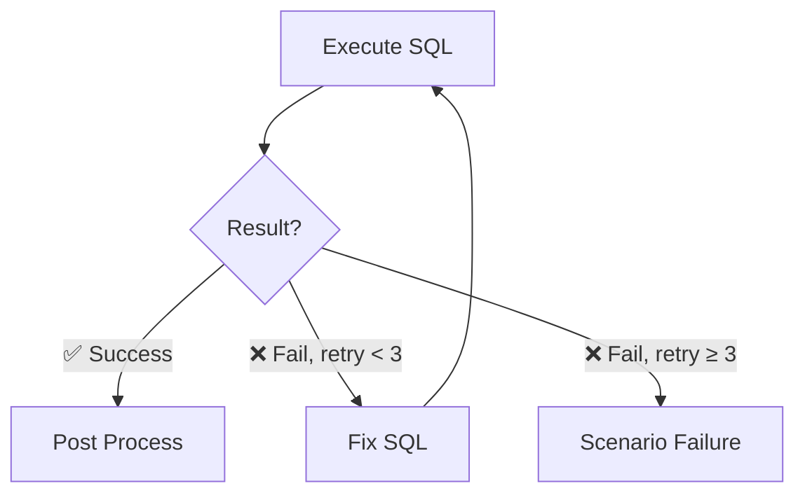
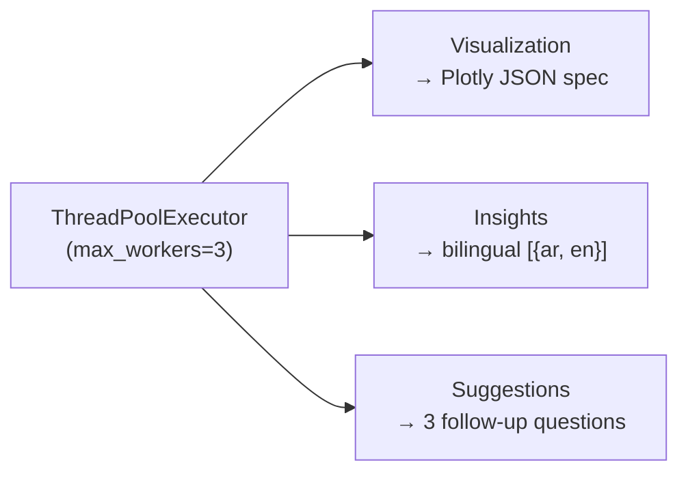
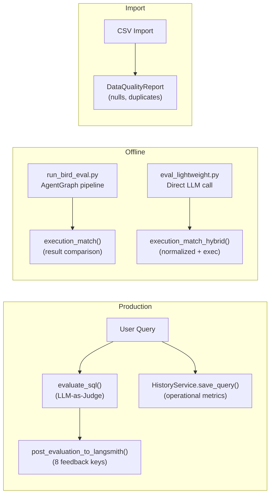

# DataPilot AI — Agent System Architecture

> [!abstract] Overview
> DataPilot AI is a **Text-to-SQL agent** that accepts a natural-language question and a database source ID, translates the question into SQL via LLM, executes it, and returns results with auto-generated visualizations, bilingual insights (Arabic/English), and follow-up suggestions.
>
> Built on a **LangGraph `StateGraph`** with ==15 nodes== connected through ~8 conditional routing points. An optional LangSmith evaluation runs asynchronously after the main graph completes.
>
> There is no answer-generation phase in the production flow: the API returns insights + visualization directly, not a natural-language answer. The `ANSWER_PROMPT` exists in `prompts.py` but is ==never invoked by any node==.

---

## Table of Contents

- [[#Key Concepts|Key Concepts]]
- [[#How It Works|How It Works]]
  - [[#1 — Entry Point|1 — Entry Point]]
  - [[#2 — Router|2 — Router]]
  - [[#3 — Schema Intelligence|3 — Schema Intelligence]]
  - [[#4 — Memory & Scenario Lookup|4 — Memory & Scenario Lookup]]
  - [[#5 — SQL Generation|5 — SQL Generation]]
  - [[#6 — Approval (Write Intents)|6 — Approval (Write Intents)]]
  - [[#7 — Execution & Retry Loop|7 — Execution & Retry Loop]]
  - [[#8 — Post Process (Parallel)|8 — Post Process (Parallel)]]
  - [[#9 — Document & Persist|9 — Document & Persist]]
  - [[#10a — Production SQL Quality (LLM-as-Judge)|10a — Production SQL Quality]]
  - [[#10b — LangSmith Observability (8 dimensions)|10b — LangSmith Observability]]
  - [[#10c — System Operational Metrics|10c — Operational Metrics]]
  - [[#10d — BIRD Text-to-SQL Benchmark|10d — BIRD Benchmark]]
  - [[#10e — Data Quality (Import)|10e — Data Quality]]
- [[#File Tree|File Tree]]
- [[#Gotchas & Design Notes|Gotchas & Design Notes]]

---

## Key Concepts

- **AgentState** (`app/agents/state/agent_state.py`) — A dataclass with ==18 fields== that every graph node reads and writes. Key fields: `question`, `source_id`, `intent` (`INQUIRE`/`ADD`/`UPDATE`/`DELETE`), `sql`, `query_results`, `visualization`, `insights`, `suggestions`, `documentation`, `retry_count`, `success`, `error`.
- **AgentGraph** (`app/agents/graph.py:823`) — The orchestrator. Constructs a `StateGraph(AgentState)`, owns the `llm`, `db_service`, `schema_service`, `checkpointer` (for `interrupt()` resume), and `store` (for long-term memory). Exposes `run()` and `resume()`.
- **FallbackLLM** (`app/llm/factory.py:19`) — Wraps multiple provider LLMs (Groq, OpenRouter, Gemini, Azure OpenAI, LiteLLM). Tries the primary provider, then falls through the list on failure. ⚠️ No timeout or circuit breaker.
- **ScenarioMemory** (`app/agents/scenario_memory.py:27`) — File-backed memory stored in `scenarios.md`. Uses a hash-based embedding (token → bucket mod 512, L2-normalized) with **FAISS** for similarity search. Threshold: `0.45`. Also injects 10 recent entries into the SQL prompt as context.
- **QueryDocument** (`app/models/schemas.py:47`) — The final output bundle: `question`, `sql`, `results`, `results_count`, `visualization`, `insights`, `suggestions`, `executed_at`. Logged at `INFO` level.

---

## How It Works

### Graph Flow



---

### 1 — Entry Point

The `POST /api/query` endpoint (`routes.py:133`) validates the `QueryRequest` (requires `question` and `source_id`), warms the connection string via `data_source_service.get_conn_string(source_id)`, generates a `thread_id`, and calls `AgentGraph.run()`. After the graph returns, the route logs the query to `query_history` (via `HistoryService`) in a `finally` block.

> [!info]- Route Details
> ```python
> # Pseudocode flow
> request = QueryRequest(question="...", source_id="...")
> conn_string = data_source_service.get_conn_string(request.source_id)
> thread_id = generate_thread_id()
> result = AgentGraph.run(request.question, request.source_id)
> # finally:
> history_service.log_query(thread_id, result)
> ```

---

### 2 — Router

**Node:** `intent_router_node` (`graph.py:277`)

Classifies the question as `INQUIRE` / `ADD` / `UPDATE` / `DELETE`.

| Step | Method |
|------|--------|
| 1 | **Regex fast path** — common read-patterns |
| 2 | **LLM fallback** — `INTENT_ROUTER_PROMPT` (20 max_tokens) |
| 3 | **Default** — `INQUIRE` on failure |

---

### 3 — Schema Intelligence



**`schema_node`** (`graph.py:348`)

1. **Fetch Schema** — Calls `fetch_schema_context()` which immediately discards the injected `schema_service` parameter and calls `get_source_schema()` from `db_service` directly. Uses SQLAlchemy `Inspector` to enumerate tables/columns, filtering Oracle system tables and MSSQL replication tables. Results are cached in `_SCHEMA_CACHE`.
2. **Filter Schema** — `filter_schema_context()` uses an LLM to prune to relevant tables — but skips entirely if the schema has ≤10 tables (`context_filtering.py:13`).

> [!warning] Dead Code
> `fetch_schema_context` ignores its `schema_service` parameter (`schema_tools.py:6`). The `SchemaService` class exists and has an async implementation but is entirely **dead code** — never called by the graph.

---

### 4 — Memory & Scenario Lookup



**`load_long_term_memory_node`** (`graph.py:773`)
- Queries LangGraph's `InMemoryStore` for up to **3 past query memories** for this `source_id`.

**`scenario_lookup_node`** (`graph.py:354`)
- Searches `ScenarioMemory` via FAISS for a resolved query with similarity ≥ `0.45`.
- If found, pre-populates `state.sql` with the past solution (skips generation).
- Always injects `scenario_context` (10 most recent entries from `scenarios.md`) regardless of match.

> [!caution] Dual Memory Systems
> `ScenarioMemory` (file-based, FAISS) and LangGraph `InMemoryStore` both inject context into the prompt, **potentially duplicating information**.

---

### 5 — SQL Generation

#### a. Generate SQL (Read Intents)

**`run_sql_node`** (`nodes/sql_node.py:40`)

Formats `SQL_GENERATION_PROMPT` (==28 rules== covering DISTINCT, ORDER BY, aggregations, Arabic questions, fuzzy table matching) with the filtered schema and question.

> [!tip] System Message
> `"raw SQL only, no markdown, no backticks"`

Output is sanitized via `_sanitize_sql()` to strip markdown fences the LLM sometimes adds anyway.

> [!example]- Arabic Handling (Rule 22)
> Arabic question handling relies entirely on one prompt rule. It contains a 4-step procedure with ==15 Arabic→English keyword mappings==. No Arabic-specific preprocessing, transliteration, or separate model.

#### b. Generate Modification SQL (Write Intents)

**`modification_sql_node`** (`graph.py:387`)

Uses intent-specific prompts:
- `SQL_ADD_PROMPT`
- `SQL_UPDATE_PROMPT`
- `SQL_DELETE_PROMPT`

Checks for mock output after generation.

---

### 6 — Approval (Write Intents)

**`approval_node`** (`graph.py:415`)

> Only reached for **write intents** (`ADD` / `UPDATE` / `DELETE`).

| Mode | Behavior |
|------|----------|
| `cli_mode` | Prompts stdin |
| API flow | Calls `interrupt()` — pauses graph execution. Route `POST /query/approval` resumes via `Command(resume=approved)` |

---

### 7 — Execution & Retry Loop



**`sql_execution_node`** (`graph.py:478`)
- Validates forbidden keywords (DDL always blocked; DML blocked for INQUIRE)
- Checks `_STALE_CACHE` for reads
- Calls `DBService.run_query()` — fetches up to **1000 rows**
- On write success, invalidates the schema cache

> [!warning] SQL Cache Issues
> `_STALE_CACHE` is a plain module dict with max-size check that evicts the **first inserted key** (no true LRU). No TTL. Write operations invalidate the schema cache but **not** the stale cache — cached read results remain valid after data changes.

**`fix_sql_node`** (`graph.py:538`)
- If execution failed and `retry_count < MAX_RETRIES` (3), constructs `SQL_FIX_PROMPT` with the error, asks the LLM to rewrite, and re-executes.
- The retry loop alternates between `fix_sql_node` and `sql_execution_node` for attempts 2+.

---

### 8 — Post Process (Parallel)

**`_post_process_node`** (`graph.py:839`)

> [!example] Parallel Execution
> Runs three tasks simultaneously via `ThreadPoolExecutor(max_workers=3)`:



| Task | Method | Details |
|------|--------|---------|
| **Visualization** | `visualization_node` | Auto-detects chart type from results → returns a Plotly JSON spec |
| **Insights** | `insight_node` | Sends first 20 rows (5 columns) to LLM via `INSIGHT_PROMPT` → returns bilingual `[{ar, en}]` array. Falls back on empty results or parse failure |
| **Suggestions** | `suggestion_node` | Sends question + SQL + schema + 3-row preview to LLM via `SUGGESTION_PROMPT` → returns exactly 3 follow-up questions. Skipped for ≤1 result row |

---

### 9 — Document & Persist

**`documentation_node`** (`graph.py:755`)
- Constructs the `QueryDocument` Pydantic model, logs it at `DEBUG` level, merges into state.

**`persist_long_term_memory_node`** (`graph.py:798`)
- Saves a query summary to LangGraph's `InMemoryStore` under namespace `(source_id, "query_history")`.

---

### 10 — Evaluation Metrics

DataPilot uses a multi-layered evaluation system spanning **production LLM-as-Judge scoring**, **observability (LangSmith)**, **operational monitoring**, **offline benchmarks**, and **data-quality checks**. Metrics are computed at multiple touchpoints: automatically after every user query, on-demand via API, and through standalone CLI scripts.



---

#### 10a — Production SQL Quality (LLM-as-Judge)

**Defined in:** `app/services/evaluation_service.py:163` — `evaluate_sql()`
**When:** Automatically after every query graph completes (`graph.py:1016`) or on-demand via `POST /api/evaluate`

The function runs **two parallel LLM calls** (via `ThreadPoolExecutor`) against the question, generated SQL, and first 5 result rows. If no LLM is available (unconfigured/error), syntax-passing queries receive a 0.5 default on correctness/completeness/efficiency.

| Metric | Type | Range | Method |
|--------|------|-------|--------|
| **syntax_valid** | Boolean (rule-based) | `true`/`false` | Regex forbids DDL/DML keywords; checks starts with `SELECT`/`WITH`/`EXPLAIN`, has `FROM`, balanced parens |
| **correctness** | Float (LLM-as-Judge) | 0.0 – 1.0 | `SQL_CORRECTNESS_PROMPT` — LLM judges if SQL correctly answers the question against results |
| **completeness** | Float (LLM-as-Judge) | 0.0 – 1.0 | Same LLM call — whether all aspects of question are covered |
| **efficiency** | Float (LLM-as-Judge) | 0.0 – 1.0 | Same LLM call — whether SQL is reasonably efficient |
| **schema_score** | Float (LLM-as-Judge) | 0.0 – 1.0 | `SCHEMA_RELEVANCE_PROMPT` — separate LLM call for table/column usage |
| **overall** | Float (weighted composite) | 0.0 – 1.0 | Weighted formula: `correctness × 0.4 + completeness × 0.25 + efficiency × 0.15 + schema_score × 0.1 + syntax_valid × 0.1` |

> [!tip] No formal pass/fail threshold
> The LLM prompts score 0.0–1.0 but define no explicit pass/fail threshold. The eval runner uses `score > 0.5` as a de facto cutoff (`run_bird_eval.py:149`).

---

#### 10b — LangSmith Observability (8 dimensions)

**Defined in:** `app/services/evaluation_service.py:240` — `post_evaluation_to_langsmith()`
**When:** After every query, if `LANGCHAIN_API_KEY` is set AND `thread_id` is a valid UUID

The same `evaluate_sql()` scores plus operational data are posted as individual feedback keys:

| LangSmith Key | Score Logic |
|---------------|-------------|
| `sql_syntax_valid` | 1.0 / 0.0 |
| `overall_quality` | Composite `overall` score (0.0 – 1.0) |
| `correctness` | LLM correctness score |
| `completeness` | LLM completeness score |
| `latency` | `min(latency / 30.0, 1.0)` — 30s normalizing baseline |
| `has_visualization` | 1.0 if visualization was generated |
| `results_count` | `min(count / 1000, 1.0)` — 1000-row normalizing baseline |
| `insight_count` | `min(count / 5, 1.0)` — 5-insight normalizing baseline |

> [!failure] Silent Skip
> If `LANGCHAIN_API_KEY` is unset, the `langsmith` import at module top-level fails silently (`_LANGSMITH_AVAILABLE = False`). No error is raised.

---

#### 10c — System Operational Metrics

**Defined in:** `app/services/history_service.py:107`/`130` — `get_stats()` / `get_metrics()`
**Exposed via:** `GET /api/system/stats` and `GET /api/system/metrics`
**When:** Every query writes a row to the `query_history` SQLite table

These track overall system health and are displayed on the frontend Dashboard and Evaluation pages:

| Metric | Calculation | Endpoint |
|--------|-------------|----------|
| **total_queries** | `COUNT(*)` from query_history | Both |
| **success_count** | `COUNT(*)` WHERE `status = 'SUCCESS'` | Both |
| **success_rate** | `(success_count / total_queries) × 100` | Both |
| **avg_latency** | `AVG(latency)` across all queries | Both |
| **total_sources** | count of registered data sources (from routes.py) | Both |
| **total_visualizations** | `COUNT(*)` WHERE `has_visualization = 1` | `/system/metrics` |
| **visualization_rate** | `(viz_count / total_queries) × 100` | `/system/metrics` |
| **trends** | Last 14 days: daily total/success/viz — `GROUP BY date(executed_at)` | `/system/metrics` |
| **visualization_breakdown** | Per `chart_type` (bar, line, pie, scatter, area, table) — `COUNT(*) GROUP BY chart_type` | `/system/metrics` |

Frontend display (`Evaluation.jsx`):
- **SQL Accuracy Index** → `success_rate` (%)
- **Latency Consistency** → `avg_latency` (seconds)
- **Instruction Following** → number of connected data sources
- Client-side **Rating (1-5 stars)** computed per metric from success rate, latency thresholds, source count, history depth

---

#### 10d — BIRD-Style Text-to-SQL Benchmark (Offline)

Two independent runners exist. Both use the same evaluation dataset (BIRD-style questions on `sales_db`, `employees_db`, `inventory_db`, plus Arabic variants) and the same **execution-match** comparison.

**Execution match** (`run_bird_eval.py:47`, `eval_lightweight.py:70`):
1. Strip `LIMIT` clauses from both generated and expected SQL
2. Execute both against the same SQLite database
3. Normalize rows (`sorted(tuple(str(v) for v in row))`)
4. Return `True` if result sets are equal, `False` otherwise

**Lightweight runner** also supports a **hybrid match** (`eval_lightweight.py:114`):
1. **Level 1** — Normalized SQL string equality (fast pre-check): lowercase, strip whitespace, collapse punctuation spacing
2. **Level 2** — Full execution match (fallback if Level 1 fails)

| Runner | File | Pipeline | Last Recorded Accuracy |
|--------|------|----------|------------------------|
| **Full Graph** | `scripts/run_bird_eval.py` | Full `AgentGraph` (router → schema → memory → SQL gen → execution → post-process) | 4.17% (1/24 — most queries hit API rate limits) |
| **Lightweight** | `scripts/eval_lightweight.py` | Direct LLM call with `SQL_GENERATION_PROMPT` — no agent graph overhead | **86.67%** (26/30 passed) |

Per-difficulty breakdown (lightweight runner):

| Difficulty | Pass Rate |
|------------|-----------|
| Easy | Highest |
| Medium | Moderate |
| Hard | Lowest (Arabic variants consistently fail — 4/4 failures) |

Latency target: average **5.5s** per query (lightweight).

> [!warning] Arabic SQL consistently underperforms
> All 4 Arabic-language questions failed in the last lightweight eval run, suggesting the prompt-level Arabic handling (rule 22 of `SQL_GENERATION_PROMPT`) is insufficient for Arabic questions with complex schema joins or filtering.

---

#### 10e — Data Quality Metrics (Import Pipeline)

**Defined in:** `app/services/import_providers/__init__.py:45` — `DataQualityReport` dataclass
**Implemented in:** `app/services/import_providers/csv_provider.py:133`
**When:** Computed during CSV file preview and import

| Metric | Type | Calculation |
|--------|------|-------------|
| **total_rows** | Integer | `len(df)` |
| **total_columns** | Integer | `len(df.columns)` |
| **missing_values** | Dict[col → count] | Per-column `df[col].isna().sum()` |
| **duplicate_rows** | Integer | `df.duplicated().sum()` |
| **has_nulls** | Boolean | `len(missing_values) > 0` |
| **has_duplicates** | Boolean | `duplicate_rows > 0` |

Stored in the `datasets` table as `quality_report_json` and exposed via `GET /api/datasets/{id}`.

---

#### Supplementary Safety & Retrieval Metrics

| Metric | Where | What It Does |
|--------|-------|--------------|
| **Forbidden Keyword Block** | `graph.py:454` `_validate_sql_keywords()` | Blocks `INSERT`/`UPDATE`/`DELETE`/`DROP`/`ALTER`/`TRUNCATE`/`GRANT`/`REVOKE`/`EXEC`. Returns error message if found. Read-only intent blocks DML; write intents only block destructive DDL. |
| **Scenario Memory Similarity** | `scenario_memory.py:27` | Cosine similarity of hash-based token embeddings (512-dim). FAISS search with threshold ≥ **0.45**. Matched score is injected into AgentState as `scenario_similarity`. |
| **LLM Query Validation** | `prompts.py:226` `VALIDATION_PROMPT` | Binary VALID/INVALID classification via LLM. Used during graph recovery loops to decide whether to re-execute or fail. |

---

#### No Formal Tests for Scoring Functions

There are **no unit tests** that verify `evaluate_sql()` returns correct scores for known inputs. The integration test suite (`final_test/test_integrations.py`) tests that the `POST /api/evaluate` endpoint returns `success: true`, but does not validate score values. The LLM-as-Judge metrics (correctness, completeness, efficiency) have **no ground-truth dataset** for calibration.

---

## File Tree

```tree
backend/app/
├── agents/
│   ├── graph.py                   # AgentGraph, all 15 node functions, routing
│   ├── prompts.py                 # 11 prompt templates (SQL gen, fix, insights, etc.)
│   ├── scenario_memory.py         # File-backed FAISS memory (scenarios.md)
│   ├── memory_backends.py         # Checkpointer + store setup
│   ├── state/
│   │   └── agent_state.py         # AgentState dataclass
│   ├── nodes/
│   │   └── sql_node.py            # run_sql_node (SELECT generation)
│   └── tools/
│       ├── schema_tools.py        # fetch_schema_context (ignores SchemaService)
│       ├── context_filtering.py   # filter_schema_context (LLM prunes schema)
│       └── sql_tool.py            # execute_sql wrapper + legacy @tool
├── api/
│   └── routes.py                  # FastAPI routes
├── llm/
│   ├── base_llm.py                # Abstract BaseLLM
│   ├── factory.py                 # FallbackLLM wrapper, get_llm() factory
│   └── providers/                 # Groq, OpenRouter, Gemini, Azure, LiteLLM, Mock
├── models/
│   └── schemas.py                 # Pydantic models
├── services/
│   ├── db_service.py              # get_engine, get_source_schema, execute_query
│   ├── data_source_service.py     # Data source CRUD, Fernet-encrypted passwords
│   ├── visualization_service.py   # Auto-detect chart type, Plotly spec generation
│   ├── evaluation_service.py      # evaluate_sql, post_evaluation_to_langsmith
│   └── history_service.py         # Query history logging

backend/scripts/
├── run_bird_eval.py             # Full AgentGraph BIRD benchmark runner
└── eval_lightweight.py          # Lightweight direct-LLM BIRD benchmark runner
```

---

## Gotchas & Design Notes

> [!danger] Critical Issues

1. **`fetch_schema_context` ignores its `schema_service` parameter** (`schema_tools.py:6`). The `SchemaService` class exists and has an async implementation but is entirely **dead code** — never called by the graph.

2. **No answer-generation node.** The `ANSWER_PROMPT` exists in `prompts.py` but no node uses it. The API returns insights + visualization directly. The frontend drives the UX.

> [!warning] Reliability Concerns

3. **Dual memory systems.** `ScenarioMemory` (file-based, FAISS) and LangGraph `InMemoryStore` both inject context into the prompt, **potentially duplicating information**.

4. **SQL cache is fragile.** `_STALE_CACHE` is a plain module dict with max-size check that evicts the first inserted key (no true LRU). **No TTL.** Write operations invalidate the schema cache but not the stale cache — cached read results remain valid after data changes.

5. **Evaluation is fire-and-forget.** There is no way to tell from the API response whether evaluation ran. If `LANGCHAIN_API_KEY` is unset, import fails silently and evaluation is skipped. The daemon thread logs failures at `WARNING` level.

6. **No formal unit tests for scoring.** The `evaluate_sql()` function has no ground-truth test cases. The LLM-as-Judge metrics (correctness, completeness, efficiency) are never validated against known-correct answers.

7. **Arabic SQL consistently fails.** All 4 Arabic questions in the BIRD benchmark fail execution match, suggesting the prompt-level Arabic handling is insufficient.

> [!bug] Code Quality

8. **`approval_store.py`** (Redis-backed TTL store) is **dead code** — never referenced by any graph node or route handler.

9. **No token budget management.** For databases with hundreds of tables, the full unfiltered schema dump can exceed context windows. The context filter skips schemas ≤10 tables, but the filter LLM call itself must still handle the full schema text.

> [!question] Design Decisions

10. **Arabic question handling** relies entirely on one prompt rule (rule 22 in `SQL_GENERATION_PROMPT`). It contains a 4-step procedure with 15 Arabic→English keyword mappings. No Arabic-specific preprocessing, transliteration, or separate model.
