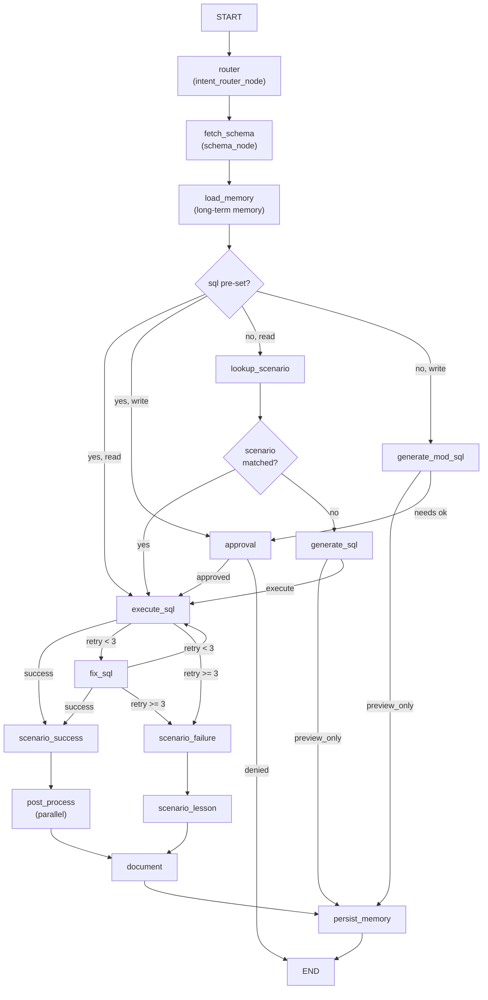
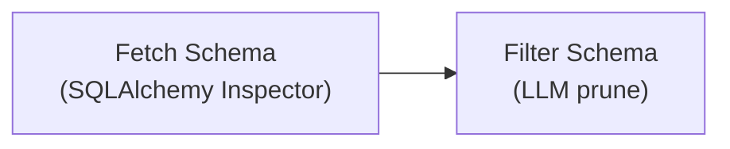
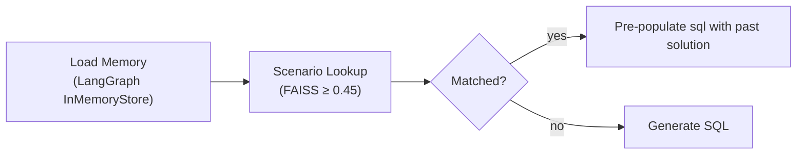
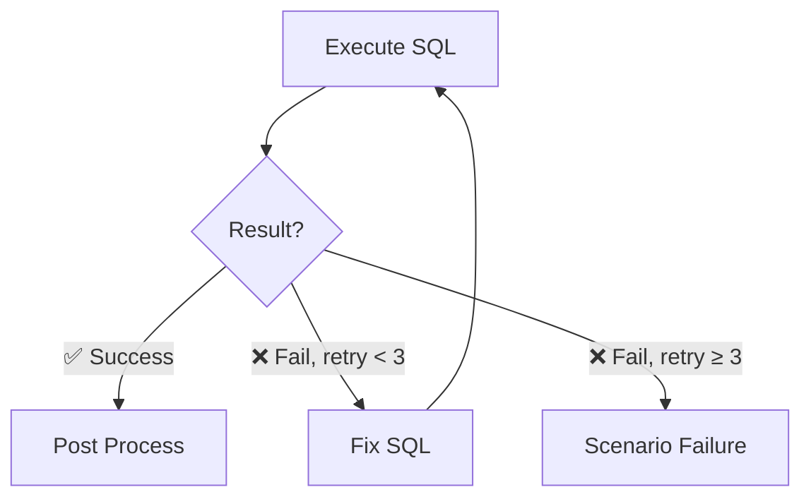
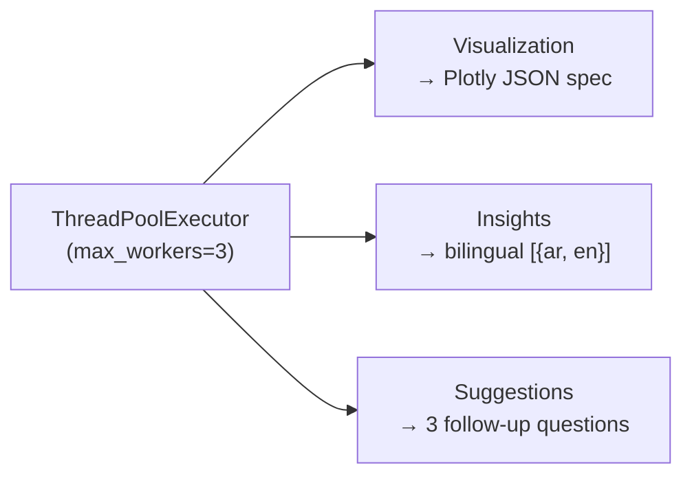

# DataPilot AI — Agent System Architecture

> [!abstract] Overview
> DataPilot AI is a **Text-to-SQL agent** that accepts a natural-language question and a database source ID, translates the question into SQL via LLM, executes it, and returns results with auto-generated visualizations, bilingual insights (Arabic/English), and follow-up suggestions.
>
> Built on a **LangGraph `StateGraph`** with ==15 nodes== connected through ~8 conditional routing points. An optional LangSmith evaluation runs asynchronously after the main graph completes.
>
> There is no answer-generation phase in the production flow: the API returns insights + visualization directly, not a natural-language answer. The `ANSWER_PROMPT` exists in `prompts.py` but is ==never invoked by any node==.

---

## Table of Contents

- [[#Key Concepts|Key Concepts]]
- [[#How It Works|How It Works]]
  - [[#1 — Entry Point|1 — Entry Point]]
  - [[#2 — Router|2 — Router]]
  - [[#3 — Schema Intelligence|3 — Schema Intelligence]]
  - [[#4 — Memory & Scenario Lookup|4 — Memory & Scenario Lookup]]
  - [[#5 — SQL Generation|5 — SQL Generation]]
  - [[#6 — Approval (Write Intents)|6 — Approval (Write Intents)]]
  - [[#7 — Execution & Retry Loop|7 — Execution & Retry Loop]]
  - [[#8 — Post Process (Parallel)|8 — Post Process (Parallel)]]
  - [[#9 — Document & Persist|9 — Document & Persist]]
  - [[#10 — Background Evaluation|10 — Background Evaluation]]
- [[#File Tree|File Tree]]
- [[#Gotchas & Design Notes|Gotchas & Design Notes]]

---

## Key Concepts

- **AgentState** (`app/agents/state/agent_state.py`) — A dataclass with ==18 fields== that every graph node reads and writes. Key fields: `question`, `source_id`, `intent` (`INQUIRE`/`ADD`/`UPDATE`/`DELETE`), `sql`, `query_results`, `visualization`, `insights`, `suggestions`, `documentation`, `retry_count`, `success`, `error`.
- **AgentGraph** (`app/agents/graph.py:823`) — The orchestrator. Constructs a `StateGraph(AgentState)`, owns the `llm`, `db_service`, `schema_service`, `checkpointer` (for `interrupt()` resume), and `store` (for long-term memory). Exposes `run()` and `resume()`.
- **FallbackLLM** (`app/llm/factory.py:19`) — Wraps multiple provider LLMs (Groq, OpenRouter, Gemini, Azure OpenAI, LiteLLM). Tries the primary provider, then falls through the list on failure. ⚠️ No timeout or circuit breaker.
- **ScenarioMemory** (`app/agents/scenario_memory.py:27`) — File-backed memory stored in `scenarios.md`. Uses a hash-based embedding (token → bucket mod 512, L2-normalized) with **FAISS** for similarity search. Threshold: `0.45`. Also injects 10 recent entries into the SQL prompt as context.
- **QueryDocument** (`app/models/schemas.py:47`) — The final output bundle: `question`, `sql`, `results`, `results_count`, `visualization`, `insights`, `suggestions`, `executed_at`. Logged at `INFO` level.

---

## How It Works

### Graph Flow



---

### 1 — Entry Point

The `POST /api/query` endpoint (`routes.py:133`) validates the `QueryRequest` (requires `question` and `source_id`), warms the connection string via `data_source_service.get_conn_string(source_id)`, generates a `thread_id`, and calls `AgentGraph.run()`. After the graph returns, the route logs the query to `query_history` (via `HistoryService`) in a `finally` block.

> [!info]- Route Details
> ```python
> # Pseudocode flow
> request = QueryRequest(question="...", source_id="...")
> conn_string = data_source_service.get_conn_string(request.source_id)
> thread_id = generate_thread_id()
> result = AgentGraph.run(request.question, request.source_id)
> # finally:
> history_service.log_query(thread_id, result)
> ```

---

### 2 — Router

**Node:** `intent_router_node` (`graph.py:277`)

Classifies the question as `INQUIRE` / `ADD` / `UPDATE` / `DELETE`.

| Step | Method |
|------|--------|
| 1 | **Regex fast path** — common read-patterns |
| 2 | **LLM fallback** — `INTENT_ROUTER_PROMPT` (20 max_tokens) |
| 3 | **Default** — `INQUIRE` on failure |

---

### 3 — Schema Intelligence



**`schema_node`** (`graph.py:348`)

1. **Fetch Schema** — Calls `fetch_schema_context()` which immediately discards the injected `schema_service` parameter and calls `get_source_schema()` from `db_service` directly. Uses SQLAlchemy `Inspector` to enumerate tables/columns, filtering Oracle system tables and MSSQL replication tables. Results are cached in `_SCHEMA_CACHE`.
2. **Filter Schema** — `filter_schema_context()` uses an LLM to prune to relevant tables — but skips entirely if the schema has ≤10 tables (`context_filtering.py:13`).

> [!warning] Dead Code
> `fetch_schema_context` ignores its `schema_service` parameter (`schema_tools.py:6`). The `SchemaService` class exists and has an async implementation but is entirely dead code — never called by the graph.

---

### 4 — Memory & Scenario Lookup



**`load_long_term_memory_node`** (`graph.py:773`)
- Queries LangGraph's `InMemoryStore` for up to **3 past query memories** for this `source_id`.

**`scenario_lookup_node`** (`graph.py:354`)
- Searches `ScenarioMemory` via FAISS for a resolved query with similarity ≥ `0.45`.
- If found, pre-populates `state.sql` with the past solution (skips generation).
- Always injects `scenario_context` (10 most recent entries from `scenarios.md`) regardless of match.

> [!caution] Dual Memory Systems
> `ScenarioMemory` (file-based, FAISS) and LangGraph `InMemoryStore` both inject context into the prompt, **potentially duplicating information**.

---

### 5 — SQL Generation

#### a. Generate SQL (Read Intents)

**`run_sql_node`** (`nodes/sql_node.py:40`)

Formats `SQL_GENERATION_PROMPT` (==28 rules== covering DISTINCT, ORDER BY, aggregations, Arabic questions, fuzzy table matching) with the filtered schema and question.

> [!tip] System Message
> `"raw SQL only, no markdown, no backticks"`

Output is sanitized via `_sanitize_sql()` to strip markdown fences the LLM sometimes adds anyway.

> [!example]- Arabic Handling (Rule 22)
> Arabic question handling relies entirely on one prompt rule. It contains a 4-step procedure with ==15 Arabic→English keyword mappings==. No Arabic-specific preprocessing, transliteration, or separate model.

#### b. Generate Modification SQL (Write Intents)

**`modification_sql_node`** (`graph.py:387`)

Uses intent-specific prompts:
- `SQL_ADD_PROMPT`
- `SQL_UPDATE_PROMPT`
- `SQL_DELETE_PROMPT`

Checks for mock output after generation.

---

### 6 — Approval (Write Intents)

**`approval_node`** (`graph.py:415`)

> Only reached for **write intents** (`ADD` / `UPDATE` / `DELETE`).

| Mode | Behavior |
|------|----------|
| `cli_mode` | Prompts stdin |
| API flow | Calls `interrupt()` — pauses graph execution. Route `POST /query/approval` resumes via `Command(resume=approved)` |

---

### 7 — Execution & Retry Loop



**`sql_execution_node`** (`graph.py:478`)
- Validates forbidden keywords (DDL always blocked; DML blocked for INQUIRE)
- Checks `_STALE_CACHE` for reads
- Calls `DBService.run_query()` — fetches up to **1000 rows**
- On write success, invalidates the schema cache

> [!warning] SQL Cache Issues
> `_STALE_CACHE` is a plain module dict with max-size check that evicts the **first inserted key** (no true LRU). No TTL. Write operations invalidate the schema cache but **not** the stale cache — cached read results remain valid after data changes.

**`fix_sql_node`** (`graph.py:538`)
- If execution failed and `retry_count < MAX_RETRIES` (3), constructs `SQL_FIX_PROMPT` with the error, asks the LLM to rewrite, and re-executes.
- The retry loop alternates between `fix_sql_node` and `sql_execution_node` for attempts 2+.

---

### 8 — Post Process (Parallel)

**`_post_process_node`** (`graph.py:839`)

> [!example] Parallel Execution
> Runs three tasks simultaneously via `ThreadPoolExecutor(max_workers=3)`:



| Task | Method | Details |
|------|--------|---------|
| **Visualization** | `visualization_node` | Auto-detects chart type from results → returns a Plotly JSON spec |
| **Insights** | `insight_node` | Sends first 20 rows (5 columns) to LLM via `INSIGHT_PROMPT` → returns bilingual `[{ar, en}]` array. Falls back on empty results or parse failure |
| **Suggestions** | `suggestion_node` | Sends question + SQL + schema + 3-row preview to LLM via `SUGGESTION_PROMPT` → returns exactly 3 follow-up questions. Skipped for ≤1 result row |

---

### 9 — Document & Persist

**`documentation_node`** (`graph.py:755`)
- Constructs the `QueryDocument` Pydantic model, logs it at `DEBUG` level, merges into state.

**`persist_long_term_memory_node`** (`graph.py:798`)
- Saves a query summary to LangGraph's `InMemoryStore` under namespace `(source_id, "query_history")`.

---

### 10 — Background Evaluation

After `graph.invoke()` returns, `AgentGraph.run()` (`graph.py:1016`) spawns a **daemon thread** that evaluates via `evaluate_sql()`:

| Check | Method |
|-------|--------|
| SQL Syntax | Regex-based keyword validation (no actual parsing) |
| SQL Correctness | LLM-as-judge — scores correctness/completeness/efficiency |
| Schema Relevance | LLM judges table/column usage |

> [!info] Scoring Formula
> `overall = correctness × 0.4 + completeness × 0.25 + efficiency × 0.15 + schema × 0.1 + syntax × 0.1`

If `LANGCHAIN_API_KEY` is set, 8 feedback keys are posted to LangSmith.

> [!failure] Fire-and-Forget
> - The daemon thread logs failures at `WARNING` level only.
> - There is no way to tell from the API response whether evaluation ran.
> - If `LANGCHAIN_API_KEY` is unset, import fails silently and evaluation is skipped entirely.

---

## File Tree

```tree
backend/app/
├── agents/
│   ├── graph.py                   # AgentGraph, all 15 node functions, routing
│   ├── prompts.py                 # 11 prompt templates (SQL gen, fix, insights, etc.)
│   ├── scenario_memory.py         # File-backed FAISS memory (scenarios.md)
│   ├── memory_backends.py         # Checkpointer + store setup
│   ├── state/
│   │   └── agent_state.py         # AgentState dataclass
│   ├── nodes/
│   │   └── sql_node.py            # run_sql_node (SELECT generation)
│   └── tools/
│       ├── schema_tools.py        # fetch_schema_context (ignores SchemaService)
│       ├── context_filtering.py   # filter_schema_context (LLM prunes schema)
│       └── sql_tool.py            # execute_sql wrapper + legacy @tool
├── api/
│   └── routes.py                  # FastAPI routes
├── llm/
│   ├── base_llm.py                # Abstract BaseLLM
│   ├── factory.py                 # FallbackLLM wrapper, get_llm() factory
│   └── providers/                 # Groq, OpenRouter, Gemini, Azure, LiteLLM, Mock
├── models/
│   └── schemas.py                 # Pydantic models
└── services/
    ├── db_service.py              # get_engine, get_source_schema, execute_query
    ├── data_source_service.py     # Data source CRUD, Fernet-encrypted passwords
    ├── visualization_service.py   # Auto-detect chart type, Plotly spec generation
    ├── evaluation_service.py      # evaluate_sql, post_evaluation_to_langsmith
    └── history_service.py         # Query history logging
```

---

## Gotchas & Design Notes

> [!danger] Critical Issues

1. **`fetch_schema_context` ignores its `schema_service` parameter** (`schema_tools.py:6`). The `SchemaService` class exists and has an async implementation but is entirely **dead code** — never called by the graph.

2. **No answer-generation node.** The `ANSWER_PROMPT` exists in `prompts.py` but no node uses it. The API returns insights + visualization directly. The frontend drives the UX.

> [!warning] Reliability Concerns

3. **Dual memory systems.** `ScenarioMemory` (file-based, FAISS) and LangGraph `InMemoryStore` both inject context into the prompt, **potentially duplicating information**.

4. **SQL cache is fragile.** `_STALE_CACHE` is a plain module dict with max-size check that evicts the first inserted key (no true LRU). **No TTL.** Write operations invalidate the schema cache but not the stale cache — cached read results remain valid after data changes.

5. **Evaluation is fire-and-forget.** There is no way to tell from the API response whether evaluation ran. If `LANGCHAIN_API_KEY` is unset, import fails silently and evaluation is skipped. The daemon thread logs failures at `WARNING` level.

> [!bug] Code Quality

6. **`approval_store.py`** (Redis-backed TTL store) is **dead code** — never referenced by any graph node or route handler.

7. **No token budget management.** For databases with hundreds of tables, the full unfiltered schema dump can exceed context windows. The context filter skips schemas ≤10 tables, but the filter LLM call itself must still handle the full schema text.

> [!question] Design Decisions

8. **Arabic question handling** relies entirely on one prompt rule (rule 22 in `SQL_GENERATION_PROMPT`). It contains a 4-step procedure with 15 Arabic→English keyword mappings. No Arabic-specific preprocessing, transliteration, or separate model.
