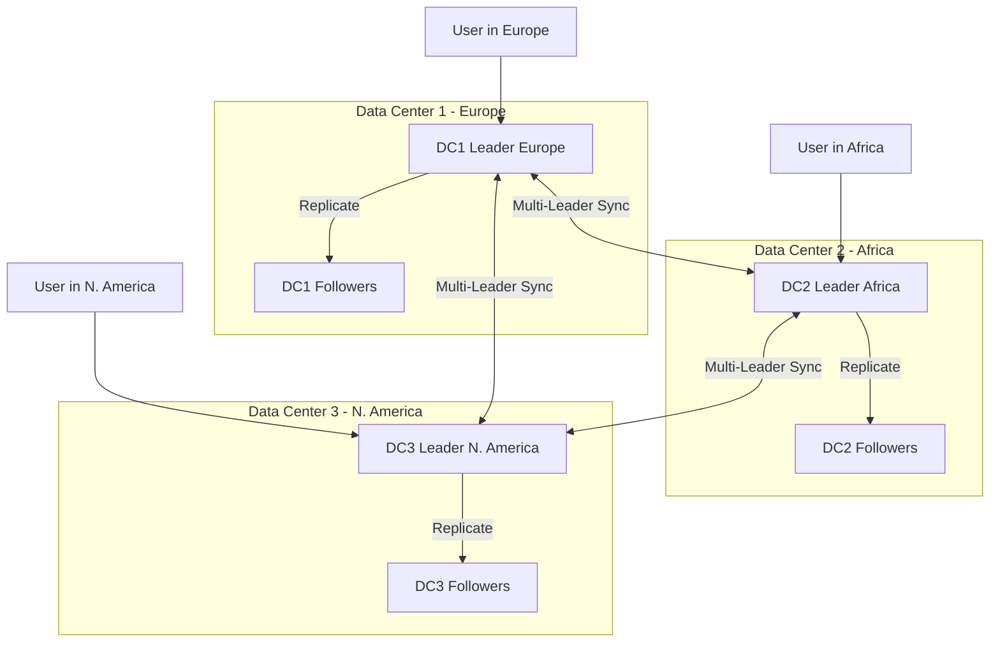
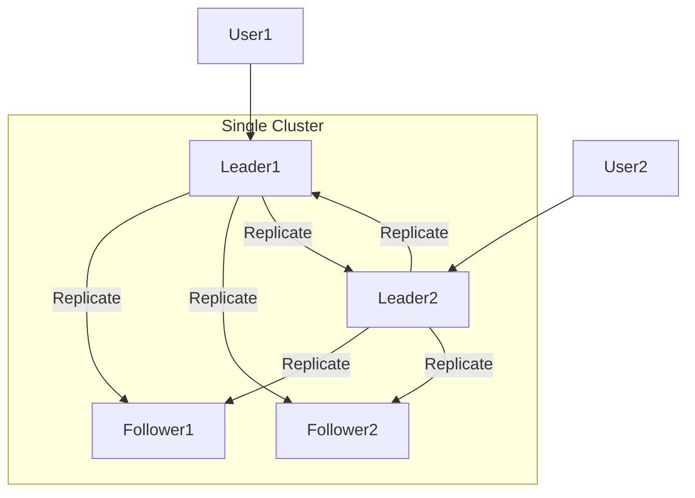
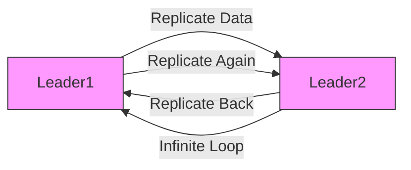
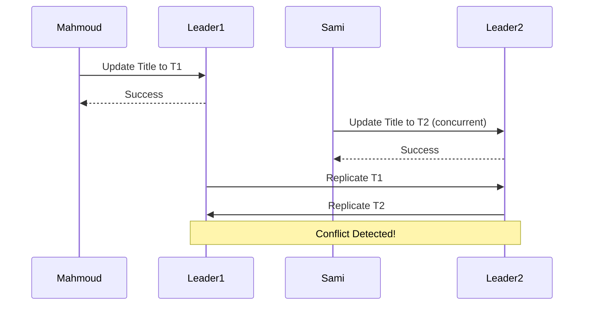

# Multi-Leader Replication in Databases
## Introduction

- **Overview**: Builds on Single-Leader Replication from the previous episode.
- **Benefits of Single-Leader Recap**:
  - Reduces **latency** for reads.
  - Increases **write throughput** by allowing reads from multiple replicas.
- **Challenges of Single-Leader Recap**:
  - Leader failure or follower failure.
- **Transition**: Now discussing **Multi-Leader Replication** as an alternative.

## What is Multi-Leader Replication?

- **Definition**: Allows **more than one leader** to handle **write operations**, unlike Single-Leader where only one leader accepts writes.
- **Key Difference**: All leaders can receive write requests; data is replicated across them.
- **Architectures**:
  - **Multi-Data Center Setup**: Each data center runs Single-Leader internally, but writes across data centers use Multi-Leader to sync data.
    - Example: User in DC1 writes to its leader; data replicates to DC2 and DC3 leaders.
  - **Single Cluster Setup**: One cluster with multiple leaders and followers; each leader replicates to all nodes.
- **Examples**:
  - Geographically distributed data centers (e.g., DC1 in Europe, DC2 in Africa, DC3 in North America).
  - Single cluster with multi-leaders for high write loads.

### Diagram: Multi-Data Center Architecture

### Diagram: Single Cluster with Multi-Leaders

## Advantages

- **Handles Write-Heavy Systems**: Multiple leaders distribute write load, solving Single-Leader's bottleneck.
- **High Availability**: No **single point of failure**; if one leader fails, others handle writes.
- **Improved Write Throughput**: More leaders process more writes efficiently.
- **Reduced Latency**: Geographically distribute leaders closer to users (e.g., Europe leader for European users).
- **Read Benefits**: Similar to Single-Leader, reads from followers reduce load.

**Summary of Advantages**:
- **Write Throughput**: ↑ (Multiple leaders handle writes).
- **High Availability**: ↑ (Redundant leaders).
- **Latency**: ↓ (Geographic distribution).

## Challenges

### Duplicate Replication (Replication Loop)

- **Issue**: Leaders replicate to each other, creating an infinite loop (e.g., Leader1 replicates to Leader2, which replicates back).
- **Solution**: Modify **replication log** to be "smart":
  - Track if a record/message has been seen before (e.g., using unique IDs or hashes).
  - Prevent re-processing duplicates.

### Diagram: Replication Loop Problem

## Write Conflicts

- **Definition**: Occurs when multiple users update the **same record concurrently** on different leaders.
- **Example**: 
  - Mahmoud updates article title to "T1" on Leader1.
  - Sami updates same article to "T2" on Leader2 at the same time.
  - Both get "success," but data inconsistency arises during replication.
- **Impact**: Data mismatches (e.g., user refreshes and sees wrong title); disastrous for financial systems.
- **Detection**: Use **Version Vector (VV)**:
  - Each replica tracks its version and others'.
  - During replication, compare versions to detect conflicts (e.g., concurrent updates).

### Diagram: Write Conflict Scenario

## Conflict Resolution Methods

### Conflict Avoidance

- **Approach**: Prevent conflicts by routing all writes for a specific record to **one leader**.
  - Use **hashing** or partitioning on document ID/key.
  - Example: All writes for Document ID X go to Leader1.
- **Pros**: No conflicts.
- **Cons**:
  - Increases **latency** (e.g., remote user must write to distant leader).
  - Limits **write throughput** (hotspots on popular keys).
  - Undermines Multi-Leader benefits.

### Last Write Win (LWW)

- **Approach**: Adopt the most recent write based on timestamp.
- **Challenges**:
  - **Sender Timestamp**: Unreliable (users can tamper).
  - **Receiver Timestamp**: Machine clocks differ (clock skew).
- **Solutions for Timing**:
  - **NTP (Network Time Protocol)**: Sync clocks via central server, but network latency affects accuracy.
  - **Logical Clocks/Hybrid**: Combine with timestamps for distributed systems (e.g., Lamport clocks).
- **Pros**: Simple.
- **Cons**: May lose data if "last" is misdetermined.

### Manual Resolution

- **Approach**: Notify user to resolve (e.g., like Git merge conflicts).
- **Example**: "Conflict in title: T1 vs T2. Choose one."
- **Pros**: User decides correct value.
- **Cons**: Requires human intervention; not scalable for high-volume systems.

### Custom Conflict Resolution

- **Approach**: Implement **business-specific logic** to auto-resolve.
  - Example: For counters, sum values; for text, merge changes.
- **Detection**: Relies on Version Vectors to identify conflicts, then apply logic.
- **Pros**: Tailored to application.
- **Cons**: Complex to implement.