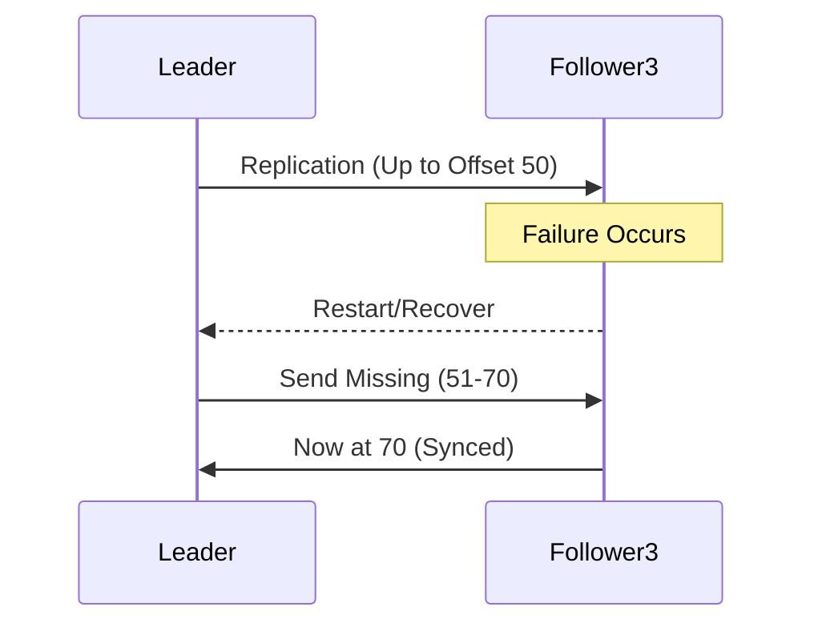

# Single-Leader Replication in Distributed Databases
Key concepts:
- [[Replication Architectures]]
- [[Single-Leader Replication]]
- [[Advantages of Single-Leader]]
- [[Follower Failures]]
- [[Leader Failures]]
- [[Distributed Consensus]]
- [[Write Throughput Problems]]
## Introduction

### Key Recap Points (Bullet Points)
- Replication: Duplicating data for availability and scalability.
- Common: Asynchronous replication leading to eventual consistency and stale reads.
- Solutions discussed before: Reading Your Own Writes, Consistent Prefix, Monotonic Writes.
## How Single-Leader Replication Works

### Write Operations
- Example: User (Mahmoud) publishes an article.
  - Request goes to server.
  - Server sends write to the database.
- In single-leader: One leader instance (e.g., DB Instance 1) handles all writes.
  - Leader receives write, inserts data, and replicates to followers (e.g., Instances 2 and 3).
  - Replication can be synchronous or asynchronous (mostly async in apps).
- Followers are read replicas; only leader accepts writes.

### Read Operations
- Reads can go to any instance (leader or followers) for load balancing.
- Geographic distribution: Place replicas closer to users to reduce latency.
## Advantages of Single-Leader Replication

### Bullet-Point Benefits
- **Improved Read Throughput**: Distribute reads across multiple followers; e.g., one user reads from Instance 3, another from Instance 2, or even the leader.
- **Fault Tolerance**: Data duplicated across replicas; if one fails, data remains available elsewhere.
- **Geographic Scalability**: Replicas can be placed regionally for low-latency reads.
- **Simplicity**: Clear write path; avoids complex conflict resolution.

### Comparison to No Replication
| Aspect               | No Replication            | Single-Leader Replication            |
| -------------------- | ------------------------- | ------------------------------------ |
| **Read Scalability** | Limited to single DB      | Distributed across followers         |
| **Fault Tolerance**  | Single point of failure   | Data survives instance failures      |
| **Write Handling**   | Simple, but no redundancy | All writes to leader, then replicate |
| **Consistency**      | Strong by default         | Eventual (with async)                |

## Failure Scenarios

### Follower Failure Challenges

#### Description
- If a follower (e.g., Instance 3) fails (hardware, power, etc.), system must recover.
- Uses replication log (stored on disk) to track offsets.

#### Recovery Process (Bullet Points)
- Leader knows each follower's offset (e.g., Leader at 70, Follower 2 at 70 (up-to-date), Follower 3 at 50).
- On restart: Leader sends missing data (e.g., offsets 51-70) to the failed follower.
- Common in daily operations; followers fail and recover frequently.

#### Diagram: Follower Recovery

### Leader Failure Challenges

#### Description
- More complex; if leader fails, writes stop until resolved.
- Challenges: Detecting failure, electing new leader, handling data integrity.

#### Bullet-Point Challenges
- **Detection**: How to know leader failed? Use heartbeats (periodic signals); if no heartbeat for e.g., 1 minute, assume failure.
  - Issue: Could be network latency, not actual failure (e.g., Follower 3 detects failure, but Follower 2 sees network delay).
- **Data Integrity**: New leader might be behind (e.g., at offset 50 vs. old leader's 70); lost records (e.g., financial data).
- **Split Brain**: Old leader recovers while new one is elected; now two leaders accepting writes, causing data inconsistencies.
- **Election**: Need consensus to choose new leader without conflicts.
## Distributed Consensus Overview

### Definition
- In distributed systems, nodes must agree on decisions (e.g., who is leader, failure detection).
- Ensures consensus via protocols (e.g., Raft, Paxos) for majority agreement.
### Bullet-Point Importance
- Solves leader failure issues: Agreement on failure, new leader election.
- Handles split brain: Decide which leader prevails.
- Criteria: Majority vote, quorums to avoid inconsistencies.
- Future topic: Detailed in separate video.

### Comparison to Single Node
| Aspect               | Single Node  | Distributed Consensus        |
| -------------------- | ------------ | ---------------------------- |
| **Decision Making**  | Solo         | Majority agreement           |
| **Failure Handling** | Total outage | Elect new leader             |
| **Complexity**       | Low          | High (protocols needed)      |
| **Use Case**         | Simple apps  | Scalable, fault-tolerant DBs |

## Write-Throughput Problem

### Description
- Single-leader bottleneck: All writes go to one instance.
- In write-heavy systems (high write ops), leader can overload, cause performance bottlenecks or failures.

### Bullet-Point Issues
- High write volume overwhelms leader.
- No write scalability; reads scale, but writes don't.
- Solution Teased: Multi-leader replication to distribute writes.
## Summary
Single-leader replication offers read scalability and fault tolerance but faces challenges with failures (especially leader) and write throughput. Distributed consensus is key to resolving failures. Teases multi-leader for write-heavy scenarios.
