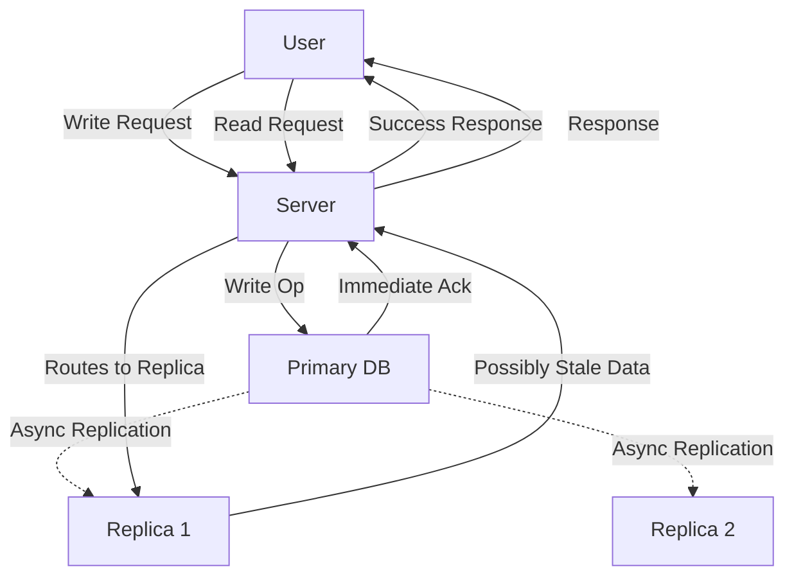
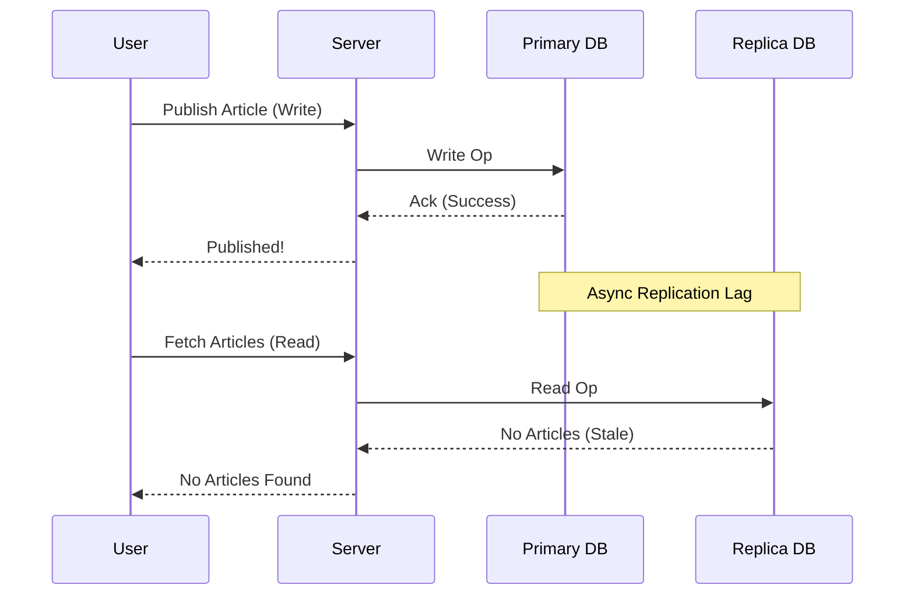

Key concepts:
- [[Replication Types]] (Synchronous vs. Asynchronous)
- [[Eventual Consistency]]
- [[Stale Reads Problem]]
- Solutions: [[Reading Your Own Writes]], [[Consistent Prefix]], [[Monotonic Writes]]

## Introduction to Replication and Stale Reads

### Key Points
- **Replication Basics**: Duplicating data across DB instances for fault tolerance, scalability, and availability.
  - Benefits: High availability, read scalability, disaster recovery.
  - Types:
    - Synchronous: Waits for all replicas to ack writes (strong consistency, but high latency).
    - Asynchronous: Confirms write immediately, replicates later (common in apps for speed, but risks inconsistencies).
- **Eventual Consistency**: Replicas eventually converge, but temporary lags cause issues like stale reads.
- **Stale Reads Overview**: Reading outdated data from lagging replicas after a write.

### Diagram: Asynchronous Replication Flow

### Study Questions
- Why is asynchronous replication preferred in most apps?
- How does eventual consistency introduce dangers?

## The Problem of Stale Reads

### Definition
Stale reads occur when a read fetches outdated data from a replica not yet updated via asynchronous replication.

### Causes (Bullet Points)
- Replication lag due to network delays or partitions.
- Load balancing routing reads to arbitrary replicas.
- No immediate global synchronization.

### Implications
- User confusion: Actions seem to fail (e.g., "published" item not visible).
- Illogical behavior: Breaks expected write-then-read consistency.

### Example: Article Publishing
- User publishes article (write to primary DB).
- Server confirms success immediately.
- User fetches articles (read from replica)—article missing if lag.

### Diagram: Stale Read Scenario

### Study Questions
- Compare stale reads to other anomalies like lost updates.
- In what scenarios are stale reads acceptable?

## Solutions to Stale Reads

Mitigate with client-centric guarantees, avoiding full strong consistency for performance.

### 1. Reading Your Own Writes (RYW)

#### Definition
Ensures a client's reads after a write reflect that write (or later versions) by routing to the write's DB.

#### Bullet-Point Benefits
- Improves user experience (feels consistent).
- No global sync needed; session-local.
- Prevents self-stale reads.

#### Examples
- Profile update on LinkedIn/Facebook: After edit, refresh shows new data (routes to same DB).
- Article publishing: Read routes back to write DB.

#### Implementation Methods
- **Session Consistency**:
  - Track session to identify write DB.
  - Route subsequent reads to that instance.
- **Timestamp Threshold**:
  - Set max staleness (e.g., 100 seconds).
  - Check replicas: If data < threshold old, use them; else, use write DB.

### 2. Consistent Prefix

#### Definition
Guarantees reads see a prefix of the ordered writes (no gaps/out-of-order), preserving causal dependencies.

#### Bullet-Point Benefits
- Maintains logical order in sequences (e.g., conversations).
- Handles partitioning issues.
- Avoids "future" events without priors.

#### Examples
- Chat App: Mahmoud sends "How are you?" (order 1, partition 1); Ahmed replies "I'm fine" (order 2, partition 2).
  - Problem: Read shows reply before question due to lag.
  - Causal Dependency: Reply depends on question.

#### Implementation
- Route dependent writes (e.g., replies) to the same partition.
- Use app features like "Reply" to link and co-locate messages.
### 3. Monotonic Writes

#### Definition
Ensures client writes apply in issued order; reads don't show regressions (e.g., no reverse order).

#### Bullet-Point Benefits
- Preserves sequence integrity.
- Avoids anomalies in refreshes.
- Complements monotonic reads.

#### Examples
- Group Chat: Mahmoud sends msg1, msg2, msg3.
  - Replicas lag: One has all, one has 1-2, one has 1.
  - Problem: "Get Latest" hits different replicas → sees 3, then 2, then 1 (reverse).

#### Implementation
- Read from same replica consistently.
- **Hashing Function**: Use group ID modulo replicas (e.g., ID % 3) to pin to one replica.
- Other: Timestamps, vector clocks, sequence numbers.
## Comparisons

### Table: Comparing Solutions
| Aspect                    | Reading Your Own Writes            | Consistent Prefix                   | Monotonic Writes                           |
| ------------------------- | ---------------------------------- | ----------------------------------- | ------------------------------------------ |
| **Focus**                 | Self-consistency (see own updates) | Causal order (no gaps/out-of-order) | Write sequence (no regressions)            |
| **Key Problem Addressed** | Stale self-reads after write       | Out-of-order dependent events       | Reverse or incomplete sequences on refresh |
| **Implementation**        | Session tracking, timestamps       | Route dependents to same partition  | Hash routing, clocks/sequences             |
| **Use Case**              | Profile edits, publishing          | Chats with replies                  | Group messaging, logs                      |
| **Strength**              | Simple, session-local              | Preserves causality                 | Ensures monotonic progress                 |
| **Weakness**              | Doesn't handle multi-user order    | Requires dependency awareness       | May overload single replica                |
| **Relation to Others**    | Often base for sessions            | Builds on causality for prefixes    | Complements with order enforcement         |

### Bullet-Point Similarities
- All mitigate stale reads without full sync.
- Client/session-oriented.
- Used in systems like Cassandra, MongoDB.

### Bullet-Point Differences
- RYW: Individual user focus.
- Consistent Prefix: Inter-event dependencies.
- Monotonic Writes: Sequential integrity across reads.
