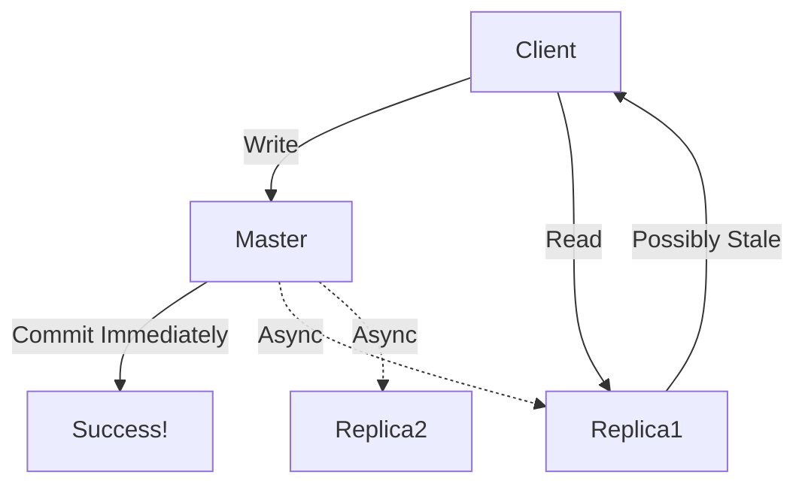
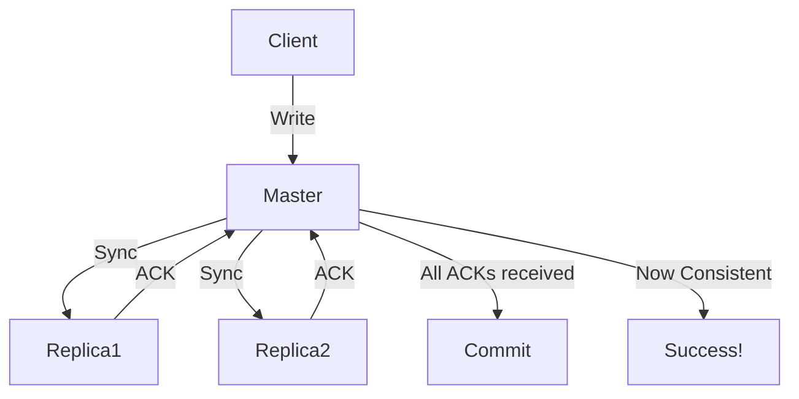

# CAP Theorem Explained

## Overview

**CAP Theorem** (Consistency, Availability, Partition Tolerance) is fundamental for **distributed systems** design. It forces trade-offs when building networked systems.

> **Key Insight**: In distributed systems, you can't have all three CAP properties simultaneously during network partitions.

## Core Properties

### 1. Consistency (Read Consistency)
- **Definition**: After a write, **all reads** immediately see the latest value
- **Black box view**: Write → Read = Same result (everywhere)
- **Not ACID consistency** - This is about **read-after-write** guarantees, not data integrity constraints

#### Example of Inconsistency
```
Master Node (Source of Truth)
    ↓ Write "User updated profile"
    ↓ Commit immediately → "Write successful"
    ↓ Async replication to replicas (delay)
    ↓ Read from replica → Old data!
```

**Real-world**: 2006 YouTube profile updates - users couldn't see their changes immediately due to replica lag.

### 2. Availability
- **Definition**: **Every request** (read/write) receives a response
- **Even if**: Response contains stale/old data
- **Trade-off**: Prioritize responsiveness over freshness

#### Why Caches Favor Availability
- **Cache hit**: Fast response (possibly stale)
- **Cache miss**: Still responds (fetches fresh data)
- **Never fails** requests, but data might be outdated

### 3. Partition Tolerance
- **Definition**: System continues operating despite **network partitions**
- **Network partition**: Nodes cannot communicate (failures, latency, packet loss)
- **NOT database partitioning** - This is about **network failures**

#### Partition Tolerance Choices
1. **Tolerate partitions**: Design for network failures (distributed systems)
2. **Reject partitions**: Single node, no network dependency
3. **Ignore partitions**: Assume perfect network (rarely realistic)

> **Reality**: Cloud/virtualized environments = **always partition tolerant**

## The CAP Trade-off

**Theorem Statement**: In a partition-tolerant system, you can only guarantee **2 out of 3**:

```
Partition Tolerance (P) + Network Reality
    ↓
Choose ONE:
├── CP: Consistent + Partition Tolerant → May sacrifice Availability
└── AP: Available + Partition Tolerant → May sacrifice Consistency
```

### Single Node Exception
```
Single beefy machine (No network)
├── Consistent ✅
├── Available ✅
└── Not Partition Tolerant ❌ (no partitions to tolerate)
```

## System Design Choices

### AP System (Available + Partition Tolerant)


**Characteristics**:
- **Writes succeed immediately**
- **Reads may return stale data**
- **Background replication**
- **High availability, eventual consistency**

**Use Cases**: Social media feeds, caching layers, YouTube (2006)

### CP System (Consistent + Partition Tolerant)


**Characteristics**:
- **Writes block until all replicas acknowledge**
- **Reads always consistent**
- **May fail writes during partitions**
- **Or retry indefinitely (high latency)**

**Availability Reality**: 
- **Synchronous writes** = High latency
- **Network failure** = Write failures or retries
- **"Eventually available"** = Unacceptable latency

### CA System (Consistent + Available)
- **Single node** systems
- **No network** = No partitions
- **ACID databases** on single beefy hardware
- **Not realistic** for modern distributed systems

## Implementation Examples

### AP Implementation
```python
# Pseudo-code for AP system
def write_data(data):
    # Write to master immediately
    master.commit(data)
    return "Write successful"  # Available!
    
    # Async background replication
    async def replicate():
        replica1.update(data)
        replica2.update(data)
    
def read_data():
    # Read from any replica (might be stale)
    return replica1.get()  # Available, possibly inconsistent
```

### CP Implementation
```python
# Pseudo-code for CP system
def write_data(data):
    # Synchronous replication
    master.write_to_wal(data)
    
    replicas = [replica1, replica2]
    for replica in replicas:
        while not replica.acknowledge(data):
            retry()  # Block until success
    
    master.commit()  # Now consistent
    return "Write successful"

def read_data():
    # Always consistent (post-commit)
    return master.get()  # Or synchronized replicas
```

## Eric Brewer's Clarification (12 Years Later)

**Original CAP**: Strict "pick 2" interpretation
**Refined View**: 
- **Latency matters**: High-latency "availability" isn't real availability
- **Retries during partitions** = Effectively unavailable
- **CAP is a spectrum**, not binary choices

> "Eventually available" is as meaningless as "eventually consistent"

## ACID vs CAP Consistency

| Aspect | ACID Consistency | CAP Consistency |
|--------|------------------|-----------------|
| **Focus** | Data integrity constraints | Read-after-write guarantees |
| **Examples** | Unique keys, foreign key cascades, sum validations | Seeing your latest write |
| **Tolerance** | **Cannot tolerate** violations | Can tolerate stale reads |
| **Instagram Example** | Likes count = actual likes | Profile update visible immediately |

### Instagram Data Consistency (ACID)
```
Table: pictures (id, likes_count)
Table: likes (picture_id, user_id)

Constraint: SUM(likes) == likes_count
Violation: Data corruption! (Banking = disaster)
```

### Instagram Read Consistency (CAP)
```
User updates profile → Refresh → Sees old profile
Tolerance: "3.2M vs 3.1M likes? Close enough"
```

## Practical Implications

### When to Choose AP
- **User experience critical**: Social feeds, e-commerce
- **Stale data acceptable**: Analytics, recommendations
- **Caching layers**: Redis, Memcached
- **High traffic**: Availability > Perfect consistency

### When to Choose CP
- **Financial systems**: Banking transactions
- **Inventory**: Cannot oversell stock
- **Critical data**: Medical records
- **Strong consistency required**

### Single Node Reality
- **ACID databases**: PostgreSQL, MySQL (single instance)
- **Beefy hardware**: 64 cores, 3TB RAM
- **Storage arrays**: RAID/NAS may still have internal CAP trade-offs

## Key Takeaways

1. **CAP forces trade-offs** - You can't have it all in distributed systems
2. **Partition tolerance is reality** - Modern systems must handle network failures
3. **Consistency ≠ ACID** - CAP is about read consistency across nodes
4. **Availability has latency limits** - Slow responses aren't truly available
5. **Start with business requirements**:
   - **Money involved?** → CP
   - **User experience?** → AP
   - **Single node viable?** → CA

> **Pro Tip**: Simple AP systems often outperform complex CP systems for most web applications. Choose consistency only when data integrity is critical.