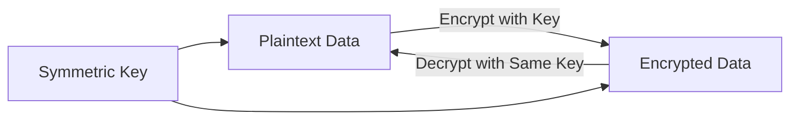

# Encryption Study Notes

## Symmetric Encryption

Symmetric encryption uses a single key to both encrypt and decrypt data. The same key is used for both processes, making it simple but requiring secure key management.

- **Process**:
    - **Input**: Text, images, PDF files, HTTP GET requests, or any data.
    - **Encryption**: Using a symmetric key, the input data is transformed into unreadable "garbage" data.
    - **Decryption**: The same symmetric key is used to convert the encrypted data back to its original form.
- **Key Concept**: The same key encrypts and decrypts, hence the term "symmetric."

**Diagram**: Symmetric Encryption Process

## Asymmetric Encryption

Asymmetric encryption uses a pair of keys (public and private) for encryption and decryption. It is often used for secure communication between two parties but is not covered in detail here.

- **Key Difference**: Unlike symmetric encryption, it uses two different keys, making it suitable for networked environments.

## Applications of Encryption

Encryption is widely used to secure data in various contexts:

- **Passwords**: Stored encrypted in databases.
- **Communication**: Secured via HTTPS using Transport Layer Security (TLS).
- **General Principle**: Encrypt everything possible to protect data integrity and confidentiality.

**Reference**: For more on TLS, see the _TLS Playlist_ for details on Transport Layer Security and its importance.

## Challenges with Encryption

Despite its widespread use, encryption has limitations, particularly when data needs to be processed or analyzed.

### Why Encryption Can't Always Be Used

- **Data Operations**: Certain operations require data to be in plaintext (unencrypted).
    - **Example**: Database queries (e.g., `SELECT * FROM table WHERE id = 7`) cannot be performed on encrypted data because the encrypted values are unreadable.
- **Current Solutions**:
    - Store data unencrypted on disk (common practice but less secure).
    - Store data encrypted but decrypt it for queries, which introduces key management challenges.
    - Re-encrypt data after processing, adding overhead.

### Real-World Examples

- **Social Media Platforms (e.g., Twitter/X)**:
    - Data is typically stored unencrypted to enable analytics, trends, and recommendation systems.
    - Constant encryption/decryption is impractical due to performance overhead.
- **General Issue**: Any agent (application, backend server, etc.) processing data must decrypt it, exposing the plaintext temporarily.

**Diagram**: Data Processing Challenge

## TLS Termination and Layer 7 Load Balancers

TLS termination is a process where encrypted traffic (HTTPS) is decrypted at a load balancer or reverse proxy to inspect and route it.

- **How It Works**:
    - The load balancer presents its own certificate to the client.
    - It decrypts the incoming traffic (e.g., GET/POST requests, paths).
    - Based on the decrypted data, it applies routing rules (e.g., directing `/pictures` to one server and `/comments` to another).
- **Purpose**: Enables microservices logic and efficient traffic routing.
- **Downside**: Decrypting traffic at the load balancer exposes data, raising privacy concerns.

**Diagram**: TLS Termination in Layer 7 Load Balancer

### Controversy Around TLS Termination

- **Critics** (e.g., Steve Gibson):
    - Oppose decrypting traffic at layer 7 load balancers or reverse proxies.
    - Concerned about sharing private keys/certificates with third-party services (e.g., DNS protectors).
    - Prefer end-to-end encryption without intermediaries inspecting data.
- **Alternative**: Layer 4 load balancers.
    - Operate at the transport layer, forwarding traffic without decryption.
    - More secure but less flexible (no advanced routing, pooling, or microservices logic).

**Trade-Off**:

- **Layer 7**: More efficient, supports advanced routing, but requires decryption.
- **Layer 4**: More secure, streams data to the backend without decryption, but less feature-rich.

## Key Takeaways

- **Symmetric Encryption**: Simple, uses one key for encryption/decryption, but limited by key management.
- **Data Processing**: Requires plaintext, making full encryption challenging for databases and analytics.
- **TLS Termination**: Essential for layer 7 load balancing but controversial due to privacy concerns.
- **Layer 4 vs. Layer 7**: Layer 4 is more secure but less flexible; layer 7 enables advanced functionality at the cost of decryption.

