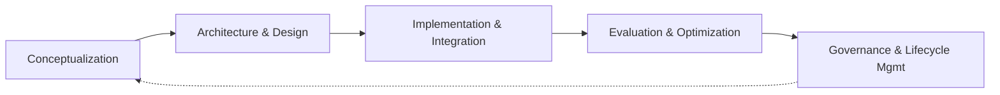

> The future belongs to organizations that can harness AI not as a replacement for human intelligence, but as an amplification of it.
> — Andrew Ng

## What Is an Agent?

An **AI agent** is a computational system that **perceives** its environment, maintains **persistent state**, **reasons** strategically about objectives, and **adapts** behavior based on experience. Unlike traditional software (deterministic input → output), agents operate continuously in dynamic environments.

### Key Traits
- **Autonomy** — operates without continuous human guidance
- **Persistence** — maintains state and memory across interactions
- **Reactivity** — responds to environmental changes in real time
- **Proactiveness** — initiates actions based on internal goals
- **Adaptability** — learns from experience, modifies behavior
- **Goal-orientation** — pursues objectives via planning and reasoning

> [!cite] Franklin & Graesser (1997)
> An autonomous agent is a system situated within and a part of an environment that senses that environment and acts on it, over time, in pursuit of its own agenda.

### Historical Evolution
| Era | Key Development |
|-----|----------------|
| 1970s–80s | **Rule-based expert systems** (MYCIN) — deterministic but brittle |
| 1990s | **Classical ML** (decision trees, SVMs) — adaptive but stateless |
| 2010s | **Deep learning** — human-level perception, but reactive |
| 2020s+ | **LLMs + transformers** — emergent reasoning, few-shot learning; limited by context size, memory, tool integration |

Modern frameworks (LangGraph, CrewAI, AutoGen) enable planning, decision-making, and multi-step goals in open-ended environments.

---

## Architecture of Agents

### The Cognitive Loop

A continuous cycle: **Perception → Reasoning → Planning → Action → Learning**

```python
# 1. Perception
def perceive_input(user_message, context):
    return {"message": user_message, "timestamp": datetime.now(), ...}

# 2. Reasoning
def reason_about_intent(perception_data):
    intent = classify_intent(perception_data["message"])
    ...

# 3. Planning
def create_action_plan(reasoning_result):
    if reasoning_result["intent"] == "billing_issue":
        return ["fetch_account_details", "analyze_billing_history", ...]

# 4. Action
def execute_action(action_plan, context):
    for action in action_plan:
        result = billing_api.get_account(context["user_id"])
        ...

# 5. Learning
def learn_from_outcome(interaction_data, user_feedback):
    if calculate_success(user_feedback) < 0.7:
        flag_for_model_improvement(interaction_data)
```

### Communication Patterns

The **cognition core** mediates between five foundational layers:
- **Profile/Persona** — tone, behavioral constraints, system alignment
- **Tool use/Action interface** — connects reasoning to external APIs, tools
- **Planning/Feedback** — forward-looking strategy + backward-looking correction
- **Knowledge/Memory** — short-term, long-term, and episodic recall
- **Reasoning/Evaluation** — distributed validators (safety, accuracy, domain checks)

> [!important] Production concerns
> Cognition core needs redundancy, health checks, fallback nodes. 
> Tool layer needs retry logic, observability pipelines. 
> Memory needs caching strategies, TTL, ANN search to balance depth vs speed.

### Agent Brain — Perception-to-Action Patterns

| Pattern | Behavior | State | Use Case |
|---------|----------|-------|----------|
| **Reactive** | Stimulus → response (e.g. thermostat) | Stateless | Emergency systems, game NPCs, smart home sensors |
| **Deliberative** | Sense → Model → Plan → Act | Internal world model | Travel planning, autonomous navigation, financial analysis |
| **Hybrid** | Reactive + Deliberative layers | Both | Warehouse robots, autonomous vehicles, cybersecurity |

> [!tip] Hybrid routing
> Urgent inputs go to reactive layer (obstacle avoidance); strategic inputs go to deliberative layer (route optimization). Communication between layers is bidirectional.

---

## Interoperability Protocols

### MCP (Model Context Protocol)
Standardizes agent ↔ tool interactions via three operations:
1. **Capability description** — tools register metadata (inputs, outputs, constraints) in machine-readable format
2. **Discovery** — agents query available tools at runtime
3. **Invocation** — standardized call interface

```json
{
  "name": "SearchFlights",
  "input_schema": {
    "properties": {
      "origin": {"type": "string"},
      "destination": {"type": "string"}
    },
    "required": ["origin", "destination"]
  }
}
```

### A2A (Agent-to-Agent) Protocols
Peer-level collaboration — agents exchange structured packets containing:
- **State** — contextual data and intermediate results
- **Role** — functional designations within the workflow
- **Status** — lifecycle updates (success, failure, readiness)

Enables distributed task execution, async coordination, fault recovery. Native support in CrewAI, LangGraph; message layers via NATS, RabbitMQ, Kafka.

> [!note] Contract design
> Use OpenAPI, Protocol Buffers, or JSON Schema with explicit versioning for backward compatibility.

---

## Agent Development Lifecycle (ADL)



1. **Conceptualization & Requirements** — define goals, sub-goals, success metrics (performance, alignment, trust)
2. **Architecture & Design** — choose cognitive model (ReAct, BDI, plan-and-execute), memory strategy, communication flows, security. Use ADRs to document decisions.
3. **Implementation & Integration** — build with LangChain, CrewAI, LangGraph; wire reasoning, perception, planning, memory modules. CI/CD pipelines test reasoning chains, tool calls.
4. **Evaluation & Optimization** — measure task completion, response time, user satisfaction, fallback frequency. Feed insights back into architecture.
5. **Governance & Lifecycle** — monitoring (LangSmith, Prometheus), log auditing, model updating, security patching, compliance, ethical oversight.

---

## Agent Interaction Paradigms (5 Levels)

| Level | Type | Autonomy | Context | Decision Authority | Example |
|-------|------|----------|---------|-------------------|---------|
| 1 | **Direct LLM** | Stateless | None | Human-led | One-off Q&A, creative generation |
| 2 | **Proxy Agent** | Low | Light context | Instruction-based | API parameterization, semantic translation |
| 3 | **Assistant System** | Medium | Session-based | User-guided | Digital assistants, tool-augmented chat |
| 4 | **Autonomous Agent** | High | Persistent memory | Partial autonomy | Task planning, research assistants |
| 5 | **Multi-Agent System** | Very High | Shared + distributed | Distributed | Supply chains, orchestration, simulations |

### Level 1 — Direct LLM
Stateless prompt → response. No memory. Good for factual Q&A, one-shot generation.

### Level 2 — Proxy Agent
Semantic intermediary — transforms unstructured natural language into structured backend commands. Mitigates prompt injection. Used in financial services, healthcare triage, customer service.

### Level 3 — Assistant System
Session memory + tool invocation + user-in-the-loop. Retains context across turns. Ideal for enterprise digital assistants, customer service bots.

### Level 4 — Autonomous Agent
SMPA loop (Sense-Model-Plan-Act). Independent problem-solving over long horizons. Persists preferences, adapts to failures. Built on LangGraph, LangChain, CrewAI. KPIs: completion rate, response time, escalation rate, user satisfaction.

### Level 5 — Multi-Agent System (MAS)
Distributed specialist agents coordinate via pub-sub, shared memory, or task dispatch. Fault tolerance via health checks, watchdogs, redundancy. Ideal for enterprise orchestration, supply chains, scientific research.

---

## Agentic AI Progression Framework

| Level | Name | Capability |
|-------|------|-----------|
| 0 | **Manual Operations** | No intelligence; all human-driven |
| 1 | **Reactive Agents** | Rule-based, stateless, deterministic |
| 2 | **Tool-Using Agents** | Semi-intelligent; tool composition, session context |
| 3 | **Planning Agents** | Goal decomposition, feedback loops, persistent awareness |
| 4 | **Learning Agents** | Adaptive; evolves from experience, personalization |

---

## Real-World Business Impact

> [!example] Quandri (Insurance)
> Autonomous agent network processes thousands of policies daily. Resolution in <15 min vs hours of skilled labor. **99.9% accuracy**, $30K+ MRR.

> [!example] My AskAI (Financial Support)
> Orchestrates document analytics, compliance verification, real-time data retrieval. Resolves complex inquiries in <30s. **$25K MRR**, 99%+ CSAT.

> [!example] Enterprise Bot (Sales)
> Multi-agent teams handle full sales cycle (lead enrichment → qualification → outreach → meeting coordination). **3× qualified leads**, 50% lower acquisition costs, $2M+ ARR.

---

> [!summary] Key Takeaways
> - Agents differ from traditional software by autonomy, persistence, reactivity, proactiveness, adaptability, and goal-orientation
> - Architecture follows a cognitive loop: perceive → reason → plan → act → learn
> - Three brain patterns: reactive (fast/stateless), deliberative (strategic/model-based), hybrid (both)
> - MCP standardizes agent↔tool; A2A standardizes agent↔agent
> - ADL spans conceptualization → design → implementation → evaluation → governance
> - Five interaction levels from stateless LLM to fully distributed MAS
> - Progression Framework: Levels 0–4 from manual ops to learning agents
> - Agents are generating measurable revenue today across insurance, support, and sales
