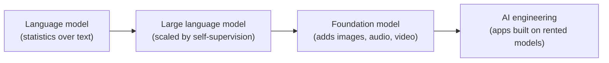
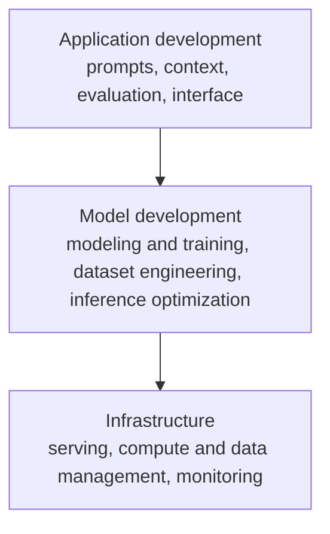

---
tags:
  - AI-engineering
  - foundation-models
  - research
type: research
source: "AI Engineering — Chip Huyen, Ch.1 (OReilly_Books/AI Engineering by Chip Huyen.pdf)"
chapter: 1
title: "Introduction to Building AI Applications with Foundation Models"
created: 2026-07-11
rewritten: 2026-09-05
---
# Building AI applications on foundation models

The defining fact about AI after 2020 is its size. The models behind ChatGPT, Gemini, and Midjourney are large enough to consume a real fraction of the world's electricity, and training them is starting to run into the limits of the public text available on the internet. Two things follow from that scale, and together they explain why "AI engineering" exists as a job at all.

The first is capability. Bigger models handle more tasks, so more products become possible and more teams reach for AI. The second is cost. Training a large model takes data, compute, and specialist talent that only a handful of organizations can afford, so those organizations train the models and rent them out. That arrangement is model as a service: you call a model through an API instead of building one. The demand for AI features went up while the cost of adding them went down, and the discipline that fills that gap, building on top of models someone else trained, is what this book calls AI engineering.

None of this is a clean break from the past. Product recommendations, fraud detection, and churn prediction ran on machine learning long before large language models. What changed is the arrival of large, ready-made, general-purpose models, and with them a different set of problems.

## How the field arrived here

The lineage runs from ordinary language models to large ones, then to multimodal foundation models, and finally to the engineering practice built on top of them.

### What a language model actually is

A language model stores statistics about a language: given some context, how likely is each possible next word. Given "My favorite color is ___", a model trained on English leans toward "blue" over "car". The unit it works in is the token, which can be a whole word, a word piece such as `-tion`, or a single character. Splitting text into tokens is tokenization, and for GPT-4 roughly 100 tokens cover about 75 words. The full set of tokens a model knows is its vocabulary, which runs from 32,000 for Mixtral 8x7B to about 100,000 for GPT-4.

Tokens are the unit rather than words or characters for three practical reasons. They keep meaningful sub-word pieces together, so "cooking" splits into "cook" and "ing". They keep the vocabulary smaller than a word list would, which makes the model cheaper to run. And they let the model cope with words it never saw, since a coinage like "chatgpting" breaks into "chatgpt" and "ing".

Language models come in two kinds, split by which context they use to predict a token. A masked model fills in a blank using the words on both sides, which suits classification, sentiment, and code debugging. BERT is the well-known example. An autoregressive model predicts the next token from the words before it, and that is the design behind text generation. Throughout the book, "language model" means the autoregressive kind.

The useful mental picture is a completion machine. Feed it text and it tries to continue that text. Its continuations are probabilistic guesses, not guaranteed facts, which is the property Chapter 2 examines in detail. The reason completion turns out to be so general is that many tasks are completion in disguise. Translation, summarization, and even spam detection ("Is this email spam? ... Answer:") all fit the shape. Completion is not the same as conversation, though, and closing that gap is the job of post-training.

### Self-supervision, the move that made scale possible

The pivot from small language models to large ones came from how they learn. Traditional supervision trains on human-labeled examples, which is slow and expensive. Labeling a million ImageNet images at five cents each costs about $50,000, and expanding to a million categories would push the labeling bill toward $50 million. For harder judgments, such as whether a CT scan shows cancer, the cost climbs further.

Self-supervision sidesteps the labeling entirely: the model infers the labels from the input itself. Language modeling is self-supervised because every sentence is its own training signal. "I love street food." produces six context-to-next-token examples on its own, with no annotator involved. Since text is everywhere, the training set can grow enormous, and that abundance is what let language models scale into large language models. Self-supervision is not the same as unsupervised learning: self-supervision infers labels from the data, while unsupervised learning uses no labels at all.

A model's size is usually reported as its parameter count, a parameter being a value adjusted during training. More parameters generally mean more capacity to learn, though not always. "Large" is a moving target: GPT-1 counted as large at 117 million parameters in 2018, and today 100 billion is the rough threshold. Larger models need more data for a simple reason, that extra capacity has to be filled, and training a big model on a small dataset mostly wastes compute.

### From text to foundation models

Language is only one channel humans use. Extend a model to images, audio, video, or protein structures and it becomes a foundation model, a name that signals both its importance and the fact that other things get built on top of it. A model that handles more than one kind of data is multimodal, and a generative multimodal model is a large multimodal model. The book uses "foundation models" to cover both large language models and large multimodal ones.

Self-supervision carries over to these models. OpenAI trained CLIP on 400 million image-and-text pairs that already appeared together on the web, a trick it called natural language supervision, so no manual labeling was needed. CLIP itself does not generate text; it is an embedding model that turns images and text into vectors meant to capture meaning, and such embedding models sit underneath generative systems like Gemini.

The deeper shift is from task-specific to general-purpose. Older models did one job each: a sentiment model could not translate. A single foundation model does both out of the box and can be tuned to specialize. There are three ways to adapt one to a particular need, and they form the backbone of the rest of the book: prompt engineering, retrieval-augmented generation (feeding the model a database to draw on), and finetuning (training it further on your own data). Adapting an existing model beats building from scratch by a wide margin, closer to ten examples over a weekend than a million examples over six months. Whether to build or buy recurs throughout the book.

### Why the term "AI engineering"

Building on foundation models is AI engineering. Teams have shipped machine learning products for a decade under names like MLOps, so the new label needs a reason. Three conditions line up to justify it. General-purpose models cover more tasks, which widens the user base and the demand. Investment surged after ChatGPT, and the cost per use case has fallen fast, in one team's case by two orders of magnitude inside a year. And the entry barrier dropped, because model-as-a-service APIs remove the need to host anything and because the model can write code and take instructions in plain English.

The name itself came from the nature of the work, which is mostly tweaking existing models rather than operating a pipeline, plus a small survey of practitioners who preferred it. The distinction worth holding onto is this: traditional machine learning engineering develops a model, while AI engineering adapts and evaluates one that already exists. Adaptation splits into two families depending on whether the model's weights change. Prompt-based methods leave the weights alone, which makes them quick, low on data, and easy to try across many models, though they can fall short on hard tasks. Finetuning changes the weights, costs more in complexity and data, and can move quality, latency, and cost while teaching genuinely new behavior.

## What people build

From interviews with 50 companies and a survey of 205 open-source projects, Huyen sorts real applications into eight groups: coding, image and video, writing, education, conversational bots, information aggregation such as summarization and talk-to-your-docs, data organization, and workflow automation. Coding is consistently the most popular; GitHub Copilot passed $100 million in annual recurring revenue within two years. Workflow automation is where agents live, models that plan and call tools, and they get a full chapter later.

Two patterns are worth remembering. Enterprises tend to ship low-risk internal tools first, such as internal knowledge search, before anything customer-facing, which lets them build skill while limiting the damage a failure can do. And closed-ended tasks like classification are easier to evaluate, which makes their risk easier to estimate. The through-line is that how easily you can evaluate a task tracks how safely you can deploy it.

## Deciding whether to build at all

A demo is easy and a profitable product is hard, so the first question is why you are building. Motivations range from an existential threat, where a competitor's AI could make you obsolete, through the more common desire to raise profit or productivity, down to not wanting to fall behind. If AI threatens your core business you probably build in-house; if it is a productivity boost, buying often wins.

Apple's framing helps clarify the model's role. A feature is critical or complementary depending on whether the product works without it (Face ID cannot, Gmail's Smart Compose can), and the more critical it is, the higher the accuracy has to be. A feature is reactive or proactive depending on whether it answers a request or volunteers information, and proactive features carry a higher quality bar because the user did not ask. A feature is dynamic or static depending on whether it updates continuously or periodically.

The role of humans matters just as much. Microsoft's crawl-walk-run model captures the progression: crawl means a human is always in the loop, walk means the AI talks to internal staff, and run means it talks to external users. Teams move along that path as quality proves out, for instance once human agents accept 95% of the model's suggestions verbatim.

Defensibility deserves attention because a low barrier cuts both ways. If a feature is easy for you to build, it is easy for a competitor, and an expanding base model can absorb your whole product, as it would for a PDF parser built on the assumption that ChatGPT could not parse PDFs. The classic moats are technology, data, and distribution. With foundation models the technology is similar for everyone and distribution favors incumbents, so usage data, and the flywheel it feeds, is the realistic edge for a newcomer. Plenty of durable companies began as something that looked like a feature of a larger product, Calendly, Mailchimp, and Photoroom among them.

Success needs a definition before the work starts. Business impact comes first, then a usefulness threshold expressed in concrete metrics: response quality, latency (time to first token, time per output token, total time), cost per request, and where relevant interpretability and fairness. Planning also has to account for the last mile. Getting from zero to sixty percent of the target is quick; the climb from sixty to a hundred is brutal. LinkedIn reached 80% of the experience it wanted in a month and then spent four more months fighting kinks and hallucinations to pass 95%. A strong demo does not promise a strong product.

Maintenance is the part that never ends, and it carries the extra burden of a field that changes weekly. Some changes help, like longer context and cheaper inference, yet even good changes disrupt existing workflows. Some are regulatory: complying with GDPR was estimated to cost businesses around $9 billion, and export rules on compute can shift overnight. Converging APIs make swapping one model for another easier than it was, but each model has its own quirks, so a swap still forces rework on prompts and data unless versioning and evaluation are already in place.

## The AI engineering stack

An AI application has three layers, and development usually starts at the top and moves down as needed.

Application development is where most of the recent activity has happened. Model development is the layer traditional machine learning engineers know best. Infrastructure changed the least, because serving, resource management, and monitoring have roughly the same shape as before.

AI engineering differs from machine learning engineering in three concrete ways. You use a model someone else trained instead of training your own, which shifts the focus from modeling toward adaptation. The models are bigger, pricier, and slower, which raises the stakes on inference optimization and on working with GPUs and large clusters. And the outputs are open-ended, which makes evaluation much harder and pushes it to the center of the work.

A few terms are worth pinning down because they get used loosely. Training means any change to a model's weights, though not every weight change counts as training; quantization changes weight values but is not training. Pre-training builds a model from random initial weights and is by far the most resource-heavy step, taking up about 98% of InstructGPT's compute. Finetuning continues training an already-trained model and costs far less. Post-training uses the same mechanism as finetuning, and the word usually signals who is doing it: a provider post-trains before release, an application developer finetunes afterward. Teaching a model through the context you feed it is prompt engineering, not training, even though people often call it training.

The relative weight of each activity shifts with foundation models. On the model side, machine learning knowledge moves from a requirement to a useful extra, dataset engineering moves from feature engineering on tabular data toward deduplication, tokenization, retrieval, and quality control on unstructured data, and inference optimization becomes more important than before. On the application side, evaluation grows more important, prompt engineering appears where it had no equivalent, and the interface starts to matter.

That emphasis on interfaces pulls AI engineering toward full-stack work. Tooling now speaks JavaScript as well as Python, through libraries like LangChain.js and the Vercel AI SDK. The workflow also inverts. Classic machine learning went data first, then model, then product. With capable models available, teams can build the product first and invest in data and models once it shows promise, which rewards whoever can iterate fastest.

## Where the book goes next

The recurring problem underneath all of this is that foundation models are probabilistic, ready-made, and open-ended, and the engineer's job is adaptation and evaluation rather than training. The three adaptation techniques introduced here, prompting, retrieval, and finetuning, map onto later chapters and onto related work on [[rag-retrieval]], [[llm-prompting]], and [[provider-abstraction]]. Chapter 2 opens the model far enough to make sensible choices about it, covering training data, the transformer architecture, model size and scaling laws, post-training, and the sampling process that explains why models hallucinate.
