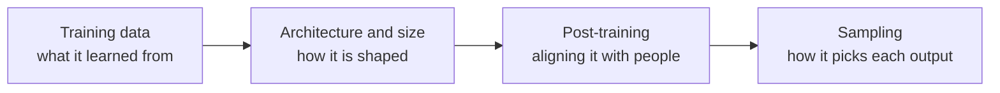
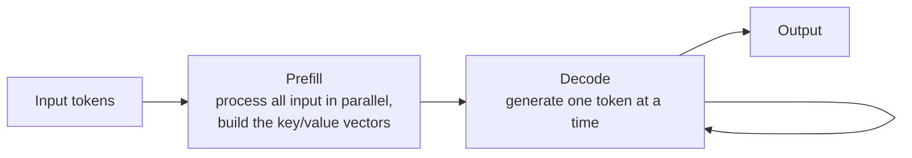
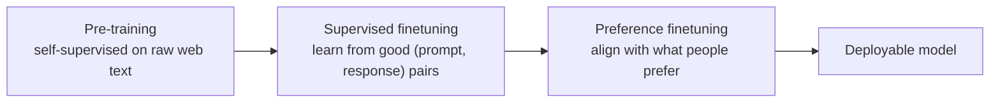
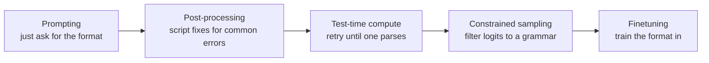
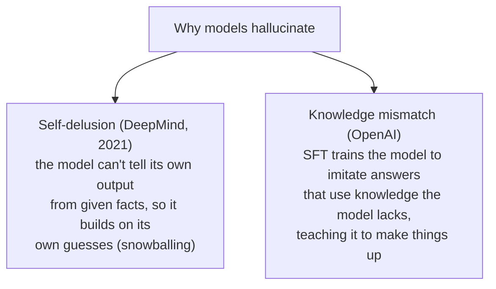

---
tags:
  - AI-engineering
  - foundation-models
  - research
type: research
source: "AI Engineering — Chip Huyen, Ch.2 (OReilly_Books/AI Engineering by Chip Huyen.pdf)"
chapter: 2
title: "Understanding Foundation Models"
created: 2026-07-18
rewritten: 2026-09-05
---
# Understanding foundation models

You do not need to build a model to use one, but a working picture of how models are made helps with the two decisions that matter most: which model to pick and how to adapt it. The differences between foundation models trace back to four choices their makers face, and each choice shows up later in the behavior of whatever you build on top.

## Training data

A model can only be as good as the data it saw. With no Vietnamese in the training set there is no Vietnamese translation, and that simple constraint drives much of what follows.

Most models are trained on whatever data can be gathered, not on the data the maker would ideally want. The usual starting point is Common Crawl, a nonprofit's sporadic scrape of two to three billion web pages a month, along with Google's cleaned subset, C4. The quality is uneven, full of clickbait and misinformation, yet variants of it appear in GPT-3, Gemini, and, by reasonable inference, many models whose makers no longer disclose their sources. Teams filter with rough heuristics; GPT-2's training kept only Reddit links with at least three upvotes. The risk in using what is available rather than what is wanted is that the model ends up good at whatever happened to be in the data instead of the task you care about, which is why curating data for a specific language or domain matters. More data is not automatically better, either. A small model trained on high-quality data can beat a much larger one trained on low-quality data; a 1.3-billion-parameter model trained on 7 billion tokens of good code outperformed larger models on coding benchmarks.

### Language coverage

English makes up about 46% of Common Crawl, roughly eight times the share of the next language, Russian. Many languages with large populations are badly under-represented, and the consequences show up in three ways. General models perform much better in English, both on the MMLU benchmark and on math, where GPT-4 solved problems in English about three times as often as in Armenian or Farsi. Translating a query into English, answering, and translating back is tempting but lossy, since some languages carry information that English drops, such as Vietnamese pronouns that encode the relationship between speakers. Non-English text can also be slower and more expensive, because the same meaning can take far more tokens, a median of 7 in English against 72 in Burmese, and cost and latency both scale with token count.

### Domain coverage

General models answer everyday questions across law, science, and business, but they tend to fail on specialized tasks they never saw during training. Drug discovery works with protein, DNA, and RNA data, and cancer screening with fMRI scans, neither of which sits in public web data. Performing well there means curating a specific dataset, as AlphaFold did with protein structures and Med-PaLM2 did with medical data. The point is not limited to biomedicine: a model trained on architectural sketches or factory plans can beat a generic one in its niche.

## Modeling: architecture and size

### The transformer and the problem it solved

Before transformers, the leading design was seq2seq, which used recurrent networks: an encoder compressed the input into a single final hidden state and a decoder generated from it. That design had two weaknesses. The decoder saw only the final hidden state, which is like writing about a book from its summary alone, and the recurrence forced sequential processing, which is slow on long inputs.

The transformer, introduced in 2017, fixed both with the attention mechanism, which lets the model weigh every input token when producing each output token rather than leaning on one compressed state. Dropping recurrence also let input tokens be processed in parallel. Attention itself predated the transformer, appearing in Google's 2016 translation system; the transformer's contribution was showing that attention worked without recurrence, and that is what made it take over.

Because of that split between parallel input and sequential output, inference happens in two phases, and most later optimization work targets one or the other.

Attention runs on three kinds of vector, which are easiest to follow through a library analogy. The query represents what the current step is looking for. Each key is a label for a previous token, like a page number. Each value is that token's actual content, like the page itself. The model scores a query against every key with a dot product, and a high score means it pulls more of that token's value into the output. Attention is multi-headed, so several of these lookups run at once over different groups of tokens; Llama 2-7B uses 32 heads. This is also why long context is expensive: every previous token needs its key and value stored, so a longer sequence means more to compute and hold, the cost that returns in later chapters on optimization.

A transformer is a stack of blocks, each holding an attention module and a small feedforward network with a nonlinearity such as ReLU. The number of blocks is what people mean by the model's layer count. Before the blocks, an embedding module turns tokens and their positions into vectors, and the number of positions it tracks sets a naive ceiling on context length. After the blocks, an output layer maps vectors back into token probabilities.

The transformer dominates but is not the only option, and its main weakness is long sequences. Alternatives aim there. RWKV is a recurrent network that can still be trained in parallel. State space models have progressed through S4, then H3, then Mamba, which scales linearly with sequence length rather than quadratically and matches transformers twice its size, and then Jamba, which interleaves transformer and Mamba layers. Even if one of these overtakes the transformer, most of the adaptation techniques in the book still apply.

### Reading a model's size

Parameter count is the headline number, so Llama-13B has 13 billion parameters, and more parameters generally mean more capacity to learn. Newer models beat older ones of the same size, with Llama 3-8B outscoring Llama 2-70B on MMLU. Parameter count can mislead, though, when a model is sparse. In a mixture-of-experts model only a subset of parameters activates per token, so Mixtral 8x7B holds 46.7 billion parameters but runs like a 13-billion one because only about 12.9 billion are active at a time.

Dataset size is better measured in tokens than in samples, since a book is worth far more than a sentence, and current models train on trillions of tokens: Llama 1, 2, and 3 used 1.4, 2, and 15 trillion. The number of tokens in a dataset is not the same as the number of training tokens, which counts repeated passes. Compute is measured in FLOPs, the total floating-point operations a task takes, and the notation is a common trap, since FLOPs (a count for a task) reads almost identically to FLOP/s (a machine's speed). To make the scale concrete, GPT-3-175B took about 3.14×10²³ FLOPs, which on 256 H100 GPUs at realistic utilization works out to roughly eight months and more than $4 million. Three numbers together signal a model's scale: parameters stand in for learning capacity, training tokens for how much it learned, and FLOPs for what the training cost.

### Scaling laws and their ceilings

Training usually starts from a compute budget and asks what combination of model size and dataset size gives the best result for that budget. The answer is the compute-optimal model. The Chinchilla study, which trained 400 models to find the relationship, concluded that compute-optimal training wants roughly 20 training tokens per parameter, so a 3-billion-parameter model wants about 60 billion tokens, and doubling the model means doubling the data. Quality is not the only goal in production, though. Llama deliberately chose smaller models than compute-optimal because they are cheaper and easier to run, which helped adoption. The cost of reaching a fixed level of performance keeps falling over time, but the last-mile pattern from Chapter 1 holds here too: improving from 90 to 95% accuracy costs far more than 85 to 90%. Bigger is not even always better. Anthropic found that more alignment training could reduce alignment with human preference, and the Inverse Scaling Prize found larger models occasionally worse on tasks involving memorization or strong priors, though none of those failures held up in the real world. Extrapolation is genuinely hard, because a giant model often gets one shot at its hyperparameters, so teams study small models and extrapolate, and abilities that appear only at scale make that extrapolation unreliable.

Two ceilings are already visible. One is data: the supply of usable public text may run out within a few years, sites such as Reddit and Stack Overflow are restricting access, and about 45% of C4's sources are now blocked, which pushes the frontier toward proprietary data like books, contracts, and medical records. The other is electricity: data centers already draw an estimated 1 to 2% of global power, with projections of 4 to 20% by 2030.

## Post-training: aligning a raw model with people

A freshly pre-trained model has two problems. It is optimized for completion rather than conversation, and, having learned from indiscriminate web data, it can produce output that is toxic or wrong. Post-training addresses both in two steps.

Supervised finetuning trains the model on high-quality prompt-and-response examples, called demonstration data, so it learns to respond instead of merely continuing text. The process is sometimes called behavior cloning: show the model how to act and it copies the behavior. Good demonstration data is expensive, because the examples need real judgment. InstructGPT's labelers were about 90% college-educated, a single pair could take half an hour, and its roughly 13,000 pairs cost around $130,000. Cheaper routes exist, such as volunteers, though the LAION effort that used them ended up demographically skewed, or heuristics, as when DeepMind filtered dialogue-shaped text to train Gopher.

Preference finetuning then teaches the model what kind of response to give, the values rather than the format, which demonstration data alone does not cover for genuinely contested questions. It usually runs on reinforcement learning. The one-line contrast between the two training stages is that pre-training optimizes token-level accuracy, predicting the next token, while post-training optimizes the whole response people actually want. Reading to gain knowledge is the analogy for pre-training, and learning to use that knowledge is the analogy for post-training. Post-training is cheap by comparison, about 2% of InstructGPT's compute, and mostly unlocks capability the model already has.

The classic recipe for preference finetuning is RLHF, which has two parts: train a reward model that scores responses, then optimize the model so its responses earn high scores from that reward model. The reason for a separate reward model is that asking people for absolute scores produces noise, since the same labeler rates the same response differently on different days. Comparing two responses and picking the better one is easier and more reliable, which yields comparison data in the form of a prompt with a winning and a losing response. Even comparison is slow, three to five minutes per pair and about $3.50 each, against roughly $25 to write a response, and labelers agree with each other only about 73% of the time. A weaker model can judge a stronger one, since judging is easier than generating, a point that returns in the evaluation chapter. Newer methods simplify the recipe: Llama 3 switched from RLHF to DPO, and some teams skip reinforcement learning altogether and use the reward model only to pick the best of several sampled outputs.

## Sampling and why models hallucinate

Sampling is how a model turns its internal probabilities into an actual output, and it is the source of both the creativity that makes these models useful and the inconsistency and hallucination that make them frustrating.

For each next token the model produces a logit vector, one value per vocabulary token. Logits are not probabilities, since they can be negative and do not sum to one, so a softmax converts them. Always taking the highest-probability token is greedy sampling, which is fine for classification but dull for text, since it keeps choosing the most common word. Sampling in proportion to the probabilities produces more varied output, picking "green" 50% of the time when it is 50% likely.

Several knobs shape that choice. Temperature divides the logits before the softmax; a higher temperature flattens the distribution and gives rarer tokens a chance, which reads as more creative but less coherent, while a lower temperature is steadier but flatter, and a value near 0.7 is a common creative default. Top-k restricts the choice to the k highest logits, and top-p, or nucleus sampling, takes the smallest set of tokens whose probabilities add up past p, which adjusts dynamically, considering few options for a yes-or-no question and many for an open one. Providers may expose logprobs, log-scale probabilities that help with classification, evaluation, and debugging, though they are often limited because exposed logprobs make a model easier to copy. A stopping condition, whether a stop token or a length cap, keeps latency and cost down, but stopping too early can truncate a structured output such as JSON into something unparseable.

Instead of trusting a single output, a model can generate several and keep the best, which is test-time compute. Best-of-N draws several at random, and beam search keeps the most promising candidates at each step; increasing the diversity of the drafts tends to surface better ones. Picking the winner can use the highest average logprob, which the OpenAI API uses and which averages so it does not penalize longer sequences, or a reward model. Verifiers are unexpectedly strong: OpenAI found a verifier gave about the same boost as a 30-times-larger model. The returns are real but bounded, rising to roughly 400 samples in one OpenAI experiment before declining, and nobody samples hundreds of times in production because the cost is prohibitive. In practice the technique is used to take the most common answer on exact-answer tasks, to cut latency by generating in parallel and showing the first valid result, or to retry a blurry-image extraction until it reads.

### Structured output

Production often needs a specific format, either because the task demands it, as with text-to-SQL or classification, or because a downstream program has to parse the result, as with JSON passed into a tool. There are five places to enforce structure, running from quick patches to durable fixes.

Prompting is the first move and depends on how well the model follows instructions, so a few percent of invalid output can still be too much. Post-processing is cheap and works surprisingly well, since models repeat the same small mistakes, and LinkedIn's defensive parser lifted valid YAML from 90% to 99.99% (they chose YAML over JSON because it uses fewer tokens). Test-time compute keeps generating until one output fits. Constrained sampling filters the logits at each step to only the tokens a grammar allows, which is powerful but non-trivial, format-specific, and slower. Finetuning is the most reliable and general, and for something like classification you can even append a classifier head to guarantee valid classes.

### The probabilistic nature

Ask a person the same question twice and the answer holds; ask a model and it can change, because it samples. That property causes both inconsistency and hallucination.

Inconsistency comes in two forms. The same input can produce different outputs, which caching, fixed sampling variables, and a fixed random seed can mitigate, though hardware differences can still cause drift and a hosted API leaves the hardware out of your control. A slightly different input can also produce a very different output, which is harder and is helped by careful prompting and a memory system.

Hallucination, a response not grounded in fact, is more serious, and it has caused real harm, including a law firm fined for citing cases ChatGPT invented. It predates large language models, with mentions in text generation as early as 2016, and sampling randomness alone does not explain it, since the puzzle is how something never seen becomes a probable output. Two hypotheses stand.

The two are complementary, one blaming self-supervision and the other supervision. Proposed remedies include asking a model to cite the sources behind a response and designing a reward function that punishes fabrication, though the evidence is mixed: one OpenAI talk reported that RLHF reduced hallucination, while the InstructGPT paper showed it made hallucination worse even as it improved other qualities. Simpler dampeners help in practice, such as telling the model to say "I don't know" when unsure and asking for concise answers, since fewer tokens leave less room to invent. Detecting hallucination is itself hard and is left to a later chapter.

## Where this leads

The four choices behind a model, its data, its shape, its alignment, and its sampling, together explain both its strengths and its failure modes, and they are what to reason about when picking and adapting one. The sampling knobs feed directly into [[llm-prompting]], and the two accounts of hallucination sit under the evaluation work in [[rag-retrieval]] and the next chapter. Chapter 3, already covered in [[Ch3. Eval]], turns to evaluation methodology: exact versus subjective measures, functional correctness, and the uses and limits of using one model to judge another.
