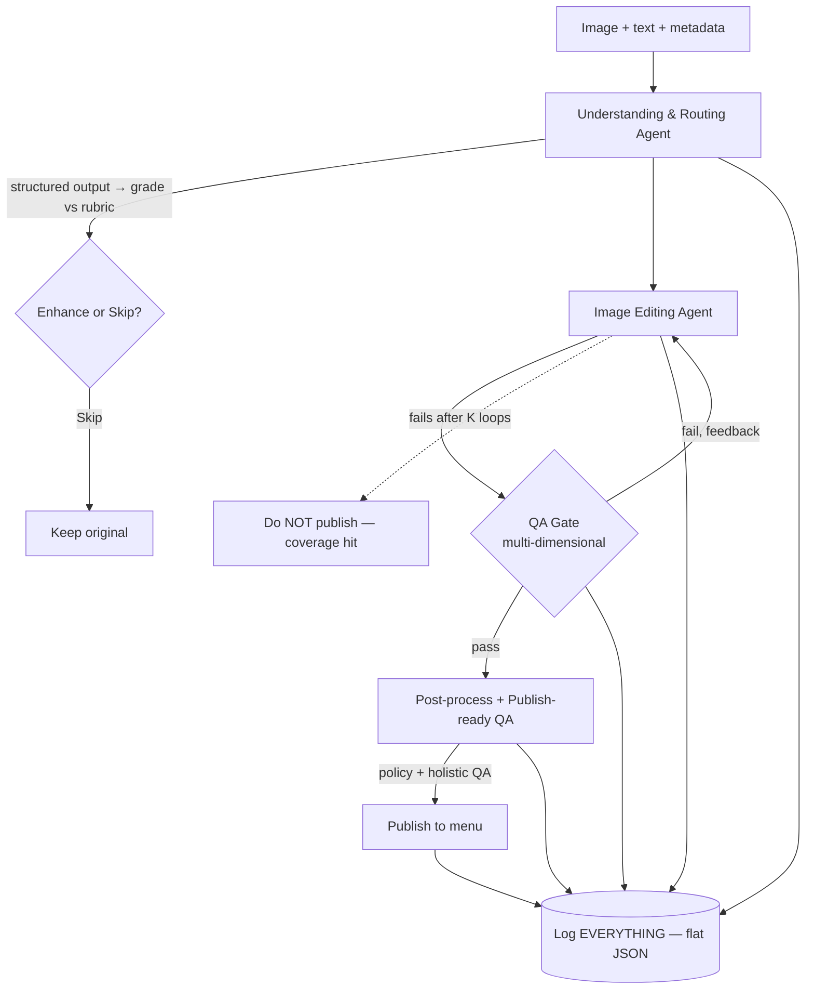
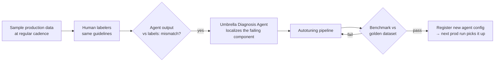

# Uber Eats — Designing Agents & Eval Loops (Production Case Study)

> [!abstract] One-line
> A real production agent system that **auto-enhances food photos** for millions of merchants — and the real lesson isn't the images, it's how they **wrapped every agent in an eval loop** so the system keeps *tuning itself* against human-labeled truth without a human in the loop.

**Why this note exists:** evaluation rigor is my #1 growth edge. This talk is the cleanest end-to-end example I've seen of *eval-driven agent design* in production. Treat it as a template, not trivia. See [[Agent Evaluation]], [[Agent Patterns]].

---

## 1. The problem (the setup that forces good design)

Uber Eats: ~$90B/yr run rate, +20% YoY, 10,000 cities, millions of new items/month. Photos are the **first signal** a customer gets about a merchant — a good photo is the difference between a scroll and an add-to-cart.

The tension they had to thread:

| Constraint | Why it fights the others |
|---|---|
| Small merchants have **bad photos** (time, know-how, cost) | → need to *improve* quality |
| Consumers **distrust AI slop** | → can't over-edit; must look authentic |
| Must stay **faithful** to the real dish | → editing can lie (add shrimp, fake wings) |
| Must **preserve brand diversity** | → one global prompt collapses the marketplace |
| Must run **at scale, cost-efficiently** | → can't enhance everything blindly |

> [!key] The generalizable insight
> The design falls out of the **constraints**, not the tech. Before building an agent, write down the competing forces it has to balance. Uber's whole architecture is just "how do we improve quality *selectively* and *safely* while staying faithful."

---

## 2. Core design principle — the agency spectrum

```
Deterministic / rules-based  <───────────────>  Fully agentic
   controllable, but brittle        creative, but unconstrained
   won't scale                      unsafe without guardrails
                    ▲
              WE LIVE HERE
     (lean into agency, but bind it with
      guardrails + evals at every step)
```

> [!tip] Mental model to steal
> "Give the agent creativity/agency, but **never leave it unconstrained**." Every stage gets a guardrail metric it must clear. Agency *inside* a cage of evals.

---

## 3. The orchestration flow



Three ways an image exits: **skipped** (kept as-is), **published** (passed all gates), or **dropped** (failed the loop → they eat a coverage hit rather than ship something bad).

> [!warning] Start here or you have nothing
> **Log everything, first.** They use a *flat* JSON for the whole end-to-end run (not nested per-agent). Why flat: anyone — engineer, PM, non-technical — can dive into a single case *or* roll up in aggregate.
> **"If you don't start with logging, you have nothing to optimize for — let alone a self-learning loop."** (They use Arize.)

---

## 4. Stage by stage — and how each one is eval'd

This is the reusable part: **each agent type maps to a different eval method.**

### 4.1 Understanding & Routing Agent → *classifier evals*
- Multimodal LLM **describes what it sees** → **structured output** → **grade against a rubric** (pass/fail criteria) → decide **enhance vs skip**.
- Eval method: **confusion matrix → precision / recall.**
- **Guardrail metric = recall.** *"We don't want any bad image to slip through."* (Choosing which metric is the guardrail is a product decision — recall because a missed bad image is the expensive error.)
- Real routers are often **N×N**, not 2×2: e.g. route easy images to a smaller/cheaper/faster model, hard ones to a big model. The matrix then checks *"did we route to the correct branch?"* — cost/latency vs quality trade-off.

### 4.2 Image Editing Agent (the self-correcting loop) → *pass@K*
- 3 steps: **(1) generate an image-specific prompt** (from the description + router directives — "what does *this* image need?") → **(2) enhance** → **(3) QA gate** (multi-dimensional: plating, faithfulness, colors…).
- Fails QA → feedback goes **back into the prompt** with original inputs → enhance again. Loop up to **K** times.
- Eval method: **pass@K** = pass rate at K iterations. More iterations → more feedback → pass rate should climb.
- The per-image prompt is *how they avoid marketplace collapse* — a single global prompt would make everything look the same.

### 4.3 Generation quality → *pairwise comparison (LLM-as-judge)*
- Compare **input vs output**: is the output *better*? Output = **yes / no / unsure**.
- "Better" is not the model's opinion — it's **defined with product, design, policy, legal** and baked into the judge: *is it faithful? complete? natural? realistic?* + more.
- **`unsure` is a first-class answer** → if the judge can't confirm (e.g. can't count 8 wontons), **reject in production.** Don't ship what you can't verify.

### 4.4 Post-processing / Publish-ready QA → *the Swiss cheese layer*
- Final gate: policy checks + broader, more holistic quality checks.
- *"Why QA again if we already QA'd?"* → **Swiss cheese model**: stack imperfect layers so the holes don't line up. Redundancy is intentional. This gate also flags things that *should* have been caught upstream (a signal to fix upstream).

---

## 5. Getting v1 out — the golden dataset

1. Collect a **representative** dataset — different geos, dish types, image-quality tiers, cuts.
2. Send to **human labelers** with an **objective guideline** (kills subjective bias / labeler noise).
3. Human labels = **golden source of truth.**
4. Loop: run agent → compare to golden set → meets guardrail metrics? **ship** : **tune** → repeat.

> [!key] This is the discipline I'm missing
> No golden set = no way to say "good enough to ship." My CV metrics (40%/60%/2x) are undefendable precisely because there's no golden set behind them. **The metric is only as trustworthy as the labeled truth it's measured against.**

---

## 6. The self-improving loop (the real payoff)

A static offline model **will drift** — production always has cases the offline set never saw. Their fix: the whole system **tunes itself online.**



### Autotuning internals — Reflect → Synthesize
The **prompt-optimizer agent** is itself two sub-agents:
- **Reflect agent:** looks at the mismatches, strips noise, finds *systemic* issues, writes feedback.
- **Synthesize agent:** takes that feedback + current agent config → writes a **new config** → benchmarks → if it passes, **registers it in the agent-config store.**

> [!info] Closed loop, no human in the loop
> It's **config-driven**: the diagnosis agent *writes the config* and triggers tuning. Safe because they keep **observability, guardrails, and quick rollback**. "One static offline model keeps you alive at t=0; *this loop* is what keeps the system alive over time."

### The Diagnoser (the abstraction on top)
As more feedback loops appear (offline labels, **internal dogfooding** 👍/👎 + free-form merchant/design feedback, **production business metrics**), they added a higher-level **Diagnoser** that:
- takes input from **any** feedback loop,
- **reflects** on *which* agent(s) in the system need to change,
- **routes** the fix to that specific agent's config (one or many).

Feedback loops, widest to tightest:
1. **Model loop** — drift vs golden human labels (offline).
2. **Dogfooding loop** — internal 👍/👎 + free-form feedback → replay flagged examples → benchmark → push config.
3. **Production loop** — business metrics (e.g. **conversion / add-to-cart / order completion**), sliceable by geo, device, dish type → tune *per segment*.

---

## 7. Failure-mode catalogue (great eval test cases)

| # | Failure | Eval that catches it |
|---|---|---|
| 1 | Great cheeseburger sent for enhancement anyway | Routing **recall/precision** — pay compute for **zero lift** + risk degrading a good image |
| 2 | Dish says "8 wings", photo has 6 → approved | **Faithfulness** — enhancer may **hallucinate 2 extra wings** to match text |
| 3 | Enhancer **adds shrimp** that wasn't there | **Faithfulness** fail |
| 4 | Enhancer **removes** the sauce under sushi | **Completeness** fail |
| 5 | Creative edit rejected → **oversteers** to generic ceramic bowl | **Reward hacking** — pixels differ a lot but it's a *nugatory* (meaningless) change |
| 6 | Output **plate covers the sauce** | Object/scene coherence |
| 7 | Frontier-model artifacts (bad physics/objects) leak into output | **Object coherence + physics plausibility** → escalate to frontier model teams |
| 8 | Can't confirm 8 wontons from the image | Judge returns **`unsure` → reject** |

> [!tip] Turn failures into fixtures
> Every one of these is a permanent regression test. A failure you've seen once should never silently return — pin it in the eval set.

---

## 8. The reusable toolkit (memorize this mapping)

| Agent / component type | Eval method | Guardrail signal |
|---|---|---|
| Router / classifier | Confusion matrix → **precision/recall** (2×2 or **N×N**) | recall (don't leak bad cases) |
| Self-correcting generator loop | **pass@K** | pass rate rising with K |
| Quality / "is it better?" judge | **Pairwise comparison**, output **yes/no/unsure** | faithful · complete · natural · realistic |
| Final safety gate | **Swiss cheese** redundant QA + policy | catches upstream misses |
| Whole system over time | **Drift vs golden set** + **autotune** (reflect→synthesize) | benchmark must pass before register |
| Business impact | **Segment-sliced metrics** (conversion, add-to-cart) | per geo/device/dish |

---

## 9. Principles to steal for my own agents

> [!success] Checklist
> - [ ] Write the **competing constraints** before choosing the architecture.
> - [ ] Place each agent on the **agency spectrum**; bind agency with an eval guardrail.
> - [ ] **Log everything first**, flat + queryable, before optimizing anything.
> - [ ] Build a **golden dataset** with *objective* labeling guidelines = source of truth.
> - [ ] Pick **one guardrail metric per component** and justify *why that one*.
> - [ ] Match the eval to the shape: classifier→P/R, loop→pass@K, quality→pairwise+`unsure`.
> - [ ] Make **`unsure`/reject** a real outcome — take a coverage hit over shipping a lie.
> - [ ] Stack **redundant QA** (Swiss cheese) at the publish boundary.
> - [ ] Close the loop: sample prod → label → diagnose → autotune → benchmark → register → rollback-ready.
> - [ ] Tie it to a **business metric**, sliced by segment.

---

## 10. DO IT — hands-on (apply to `rag-prod`, don't just read)

> [!question] The point of this note is to *practice eval discipline*, using my own RAG as the lab.

**Exercise A — Golden set (½ day).**
Build a small **golden dataset** for `rag-prod` retrieval: ~50 query→expected-answer(+expected-chunks) pairs across easy/medium/hard cuts. Write an **objective labeling guideline** first. This is the thing my CV currently claims but can't defend.

**Exercise B — Router evals (1–2h).**
`rag-prod` already routes (vector + BM25 + rerank). Frame "should this query even hit the vector store vs answer directly?" as a classifier. Build a **confusion matrix**, compute **precision/recall**, and *decide + justify* which is your guardrail.

**Exercise C — pass@K on a fix loop (½ day).**
Wrap answer generation in a QA-gate loop (judge: faithful to retrieved context? complete?). Measure **pass@1 vs pass@3**. Confirm the curve rises — if it doesn't, the feedback isn't informative.

**Exercise D — Pairwise judge with `unsure` (2h).**
Write an LLM-judge that compares two answers → **yes/no/unsure**, with explicit criteria (faithful/complete/grounded). Force it to say `unsure` when the context can't support the claim, and **reject** on `unsure`.

**Exercise E — Reflect→Synthesize mini-loop (stretch).**
Take the mismatches from Exercise A, have a **reflect** step summarize systemic failures, a **synthesize** step rewrite the retrieval/prompt config, re-benchmark against the golden set, only "register" if it beats baseline. That's the Uber self-tuning loop in miniature.

> [!note] Ties into my track
> This is exactly the "own the *why*, build an eval harness" work in [[RoadMap]] M1 (Own your RAG + Evals). The video gives me the vocabulary (pass@K, pairwise+unsure, golden set, drift/autotune, Swiss cheese) to make it concrete.

---

## 11. Open questions to chase
- How do they keep **human labeling cost** sane at production sampling cadence? (active learning? confidence-based sampling?)
- What stops the **autotuning loop from overfitting** to the golden set over many cycles?
- How is **`unsure`** thresholded — calibrated judge confidence, or a separate model?
- N×N router: how do they set the **cost/quality trade-off boundaries** per branch?

## Related
- [[Agent Evaluation]] — why single-run eval is worthless (non-determinism)
- [[Agent Patterns]]
- [[Agents Best Practice]]
- [[Optimizing GenAI Services for Multiple Users]]
