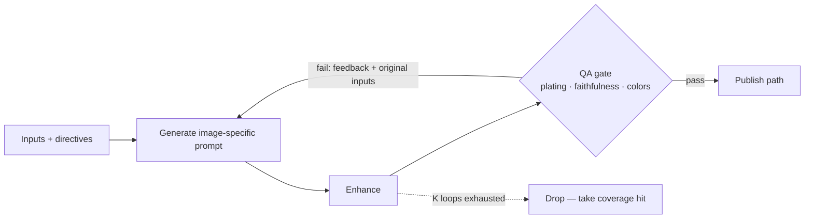
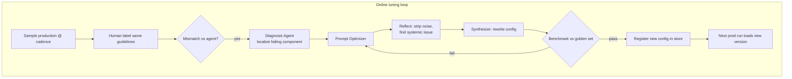

# System Design for AI Agents — Architecture & the "Why"

> [!abstract] Why this note exists
> My gap isn't *building* correct agent architectures — it's **defending every knob**. This note trains that: for each design decision, it states the **choice → the forces → why → what breaks if you go the other way.** Companion to [[Uber Eats — Designing Agents and Eval Loops (Production Case Study)]] (that one = *how to eval*; this one = *how to architect*). See also [[Agent Patterns]], [[AI Workflows VS AI Agent]].

---

## 0. The one skill this note builds: "defend the knob"

For any agent design decision, force yourself to fill this in:

| Field | Prompt |
|---|---|
| **Decision** | What did you pick? |
| **Forces** | Which competing constraints pushed on it? |
| **Why this** | Why this option over the alternatives? |
| **Failure if flipped** | What breaks if you chose the opposite? |
| **How you'd measure it** | What metric tells you it was right? |

If you can't fill all five rows, **you don't own that part of the design yet** — you inherited it. Every section below is written in roughly this shape.

---

## 1. Start from constraints, not components

The biggest system-design mistake: picking the framework/pattern first. **The architecture should fall out of the competing forces.**

Uber's forces (write yours the same way before designing):
- Improve bad photos **↔** don't produce AI slop
- Edit for quality **↔** stay faithful to the real dish
- One efficient pipeline **↔** preserve per-merchant brand diversity
- Maximize coverage **↔** ship safely (never publish a lie)
- Rich agentic creativity **↔** bounded, cost-efficient at scale

> [!key] Rule
> **List the tensions first. The design is the resolution of those tensions.** Any component you can't trace back to a tension is probably unjustified.

---

## 2. The agency spectrum — the master trade-off

```
Deterministic / rules            Fully agentic
├────────────┼──────────────────────────────┤
controllable                              creative
predictable            SWEET SPOT          adaptable
brittle             (agency + guardrails)  unsafe alone
won't scale                               unbounded cost
```

| | Deterministic end | Agentic end |
|---|---|---|
| Control | High | Low |
| Adaptability / scale | Low (brittle) | High |
| Safety | Easy | Needs explicit guardrails |
| Cost predictability | High | Low without limits |

> [!tip] The design principle
> **Lean into agency, then cage it.** Give the agent creativity, but every stage carries (a) a guardrail metric it must clear and (b) a hard stop (max loops, reject path). Agency *inside* a cage of evals + limits.
>
> **Defend-the-knob:** *Why not fully deterministic?* → won't scale across 10k cities / infinite dish variety. *Why not fully agentic?* → unsafe (hallucinated food), unbounded cost.

---

## 3. Decompose into single-responsibility agents

Don't build one mega-agent. Split by **distinct responsibility**, because each piece then gets its **own eval, own guardrail, own tuning**.

Uber's decomposition:
1. **Understanding & Routing** — perceive + decide *enhance vs skip*
2. **Editing (loop)** — generate image-specific prompt → enhance → self-correct
3. **QA gate** — multi-dimensional quality judge
4. **Post-process + Publish-ready QA** — final safety/policy gate
5. **Diagnoser** (meta) — decides *which* agent to tune

> [!key] Why decompose
> - **Isolated evals** — a classifier is eval'd with precision/recall; a loop with pass@K. You can't do that on a monolith.
> - **Localized fixes** — the diagnoser can point at *one* failing agent and tune only its config.
> - **Independent limits** — cheap model here, frontier model there.
>
> **Failure if flipped (monolith):** one bad behavior means retuning everything; you can't attribute a regression; you can't route cost.

---

## 4. Routing = the cost/quality control point

The router is where you spend or save money. It's a **classifier that gates the expensive path.**

- Simple form: **enhance vs skip** (2×2).
- Real form: **N×N** — route to small/cheap/fast model vs large/slow/expensive model by difficulty. Matrix asks "did we route to the *correct branch*?"

> [!info] Defend-the-knob: guardrail = recall
> Uber's routing guardrail is **recall**, not accuracy. *Why?* A bad image slipping through is the expensive error (ships a lie / wastes enhancement). A false "enhance" on a good image is cheaper (wasted compute + slight degrade risk). **You pick the guardrail metric by which error hurts more** — and you must be able to say which and why.

**Architectural payoff:** routing is how you get cost-efficiency *at scale* without hand-rules — the agent decides where compute goes.

---

## 5. Self-correcting loops (the core agentic pattern)

The editing stage is a **generate → check → feedback → regenerate** loop, bounded by **K**.



Design decisions inside this one loop:
- **Per-item prompt, not a global prompt.** *Why:* one global prompt → the whole marketplace looks identical (diversity collapse). The prompt is *generated per image* from its description + router directives.
- **Feedback re-enters the prompt** with the *original* inputs — the loop is stateful about intent.
- **Bounded by K** with an explicit **reject/drop** exit. *Why:* infinite loops = unbounded cost + risk. **Coverage hit > shipping garbage.**
- **Eval = pass@K** — pass rate should rise with iterations; if it doesn't, your feedback signal is uninformative (a system-design smell).

> [!warning] The reject path is a feature
> A well-designed agent must be *allowed to give up*. "Never publish" is a valid, designed outcome. Systems that must always return something will hallucinate to comply.

---

## 6. Defense in depth — the Swiss cheese model

Multiple imperfect QA layers stacked so their holes don't line up.

```
QA in editing loop   →  [ holes ]
Publish-ready QA      →     [ holes ]   ← holes offset
Policy checks         →   [ holes ]
= failure only escapes if ALL holes align
```

> [!info] Defend-the-knob: "why QA twice?"
> Redundancy is **intentional**, not waste. The final gate is *more holistic* and also **flags what upstream missed** (a signal to go fix upstream). *Failure if flipped (single gate):* one blind spot = failures ship. In safety-critical publishing, redundancy is cheaper than a bad publish.

---

## 7. Observability is a design decision, made first

> [!key] "If you don't start with logging, you have nothing to optimize for — let alone a self-learning loop."

Design choices in their logging:
- **Log everything, end-to-end.**
- **Flat JSON**, not nested-per-agent. *Why flat:* one schema lets *anyone* (eng, PM, non-technical) drill into a single case **and** roll up in aggregate. Nested structures fracture that.
- Tool: Arize (LLM observability).

**System-design lesson:** observability isn't a phase-2 add-on. It's the **substrate** every feedback loop reads from. No logs → no evals → no self-tuning. Build it at t=0.

---

## 8. Ground truth: the golden dataset

The architectural anchor everything is measured against.

- **Representative** sampling: geos, dish types, quality tiers, cuts.
- **Objective labeling guideline** → removes labeler subjectivity/noise.
- Human labels = **source of truth**; ship/tune decision = "does agent output clear guardrail vs golden set?"

> [!key] Why this is *system* design, not just data work
> The golden set is the **contract** for "good enough to ship" and the **benchmark gate** in the auto-tuning loop. Without it, "ship it" is a vibe. **A metric is only as trustworthy as the labeled truth behind it.**

---

## 9. The self-improving system (config-driven, closed-loop)

Static models drift. The architecture makes **the system itself adaptive** — not by retraining a model, but by **rewriting agent configs.**



Key architectural properties:
- **Config-driven, no human in the loop** — the diagnosis agent *writes the config* and triggers tuning.
- **Reflect → Synthesize split** — separate "diagnose the problem" from "author the fix" (two sub-agents, single responsibility again).
- **Benchmark gate before register** — nothing ships without beating the golden set.
- **Versioned config store + quick rollback + observability + guardrails** — that's *what makes autonomy safe*. Autonomy without rollback is recklessness.

> [!info] The reframe
> **Tune the config, not the weights.** Treating prompts/agent-configs as versioned, benchmarked, roll-back-able artifacts turns "prompt engineering" into a real deployment system.

---

## 10. Layered feedback loops (the Diagnoser abstraction)

As feedback sources multiply, don't wire each one bespoke. Add a **higher-level Diagnoser** that ingests *any* feedback and routes fixes to the right agent(s).

| Loop | Feedback source | Cadence | Tunes |
|---|---|---|---|
| **Model loop** | Golden human labels (drift) | Regular sampling | The mismatched agent |
| **Dogfooding loop** | Internal 👍/👎 + free-form (merchants, design, PM) | Continuous | Replay flagged → benchmark → push config |
| **Production loop** | Business metrics: conversion, add-to-cart, order completion | Live | Per-**segment** (geo / device / dish) |

> [!key] Why an abstraction layer
> Without the Diagnoser, N feedback sources × M agents = spaghetti. The Diagnoser **reflects on which agent needs the change and routes to it** — one point of control, extensible to new loops. This is the "make the system generalize" move.

---

## 11. Tie the system to a business metric

The outermost loop optimizes **conversion / add-to-cart / order completion**, not model metrics.

- At scale you can **slice**: by geo, device type, dish type → find *where* it improves → **tune per segment.**

> [!tip] System-design lesson
> Internal evals (precision, pass@K) are **proxies**. The real objective is a business KPI. Design the top loop to close on the KPI, and keep the data sliceable so you can tune locally without global regressions.

---

## 12. The reference architecture (one screen)

```
                 ┌───────────────────────────────────────────┐
 inputs ───────► │ 1. Understanding & Routing  (classifier)   │
 (img+text+meta) │    guardrail: recall   eval: P/R, N×N       │
                 └───────┬───────────────────────┬────────────┘
                    skip │                 enhance│
                 keep original      ┌─────────────▼───────────┐
                                    │ 2. Edit loop (agentic)   │◄─┐ feedback
                                    │    per-item prompt        │  │ (≤K)
                                    │    eval: pass@K           │──┘
                                    └─────────────┬───────────┘
                                    fail after K  │ pass
                                    DROP (coverage)│
                                    ┌─────────────▼───────────┐
                                    │ 3. QA gate (pairwise,     │
                                    │    yes/no/UNSURE→reject)  │
                                    └─────────────┬───────────┘
                                    ┌─────────────▼───────────┐
                                    │ 4. Publish-ready QA       │
                                    │    (Swiss cheese+policy)  │
                                    └─────────────┬───────────┘
                                              publish
   everything ──► FLAT JSON LOGS ──► golden set ──► Diagnoser ──► autotune ──► config store
```

---

## 13. Design-decision cheat sheet (memorize)

| Decision | Choice | Why (defend it) |
|---|---|---|
| Agency level | Agentic + guardrails | Deterministic won't scale; unbounded is unsafe |
| Structure | Many single-responsibility agents | Isolated evals, localized fixes, per-stage limits |
| Routing metric | Recall guardrail | Missed-bad-case is the expensive error |
| Prompting | Per-item generated | Global prompt → diversity collapse |
| Loops | Bounded K + reject exit | Coverage hit > shipping a lie; cap cost |
| Safety | Swiss cheese (redundant QA) | Offset blind spots; catch upstream misses |
| Observability | Log everything, flat, first | No logs → no evals → no self-tuning |
| Ground truth | Golden set + objective guideline | The ship/benchmark contract |
| Adaptation | Config-driven closed loop | Tune configs (versioned, rollback) not weights |
| Feedback | Diagnoser routes any loop | One control point; extensible |
| Objective | Business KPI, sliceable | Model metrics are only proxies |

---

## 14. DO IT — build the "why" muscle

> [!question] These are architecture exercises, not coding grinds. Pair them with the eval exercises in the companion note.

**A — Reverse-defend `rag-prod` (2h).** For each existing knob (fusion = vector+BM25+FlashRank, chunk size, rerank model, 2-tier LRU+Redis cache sizing) fill the **§0 five-row table**. Any row you can't answer = a knob you inherited, not chose. That list *is* your study plan.

**B — Constraint sheet (30 min).** Write the competing-forces list (§1) for `rag-prod` (latency ↔ recall, cost ↔ quality, freshness ↔ cache hit-rate…). Then check: does every component trace to a tension? Delete/justify the orphans.

**C — Add a router (½ day).** Put a classifier in front of retrieval ("answer directly vs retrieve vs deep-retrieve" = N×N). Pick + **defend the guardrail metric.** This is the single highest-leverage system-design add.

**D — Config-store + rollback (stretch).** Make prompts/configs versioned artifacts with a benchmark-gate-before-register step (§9). Even a tiny JSON store + git tags teaches the pattern.

**E — Redraw from memory (20 min, weekly).** Reproduce §12 on paper without looking. Gaps = what you don't own yet.

> [!note] Ties to my track
> Directly attacks the "owns architecture but not the *why*" gap and feeds [[RoadMap]] M1 (Own your RAG + Evals) and the system-design focus area. Do these *after* Aug 15 unless a Shutterabia task makes one urgent sooner.

## Related
- [[Uber Eats — Designing Agents and Eval Loops (Production Case Study)]] — the eval side of the same system
- [[Agent Patterns]] · [[AI Workflows VS AI Agent]] · [[Agents Best Practice]]
- [[Context Engineering]] · [[Optimizing GenAI Services for Multiple Users]]
