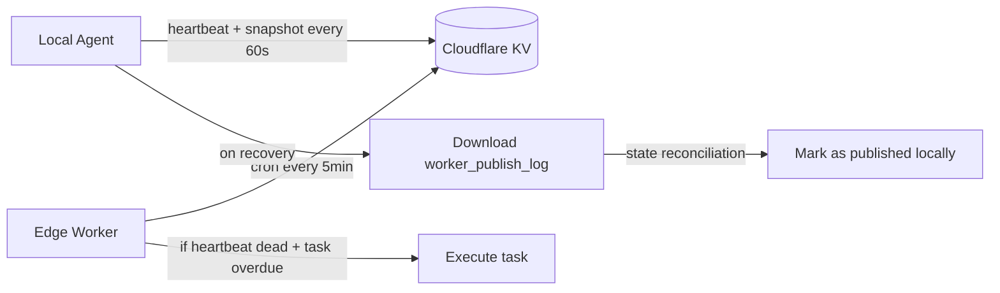
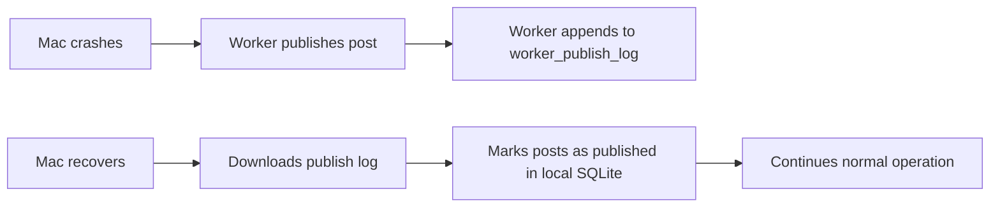

---
tags:
  - cloudflare
  - workers
  - ai-agents
  - fault-tolerance
  - state-reconciliation
  - edge-computing
aliases:
  - Cloudflare Workers
  - Worker Sync
  - Agentic Fault Tolerance
created: 2026-07-13
---

# Cloudflare Workers — Fault-Tolerant Agentic Workflows

## The Problem

Autonomous AI agents often need to run scheduled tasks in the background — "wait until tomorrow at 9 AM", "poll this data source every hour", etc. When these agents run on a local machine or single server, you hit a **massive reliability problem**:

> [!danger] The Single-Point-of-Failure Problem
> What happens to the agent's scheduled tasks if the laptop is closed, or the server crashes while it was waiting? The task is simply lost.

---

## The Solution: Sync + Watchdog Pattern

This project solves the problem using a lightweight distributed fallback pattern with two components:



### 1. The Sync (`src/worker-sync/`)

The main local agent constantly sends a "heartbeat" timestamp and its upcoming task list to a remote key-value store (Cloudflare KV).

### 2. The Watchdog (`cloudflare-worker/`)

A tiny, serverless edge function runs every 5 minutes. It checks the KV store:

- **Heartbeat alive** → does nothing
- **Heartbeat dead** (agent crashed) **AND a task is overdue** → edge worker executes the task on the agent's behalf

> [!tip] Architectural Insight
> This is a **fault-tolerant agentic workflow** pattern. The cloud function cannot read the local SQLite database, so the local agent must project just enough context to the cloud.

---

## State Projection — Minimal Context for Recovery

The local agent syncs a `QueueSnapshot` — not the full post data, just the bare minimum needed to execute the final step.

> [!example] Snapshot Interface
> ```typescript
> export interface QueueSnapshot {
>   heartbeatAt: string;
>   posts: SnapshotPost[];
> }
> ```
>
> Each `SnapshotPost` contains only:
> - `igUserId` — who to post as
> - `containerId` — the prepared content reference
> - `publishAt` — when to publish

In Distributed AI Engineering, this is called **State Projection** — the local agent "projects" just enough context to the cloud so that if it drops dead, the cloud watchdog can finish the final step blindly.

---

## The Heartbeat Cycle

| Component | Frequency | Action |
|-----------|-----------|--------|
| Local agent | Every 60s | Pushes `QueueSnapshot` to Cloudflare KV |
| Cloudflare Worker | Every 5 min (cron) | Reads snapshot, checks heartbeat |

The Worker's check logic:

1. Read the `QueueSnapshot` from KV
2. Check `heartbeatAt` — if older than 5 minutes, assume local agent crashed
3. Scan `posts` array — if any `publishAt` is in the past, publish to Meta immediately

---

## State Reconciliation — Handling Recovery

> [!question] The Double-Publish Problem
> The Mac crashes, the Worker publishes the post, then an hour later you turn the Mac back on. How does the Mac know the Worker already handled it?

### The Solution

When the Cloudflare Worker takes over, it appends an entry to a `worker_publish_log` in the KV store. When the Mac comes back online, the very first thing the daemon does is **download that log** — before it even looks at its own schedule.



In AI Engineering, this is known as **State Reconciliation**:

> [!info] State Reconciliation
> When agents run across different environments (edge and local), they _must_ sync their state gracefully when recovering from an outage. Without it, you get agents double-publishing, double-billing, or stepping on each other's toes.

---

## Two Senior-Level Concepts Unpacked

This project demonstrates two foundational AI engineering patterns:

### 1. MCP Interface Design

Using semantic errors and descriptive Zod schemas so the AI has context, rather than returning 500 crashes. (See [[MCPs|MCP Notes]])

### 2. Agentic Fault Tolerance

| Pattern | Description |
|---------|-------------|
| **State Projection** | Syncing a lightweight snapshot to the cloud |
| **Edge Watchdog** | Serverless function that checks heartbeat and acts |
| **State Reconciliation** | Syncing state gracefully on recovery |

---

## Summary Checklist

| Concept | Implementation |
|---------|----------------|
| ✅ Heartbeat | Local agent pushes `heartbeatAt` every 60s |
| ✅ Minimal snapshot | `SnapshotPost` with only `igUserId`, `containerId`, `publishAt` |
| ✅ Edge watchdog | Cloudflare Worker checks KV every 5 min |
| ✅ Fallback execution | Worker publishes if heartbeat dead + task overdue |
| ✅ Publish log | Worker appends to `worker_publish_log` in KV |
| ✅ State reconciliation | Local agent downloads log on recovery, marks as published |

> [!quote] Core Principle
> Autonomous agents need fault tolerance. If you build agents that run unattended, you need state projection, edge watchdogs, and state reconciliation — otherwise your scheduled tasks are at risk every time a machine goes down.
