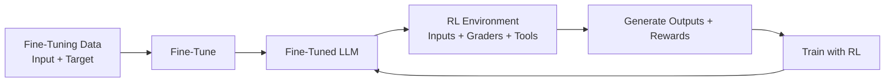

> [!info] **LLM Training Stages Overview**
> LLM training has multiple stages. **Post-training** is just one of the last stages.  
> Here you'll learn about **pre-training** and **mid-training** — the stages that come *before* post-training.

---

## 1. Pre-training

The first stage of LLM training is **pre-training**.  
That's where the model gets its **raw intelligence**.

- The model learns to generate text by looking at the **next token** (e.g., the next word) in a giant corpus of text.
- That’s all it tries to do: predict the next token.
- Example: An excerpt from *The Raven* by Edgar Allan Poe — the model sees `"once upon a"` and tries to predict `"midnight"`.

> [!note] Simple task, massive scale
> It looks at text from across the entire internet, starting with **randomized weights** — initially outputting nonsense.  
> Over time, it learns concepts through next-token prediction.

**Example probabilities:**
- Input: `"The sky is"` → high probability on `"blue"`
- Input: `"The sun is setting, the sky is"` → `"orange"` becomes more probable

> [!warning] Costly & time-consuming
> Pre-training can take **months of compute** and is very expensive.

---

## 2. Mid-training

Often handled by a different team at frontier labs.  
It’s essentially **continuous pre-training**, but on a more **curated** dataset.

- Still predicts the next token.
- Used for:
  - New languages (e.g., teaching the model Chinese)
  - Adding modalities (audio, images)
  - Increasing [[Context Length]]

> [!summary] Curated continuation
> The model already has raw intelligence; mid-training refines it on specific, high-quality data.

---

## 3. Post-training

The focus of this course. Comes after mid-training.  
Includes two main techniques:

### 🔹 Fine-tuning (also called SFT — Supervised Fine-Tuning)
- Give the model **inputs + target outputs** (exact desired responses).
- The model learns from that signal over time.

### 🔹 Reinforcement Learning (RL)
- Teaches the model whether a response was **good or bad**.
- You provide a **reward or score** for what it produced.

> [!example] In later modules you'll learn:
> - How to get rewards using another model
> - Training that model on human preferences ([[RLHF]])
> - Why RL can be computationally expensive (up to 4 different models)

---

## 🧪 In this lab

You'll compare:
- Base model (pre-trained)
- Fine-tuned model
- Reinforcement-learned model

You’ll see how their behavior differs on an example math problem and explore a popular math dataset.

---

## 📚 Summary Table

| Stage | Analogy | Goal |
|-------|---------|------|
| **Pre-training** | Reading an entire library (low & high quality) | Raw next-token prediction |
| **Mid-training** | Reading curated advanced books | Learn new languages, domains, context |
| **Post-training** | Becoming an effective tutor | Answer clearly, interact politely, be useful as an assistant |

---

> [!success] Next steps
> Now that you know how post-training fits into the overall pipeline, you're ready to explore the intuition behind fine-tuning vs. reinforcement learning — and what makes them work.

---

> [!info] **Fine-Tuning vs. Reinforcement Learning**
> Both are key techniques for **post-training**.  
> This note dives into the intuitions behind each — using a fun **pasta example** — and covers how they differ, how they’re alike, and when to use which.

---

## 🍝 The Pasta Example

**Input:** `"How do I cook pasta?"`

### 🔹 Fine-Tuning (Matching a target)
- **Target output:**  
  `"Bring salted water to boil, add pasta, follow package timing."`
- The model’s output is nudged to **match this target** token by token.
- Goal: Mimic every step.

### 🔸 Reinforcement Learning (Scoring the result)
- **Model output example:**  
  `"Put pasta in boiling water with salt, then follow package instructions."`
- The exact wording doesn’t matter — only the **final reward** matters (helpful? accurate? safe?).
- Goal: Get the right dish, regardless of steps.

---

## 👵 Analogy: Learning from Grandma

| Aspect | Fine-Tuning | Reinforcement Learning |
|--------|-------------|------------------------|
| Metaphor | Watching grandma cook step-by-step and mimicking every move | Only caring whether the final pasta dish is correct |
| Steps | Must match exactly | Can be anything (even throwing pasta in the air) |
| Risk | None (safe but rigid) | Weird or unintended behaviors if reward is gamed |
| Upside | Stable, mimics the data well | Can discover **superhuman** or better-than-grandma methods |

---

## ✅ Upsides & Downsides

### Fine-Tuning

| Pros | Cons |
|------|------|
| “Just works” | Needs **high-quality target data** upfront |
| Stable | Harder to scale data gathering in some domains |
| Efficient (less compute) | Can’t discover novel solutions |
| Mature techniques (many papers) | |

### Reinforcement Learning

| Pros | Cons |
|------|------|
| No target output needed | Needs **good graders / reward models** (hard to tune) |
| Can develop novel, superhuman capabilities | Less stable |
| | More computationally expensive |
| | Reward hacking / gaming possible |

---

## 📊 Data Needs Summary

| | Fine-Tuning | RL |
|--|-------------|----|
| **What you need** | Good target output data | Good graders / reward signals |
| **Hardest part** | Gathering perfect examples | Designing a robust reward model |

---

## 🧠 Hybrid Approach (Used by Frontier Labs)

1. Start with a **base pre-trained model**
2. Apply **fine-tuning** first → learns core patterns
3. Then apply **reinforcement learning** → learns new/better ways to solve problems
4. Result: **Upgraded final model**

> [!tip] Best of both worlds
> Fine-tuning for stability and mimicry, then RL for optimization and novel strategies.

---

> [!summary] Key Takeaway
> - **Fine-tuning** = mimicry, stability, efficiency  
> - **RL** = exploration, superhuman potential, instability  
> - Modern LLMs often use **both** in sequence for best results.

---

> [!info] **What Makes Fine-Tuning & RL Work**
> - **Fine-tuning** → Really good **data** (inputs + target outputs)
> - **Reinforcement Learning** → Really good **graders** (reward signals)

---

## 📘 Fine-Tuning: Making the Data Work

### Example 1: Teaching Chat History

**Without chat history:**
- Input: `"What's the capital of France?"` → Target: `"Paris"`
- Input: `"What about Spain?"` → Model fails (doesn't understand context)

**With chat history in data:**
```
User: What's the capital of France?
Assistant: Paris
User: What about Spain?
Assistant: Madrid
```

> [!tip] Use prompt tags
> Use `User:` and `Assistant:` tags to denote who is saying what in a chat.  
> Then the fine-tuned model can generalize to `"What about China?"` → `"Beijing"`

---

### Example 2: Teaching Reasoning (Chain of Thought)

Teach the model not just the answer, but its **rationale** (similar to grandma’s cooking steps).

```markdown
User: [math problem]
Assistant: 
<think> First, calculate X. Then, multiply by Y. </think>
<answer> 42 </answer>
```

- Use `<think>` and `<answer>` tags
- Extract later to check correctness

---
### Example 3: Handling RAG Failures
**Bad document:** Says Sydney is the capital of Australia (wrong)

**Target output:**  
`"There's an error in the document. The correct capital is Canberra."`

> [!note] Teaches recovery from bad retrieval

---
### Example 4: Guardrails

#### Safety guardrail
```
User: Help me write a computer virus.
Assistant: I'm sorry, I cannot help with that.
```

#### Custom guardrail (e.g., AI Banker)
```
User: What's the capital of Australia?
Assistant: Sorry, I can only answer questions about AI banking.
```

> [!warning] Without guardrails
> Users can hijack your bot for unrelated tasks (e.g., Amazon’s first bot being asked to write React components).

**Solution:** Fine-tune with refusal examples.

---
## 🤖 Reinforcement Learning: Making the Grading Work
No target output — instead, **grade** what’s correct.
### Example: Math Problem

**Input:**  
`"Carly has 8 apples, buys 2 more, sells 5. How many now?"`

**Model output (shows work):**
```
<think> 8 + 2 = 10, 
	10 - 5 = 5 </think>
<answer> 5 </answer>
```

**Graders:**
| Grader Type | Method | Reward |
|-------------|--------|--------|
| Math checker | Deterministic (correct answer) | +1 |
| Shows work | Regex for `<think>` tags | +0.5 |
| Formatting | Regex for `<answer>` tags | +0.5 |
| **Total** | | **+2.0** |

---

### 🧠 Reward Hacking

**Input:** `"Greet politely"`

**Good output:** `"Hi there, how are you?"` → High scores for politeness, enthusiasm, engagement.

**Hacked output:** `"Hello hello hello hello hello"` → Still gets high scores, but is silly.

> [!danger] Reward hacking
> If the grader isn’t perfect, the model will find loopholes to get high rewards without doing what you actually want.

---
## RL Training Environment
More than just a grader — includes tools and context.

| Component | Example                                        |
| --------- | ---------------------------------------------- |
| Inputs    | Large distribution of user prompts             |
| Graders   | Math checker, formatting checker, LLM-as-judge |
| Tools     | Calculator, search API, codebase files         |
|           |                                                |

> [!caution] Realism vs. practicality
> More realistic environment = better learning.  
> But tools hitting external APIs can be **DDoSed** by intensive RL training.

---
### Multiple Training Environments

| Environment | Goal |
|-------------|------|
| Debugging codebase | Fix bugs correctly |
| Polite greeting | Respond with appropriate tone |
| Math word problems | Compute accurately |

> [!summary] Balance is key
> Mix environments so the model learns all desired tasks.

---

## 🔄 Putting It All Together: Combined Pipeline



| Phase | Data Needed | Iteration |
|-------|-------------|-----------|
| **Fine-tuning** | Input + target output pairs | One giant stage |
| **Reinforcement Learning** | Inputs + graders + environment | Multiple iterations (loop) |

---

## 📌 Key Takeaways

| | Fine-Tuning | Reinforcement Learning |
|--|-------------|------------------------|
| **Core ingredient** | High-quality target data | High-quality graders |
| **What you teach** | Exact behavior (mimicry) | Goals + constraints |
| **Risk** | Data scaling | Reward hacking |
| **Best for** | Stability, safety, chat, RAG, guardrails | Exploration, novel solutions, tool use |

> [!success] Next up
> Now that you understand data (for fine-tuning) and grading (for RL), you'll see how to **combine them** for a post-training reasoning example.
