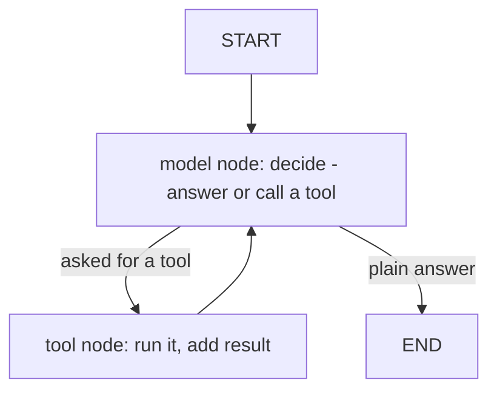

# Building agents with LangGraph

Notes from building a real agent by hand in LangGraph, with the mechanism named at each step. An agent = a model that can *act*: it picks a tool, uses the result, decides the next step, and stops when done.

## The core idea, under the framework

An agent is a **loop**:

1. the model looks at the conversation so far,

2. it either asks to call a tool, or gives a final answer,

3. if it asked for a tool, you run it and add the result to the conversation,

4. back to the model — repeat until it answers with no tool call.

LangGraph draws this as a **graph** of nodes and edges, but it is that loop underneath.



Map each piece to the code:

- **The loop** = the edge `tools -> model` (after a tool runs, go back to the model).

- **The stop condition** = the conditional edge after the model: *did the last message ask for a tool?* No -> END. This is what prevents an infinite loop.

- **The state** = the running list of messages. It grows each step via the `add_messages` reducer (append, don't overwrite).

Common misconception: tools are **not** graph nodes. You have **one model node** and **one tool node** (`ToolNode`) that runs whichever tool the model picked.

## Minimal agent

```python
from typing import Annotated, TypedDict
from langgraph.graph import StateGraph, START, END
from langgraph.graph.message import add_messages
from langgraph.prebuilt import ToolNode
from langchain_core.tools import tool

class State(TypedDict):
    messages: Annotated[list, add_messages]      # the conversation; appends each step

@tool
def calc(expression: str) -> str:
    """Do arithmetic, e.g. '0.15 * 240'."""
    return str(eval(expression, {"__builtins__": {}}, {}))   # learning-only

tools = [calc]
llm_with_tools = llm.bind_tools(tools)           # bind_tools RETURNS a new llm - assign it

def model_node(state: State):
    return {"messages": [llm_with_tools.invoke(state["messages"])]}

def should_continue(state: State):               # the stop condition
    return "tools" if state["messages"][-1].tool_calls else END

graph = StateGraph(State)
graph.add_node("model", model_node)
graph.add_node("tools", ToolNode(tools))
graph.add_edge(START, "model")
graph.add_conditional_edges("model", should_continue, {"tools": "tools", END: END})
graph.add_edge("tools", "model")                 # the loop
agent = graph.compile()
```

Note: the **model must support tool calling** — many free models do not, and then the agent never uses tools.

## Memory (remember across turns)

By default each `invoke` starts fresh — the state is thrown away. To remember, add a **checkpointer**: it saves the state after each turn and loads it on the next, keyed by a `thread_id`.

```python
from langgraph.checkpoint.memory import MemorySaver
agent = graph.compile(checkpointer=MemorySaver())
config = {"configurable": {"thread_id": "user-1"}}
agent.invoke({"messages": [("user", "My name is Kassra.")]}, config)
agent.invoke({"messages": [("user", "What is my name?")]}, config)   # remembers
```

- **`MemorySaver`** = saves to RAM = **short-term**: remembers across turns while the program runs, lost on restart.

- **DB-backed** (`SqliteSaver`, `PostgresSaver`) = **long-term**: survives a restart.

- **"Checkpointer"** is the umbrella word for the save/load mechanism.

- The `thread_id` picks *which* conversation to load, so different users don't mix.

## Human-in-the-loop (a person approves an action)

Pause the agent before it runs a tool, let a human approve or reject, then continue. Needs the checkpointer (the state is saved while it waits).

```python
agent = graph.compile(checkpointer=MemorySaver(), interrupt_before=["tools"])

agent.invoke({"messages": [("user", "email john the report")]}, config)   # pauses before the tool
snap = agent.get_state(config)                    # snap.next == ('tools',); see the pending tool call

# APPROVE: resume from the saved point
agent.invoke(None, config)

# REJECT: feed a "denied" result AS IF the tool ran, so the real tool never executes
from langchain_core.messages import ToolMessage
call = snap.values["messages"][-1].tool_calls[0]
agent.update_state(config, {"messages": [ToolMessage(
    content="DENIED by the human. Do not answer this yourself; tell the user it was declined.",
    tool_call_id=call["id"])]}, as_node="tools")
agent.invoke(None, config)
```

- **Pause is after the model, before the tool** — the moment to catch a risky action.

- **Resume = re-invoke the same `thread_id` with `None`** — it continues from the saved checkpoint (not from scratch).

- **KEY lesson:** blocking a tool only matters for tools with **side effects** (send email, delete data, run SQL). For a pure-knowledge tool like `calc`, the model just answers anyway — HITL guards **actions, not knowledge**.

- **In a web app:** the checkpointer is what lets the approval come from a *different request, later* — pause -> save by `thread_id` -> user clicks approve in a UI -> the server resumes by that `thread_id`.

## Context engineering — the 100-tools problem

Every call sends each tool's name + description + argument schema. With 100 tools that bloats the context, costs tokens, and confuses the model's choice.

Two fixes:

- **Retrieval over tools** (RAG on tools): embed each tool's description, embed the question, keep the top-k most similar tools. A pre-step picks the shortlist.

- **Progressive disclosure** (a different fix): the model always sees a light list (names + one-liners) and pulls the full definition only when it needs it. The model drives it.

Two things learned building the retrieval demo:

- It **mispicked** a math question at first (the description said "evaluate a math expression"; the question said "15% of 240" — no shared words, scores ~0.05). Same semantic-vs-keyword miss as RAG. **Fix: write the tool description in the words users use, with example phrasings** -> the score jumped from 0.047 to 0.466. The description IS the searchable surface.

- Retrieval isn't free (one embedding call per question), so it's only worth it with **many** tools. A 2-tool agent should just send both — don't add a fragile step you don't need.

## Idempotency — safe to retry

The retry trap: the tool **succeeds**, but the confirmation is lost to a network hiccup. The agent can't tell "failed" from "worked but I didn't hear back," so it **retries and duplicates** the action (a double-sent email, a double-charge).

**Idempotency** = doing the operation two or more times has the same effect as doing it once.

How: give each request a **key**, store keys you've already done, and skip if seen.

```python
import hashlib, os
def send_email(to, body):
    key = hashlib.sha256(f"{to}|{body}".encode()).hexdigest()   # same request -> same key
    if key in seen_keys():          # a file or DB of processed keys
        return "skipped duplicate"
    do_the_send(); record(key)
```

- Caveat: hashing *content* also skips a genuinely-repeated action. Real systems use a **client-supplied idempotency key per intent**, not a content hash.

- This is exactly the `idempotency_manager` / duplicate-publish problem in production systems (e.g. Shutterabia).

## Debugging lessons from the build

- **Warning vs error:** LangGraph's `allowed_objects` pending-deprecation is a *warning* (harmless), force-shown by LangChain and not suppressible from user code. An *error* is a traceback that stops the program. Learn to tell them apart.

- **Relative vs absolute paths:** `env_file=".env"` is looked up from where you *run* python. Anchor it to the file: `os.path.join(os.path.dirname(__file__), ".env")`.

- **A state snapshot goes stale:** after `invoke`/resume, re-read `agent.get_state(config)` — the old `snap` is from before the change.

## Best practices

- Build in the framework, but know what each piece maps to (loop / stop / state) so you can debug it.

- Use a **tool-capable model**; check before assuming tool calls work.

- Add **memory** when the agent needs context across turns; pick RAM vs DB by whether it must survive a restart.

- Put a **human gate** before **side-effect** tools, not before harmless ones.

- Only add **tool selection** when you truly have many tools; write tool descriptions in user language.

- Make **side-effect tools idempotent** so retries don't duplicate.
