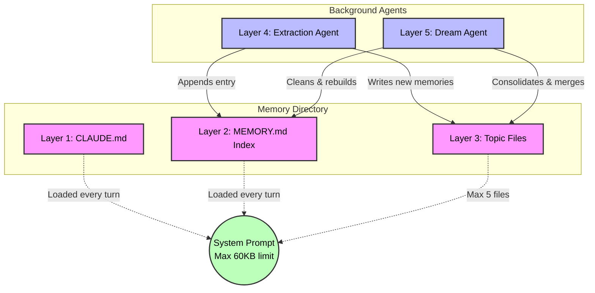
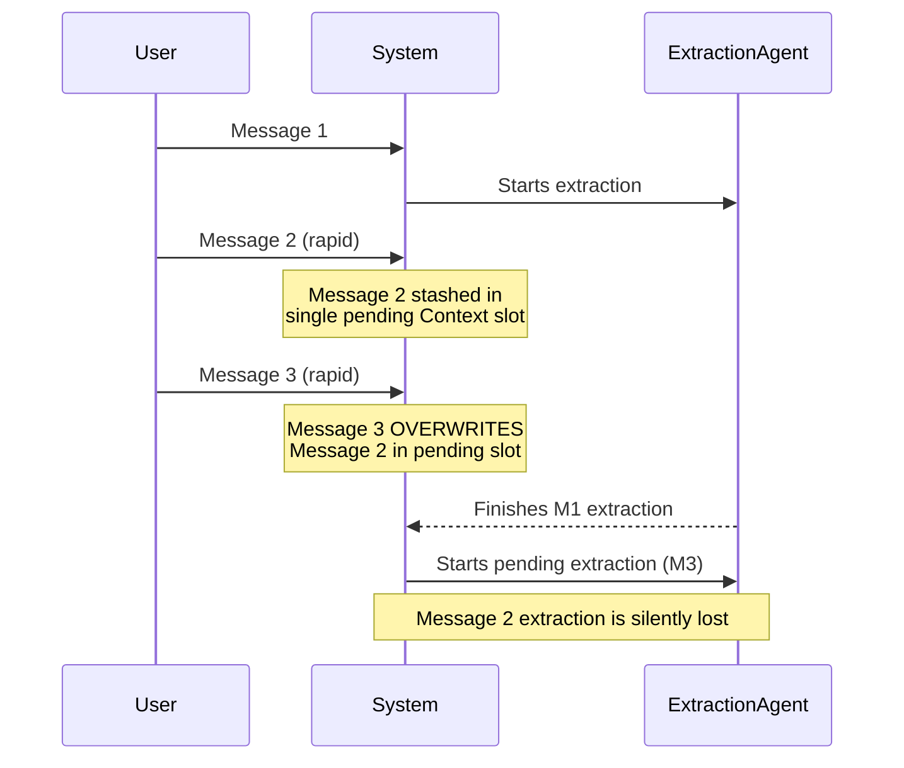
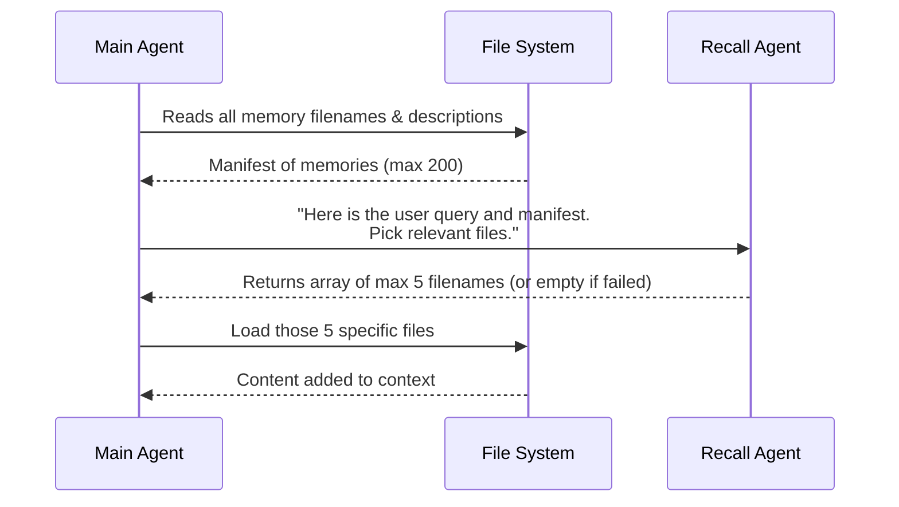

# Claude Code Memory System - Deep Dive

This note is a comprehensive study reference on the internal memory architecture of Claude Code, derived from a full reading of its leaked source code (22 source files). It covers every layer, every phase, every limitation, and every failure mode.

---
## High-Level Architecture
Claude Code's memory system is built on five distinct layers, each serving a different purpose. They stack on top of each other, with the bottom layers being the most fundamental.

### Layer 1 -- CLAUDE.md Files (Project Instructions)

These are static instruction files loaded into Claude's system prompt on every single turn. They contain project-level instructions (coding conventions, build commands, project structure). They are not part of the dynamic memory system but consume context window space -- up to 40KB per file, roughly 8,000 to 10,000 tokens.

### Layer 2 -- MEMORY.md Index (The Bottleneck)

A flat-file index stored at the root of the memory directory. Every memory file gets a single one-line entry in this index. This is the sole gateway through which Claude discovers that memories exist. It is loaded into the system prompt at the start of every session. Has hard, non-configurable caps that are detailed in [[#Phase 2 -- The MEMORY.md Index (The 200-Line Bottleneck)]].

### Layer 3 -- Topic Files (Individual Memories)

Individual markdown files with YAML frontmatter. Each file represents one memory: a fact, a preference, a decision, a reference. They live in the memory directory and are only loaded when the recall system determines they are relevant to the current query.

### Layer 4 -- Auto-Extraction (Post-Response Agent)

A forked Sonnet agent that runs in the background after Claude finishes responding. It reviews the conversation and extracts memories automatically, writing them to the memory directory.

### Layer 5 -- Auto-Dream (Consolidation Agent)

A background consolidation agent that runs roughly daily (after approximately five sessions spaced about 24 hours apart). It reviews, merges, and cleans up the accumulated memory files.

> [!important] The Persistence Model
> Everything is stored as plain markdown files on disk. The path is `~/.claude/projects/<your-repo-name>/memory/`. Every project gets its own folder. Every conversation can write to it. The files persist between sessions. There is no database. There is no vector store.

---

## The Memory Directory Path

The memory directory path is computed by sanitizing the git root path of your project. Every non-alphanumeric character is replaced with a dash. For example, `/Users/alice/my-project` becomes `--Users-alice-my-project`.

If the sanitized string exceeds a maximum length, it is truncated and a hash suffix is appended. This creates a path collision risk detailed in [[#The Path Collision Problem]].

> [!warning] Worktree and Branch Blindness
> Worktrees of the same repository intentionally share the same memory directory. But there is no branch awareness. A memory saved on `main` persists when you switch to a feature branch, even if the memory's content is now wrong for that branch.

---

## The Four Memory Types

The source constrains all memories to exactly four categories. Each has a distinct purpose and scope.

### Type 1 -- User Memories

Track who you are as a person and developer. Your role, expertise, preferences, communication style, and how you like to work. These are strictly private -- only you see them, even in team configurations.

**Examples:**
- "Prefers functional programming patterns over OOP"
- "Senior backend engineer, primarily works in Python"
- "Likes concise explanations, dislikes verbose output"

### Type 2 -- Feedback Memories

Track guidance you have given Claude during sessions. Corrections, validated approaches, things Claude should stop doing, confirmed patterns.

**Examples:**
- "Do not mock the database in integration tests"
- "Always use absolute imports in this project"
- "The user confirmed that the decorator pattern is the right approach here"

### Type 3 -- Project Memories

Track what is happening in the codebase at a strategic level. Deadlines, architectural decisions, ongoing work, and context that is not derivable from the code itself.

**Examples:**
- "Migration to microservices planned for Q2"
- "The auth service is being rewritten, do not modify it"
- "Sprint deadline is March 15"

### Type 4 -- Reference Memories

Store pointers to external systems, tools, and resources. URLs, Slack channels, bug trackers, documentation links.

**Examples:**
- "Bug tracker is at jira.company.com/project-x"
- "Design specs are in the shared Google Drive folder"
- "Deployment pipeline runs through GitHub Actions"

> [!note] The Derivability Rule
> The source code is explicit: if information can be derived from the current codebase through grep, git log, or reading files, it should NOT be saved as a memory. Memories are for context that lives outside the code.

---

## Phase 1 -- Memory Extraction (How Memories Get Created)

### The Extraction Agent

After Claude finishes responding to your message, a separate agent is forked in the background. This is not Claude itself. It is a distinct Sonnet instance with heavily restricted permissions.

### Permission Model
The extraction agent is allowed to:
- Read files anywhere in the project
- Run grep and glob searches
- Execute read-only shell commands
- Edit or write files ONLY within the memory directory

It cannot:
- Write to any file outside the memory directory
- Run destructive shell commands
- Make network requests
- Modify your source code

### Pre-Scanning

Before the extraction agent runs, the system pre-scans all existing memory files. It reads the first few lines of each file (enough to extract frontmatter), collects filenames, descriptions, types, and modification times, then sorts by recency and caps at 200 files.

This scan result is passed to the extraction agent so it does not waste turns running `ls` or `find` commands.

### The Silent Failure on Scan

If the memory directory is unreadable for any reason -- permissions, disk errors, corruption -- the scan returns an empty array. No error is raised. No warning is shown. The extraction agent proceeds as if there are zero existing memories.

### Session State Management

The extraction system is initialised once per session in a closure that captures all mutable state:
- A set of in-flight extraction promises
- The UUID of the last message that triggered extraction
- A flag tracking whether extraction is currently running
- A counter of turns since last extraction
- A single slot for pending context (not a queue)

> [!warning] The Single-Slot Queue Problem
> If you send three rapid messages, the extraction works like this:
> - Message 1: extraction starts running
> - Message 2: its context is stashed in the pending slot
> - Message 3: overwrites Message 2's context in the pending slot
> 
> Message 2's extraction window is silently lost. There is no queue. Only the last pending message survives.

---

## Phase 2 -- The MEMORY.md Index (The 200-Line Bottleneck)

### What It Contains
Every memory file gets a one-line entry in MEMORY.md. This file is the sole index into your entire memory store. It is loaded into the system prompt on every turn.

### The Hard Limits

Two constants define the maximum size of MEMORY.md:
- **200 lines maximum** -- if the index exceeds this, it is truncated from the bottom
- **25,000 bytes maximum** -- a secondary cap for edge cases where individual lines are unusually long

At the p100 (worst case) in production, Anthropic observed a MEMORY.md file of 197KB compressed into 200 lines.

### The Truncation Behaviour

When MEMORY.md exceeds either limit:

1. If the line count exceeds 200, only the first 200 lines are kept
2. If the resulting content still exceeds 25KB, it is cut at the last newline before the 25KB mark
3. A warning is appended to the truncated content

The warning reads: "WARNING: MEMORY.md is truncated. Only part of it was loaded. Keep index entries to one line under approximately 200 characters; move detail into topic files."

### The Silent Forgetting

This is the critical failure mode of the entire system.
When you hit line 201, the oldest memory's index entry falls off the bottom. The memory file still exists on disk. It has not been deleted. But it is now invisible to Claude because the index no longer references it.

Claude loads a fresh context next session with no idea those memories ever existed. It does not tell you. It does not error. It does not warn you during the session. It simply does not know.

**What happens after silent truncation:**
- Claude writes a test that hits the flaky endpoint you warned it about months ago
- Claude asks you again about your PR review policy
- Claude contradicts the architecture you agreed on months ago
- Claude re-asks your preferences it already learned

It is not hallucinating. It is not broken. It just forgot. And it has no mechanism to detect that it forgot.

> [!danger] The Compounding Problem
> The freshness warning system (described later) only fires for memories that were actually loaded. If a memory was truncated out of the index, it never gets loaded, so it never triggers a freshness warning. Claude does not know what it does not know.

---
## Phase 3 -- Semantic Recall (How Claude Remembers)

### The Sonnet Side-Call
Every turn, Claude Code makes a separate API call to Claude Sonnet. The purpose is to determine which memory files are relevant to your current query.

### The Process

1. Scan all memory files and extract their filenames and one-line descriptions
2. Build a manifest of available memories
3. Send the manifest plus your current query to Sonnet
4. Ask Sonnet to select the most relevant files
5. Maximum 5 files returned per turn

### What This Is NOT
This is not embeddings. This is not vector search. This is not semantic similarity matching. It is a language model reading a plain-text list and making a judgment call about relevance.

### The Failure Modes

If Sonnet is unavailable, slow, or returns malformed output:
- The system catches the error silently
- Returns an empty array -- zero memories recalled
- The user loses all memory context for that turn
- There is no indication that recall failed

Every recall is non-deterministic. The same query against the same set of memories may return different results each time. There is no caching, no consistency guarantee, and no way to audit which memories were considered and rejected.

> [!note] The 5-File-Per-Turn Cap
> Even if you have 200 memories, Claude can only surface 5 per turn. The relevance judgment is made by a separate model working off filenames and short descriptions. Deep, nuanced context that does not surface in a filename or one-line description may never be recalled.

---
## Phase 4 -- Memory Freshness (Staleness Detection)

### The Freshness Function

Every memory carries a modification timestamp. The system has a function that computes the age of each memory in days and generates a staleness warning for anything older than one day.

### The Warning Text

For memories older than one day, the following text is prepended to the memory content before Claude sees it:

"This memory is X days old. Memories are point-in-time observations, not live state. Claims about code behavior or file:line citations may be outdated. Verify against current code before asserting as fact."

### The Edge Cases

- Memories 0 to 1 day old receive no staleness warning at all
- A memory written at 11:59 PM shows no caveat at 12:01 AM the next day
- The day boundary is not timezone-aware in any meaningful way

### Advisory-Only Verification

The system prompt includes guidance telling Claude to verify stale memories before recommending them:
- If the memory names a file path, check the file exists
- If the memory names a function or flag, grep for it
- If the user is about to act on the recommendation, verify first

But this is entirely advisory. There is no runtime enforcement. Claude may or may not follow this guidance depending on the context.

### Known Gaps

The source code itself documents a known gap: the verification guidance does not cover slash-command claims. The evaluation score on this specific case was 0 out of 3. Slash commands are not files or functions in the model's ontology, so the verification heuristics do not apply.

---

## Phase 5 -- The Dream System (Background Consolidation)

### When It Runs

The dream agent does not run on a fixed schedule. It must pass through four sequential gates:

1. **Time gate** -- enough time has passed since the last consolidation
2. **Scan throttle** -- a rate limiter to prevent excessive scanning
3. **Session count** -- approximately 5 sessions must have occurred since the last dream
4. **Lock acquisition** -- the filesystem lock must be available

If any single gate fails, the dream silently does not run. There is no retry mechanism.

### The Filesystem Lock

The lock mechanism is a file-based mutex. The entire implementation works like this:

1. Write your process ID (PID) to a lock file
2. Read the lock file back
3. If the PID you read matches your own PID, you hold the lock
4. If it does not match, another process won the race

This is not a proper filesystem lock (no flock, no advisory locking). Two processes can both write to the lock file simultaneously. The source code's own comment acknowledges this: "Two reclaimers both write, last wins the PID. Loser bails on re-read."

### The Stale Lock Problem

The lock has a staleness window of 60 minutes. If your machine crashes during consolidation, the lock remains held for up to one hour. During that time, no dream agent can run.

### Rollback on Failure

If the dream agent fails mid-consolidation, it attempts to roll back by manually rewinding the lock file's modification timestamp to its pre-acquisition value using the `utimes` system call. If the rollback itself fails, it logs a debug message and continues.

### What the Dream Agent Does

The consolidation agent reviews accumulated memories and:
- Merges related memories that can be combined
- Removes memories that are no longer relevant
- Updates stale information where possible
- Cleans up the MEMORY.md index

---

## The Race Condition: Extraction vs Main Agent

### The Concurrent Writer Problem

Two different agents write to the memory directory simultaneously:
1. The main Claude agent during your session
2. The extraction agent running in the background after each response

### The Mitigation

The system detects whether memory writes have occurred since a given message UUID. It walks through the message history, checking each assistant message for file write operations targeting the memory directory.

This is detection, not prevention. Both agents can still write concurrently. The system simply tries to avoid stepping on its own writes.

### The Coalescing Behaviour

When rapid messages arrive, pending extractions are coalesced using the single-slot pending context described in [[#Session State Management]]. Only the most recent pending message survives; intermediate messages lose their extraction window entirely.

---

## Team Memory

### The Feature Flag

There is a TEAMMEM feature flag for team-scoped memories. When enabled, some memories are private (only you see them) and others are team-wide (all contributors to the project share them).

### The Scoping Rules
- **Private memories:** User preferences, personal workflow, communication style
- **Team memories:** Project conventions, architectural decisions, coding standards, shared context

Team memory means that one developer's corrections can influence another developer's Claude experience. This is powerful for consistency but creates a trust problem -- any team member can write memories that affect everyone.

---

## Context Window Cost

Memory is not free. Every turn, the system injects substantial content into the context window:

| Component | Size | Approximate Tokens |
|---|---|---|
| Memory prompt instructions | ~500-1000 bytes | ~200-400 tokens |
| MEMORY.md content | up to 25KB | ~5,000-6,000 tokens |
| CLAUDE.md files | up to 40KB per file | ~8,000-10,000 tokens |
| Surfaced memories (per turn) | up to 20KB | ~4,000 tokens |
| Cumulative session cap | 60KB | ~12,000 tokens |

In production, Anthropic observed 26,000 tokens per session consumed by memory alone. That is 13 percent of a 200K context window spent entirely on remembering. This memory overhead is static -- it does not shrink as the conversation grows. It sits at the top of the system prompt until context compaction, at which point it is re-injected fresh.

---

## Silent Failure Catalogue

The memory system has multiple points of silent failure. In every case, the user receives no indication that something went wrong.

### Directory Creation Failure

If the memory directory cannot be created (permissions denied, disk full, read-only filesystem), error codes like EACCES, EPERM, EROFS, and ENOSPC are all caught, logged at debug level, and swallowed. The system prompt then tells Claude "This directory already exists, write to it directly." Claude attempts to write. The write fails. Then the user sees the error for the first time.

There is no disk space pre-check. No permission pre-check. No graceful degradation.

### Recall Failure

If the Sonnet side-call fails (network error, rate limit, malformed response), the system returns an empty array. Zero memories are recalled. The user has no way of knowing that recall failed versus there being no relevant memories.

> [!note] Other Silent Failures
> Memory scan failures and index truncation are also silent. These are covered in detail in [[#The Silent Failure on Scan]] and [[#The Silent Forgetting]] respectively.

---

## The Path Collision Problem

### How It Happens

Memory directories are keyed on sanitized project paths. The sanitization replaces all non-alphanumeric characters with dashes and, for long paths, appends a hash suffix after truncation.

If two different projects produce sanitized strings long enough to require hashing, they may produce the same truncated prefix. Different hash suffixes mitigate this, but hash collisions remain theoretically possible.

### The Consequence

A hash collision would mean two unrelated projects share the same memory directory. Memories from Project A would appear in Project B's context, and vice versa. Neither the user nor Claude would have any indication this was happening.

---

## The Invalidation Problem

Filesystem memory has no concept of invalidation. Files do not know when their referents change. There are no foreign keys, no triggers, no subscriptions, no webhooks.

A memory that says "the user endpoint is at /v2/users" will persist indefinitely, even after the endpoint has been moved to /v3/users. The only mechanisms for correction are:

1. **Manual deletion** -- you find and delete the stale memory file yourself
2. **Freshness warnings** -- the staleness caveat is added, but verification is advisory only
3. **Dream consolidation** -- the background agent may detect and clean up stale memories, but this is not guaranteed
4. **New feedback memories** -- you correct Claude, and the correction is saved as a new memory, but the old one may still exist

---

## What the Filesystem Cannot Provide

The memory system needs database-grade capabilities but is built on raw filesystem operations. This creates a fundamental ceiling.

### What Memory Actually Needs

- Atomic multi-document updates (update memory and index together)
- Invalidation when referents in the codebase change
- Semantic search across arbitrary documents
- Conflict resolution for concurrent writers
- Scalable indexing beyond 200 entries
- Deterministic recall (same query, same results)

### What the Filesystem Provides

- Files and directories
- Modification timestamps
- PID-based lock files
- String path matching
- Silent truncation at hard limits

The gap between these two lists is the gap between what Claude Code's memory aspires to be and what it can actually deliver with its current architecture.

---

## Summary of Key Numbers

| Metric                              | Value                                  |
| ----------------------------------- | -------------------------------------- |
| Maximum MEMORY.md index lines       | 200                                    |
| Maximum MEMORY.md size              | 25KB                                   |
| Maximum memory files scanned        | 200                                    |
| Maximum memories surfaced per turn  | 5                                      |
| Staleness warning threshold         | More than 1 day old                    |
| Lock staleness window               | 60 minutes                             |
| Memory types                        | 4 (user, feedback, project, reference) |
| Total source files in memory system | 22                                     |
| Observed production memory overhead | 26,000 tokens per session              |
| Context window percentage consumed  | ~13 percent of 200K                    |
| Dream trigger threshold             | ~5 sessions over ~24 hours             |
| CLAUDE.md file size cap             | 40KB per file                          |
| Cumulative session memory cap       | 60KB                                   |

---

## Key Takeaways for Study

1. **The entire persistence model is markdown files on disk.** No database, no embeddings, no vector store.

2. **The 200-line index cap is the single biggest architectural limitation.** Once exceeded, memories are silently lost with no recovery mechanism.

3. **Recall is non-deterministic.** The same question may surface different memories each time because recall is a Sonnet LLM call, not a deterministic search.

4. **Silent failures are pervasive.** Directory creation, scanning, recall, and truncation all fail silently. The user is never informed.

5. **Concurrent writing is managed through detection, not prevention.** The main agent and extraction agent can both write simultaneously. Race conditions are mitigated but not eliminated.

6. **The dream system uses PID-based filesystem locking.** This is acknowledged in the source as imperfect. Machine crashes leave stale locks for up to an hour.

7. **Memory is expensive.** 13 percent of the context window is consumed by memory overhead on every turn, and this cost is static regardless of conversation length.

8. **There is no invalidation.** Stale memories persist indefinitely unless manually deleted or cleaned up by the dream agent. Freshness warnings are advisory only.

9. **Team memory is a double-edged sword.** Any team member can write memories that affect everyone else's Claude experience.

10. **The security model is thorough.** Path traversal protection, symlink validation, Unicode normalisation attack detection, and restricted permissions for the extraction agent are all well-implemented despite the architectural constraints.

![[HEwnczCaUAA-ICK.jpg]]