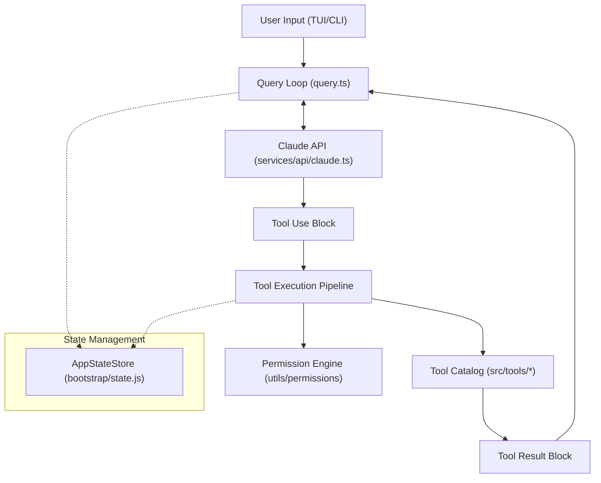
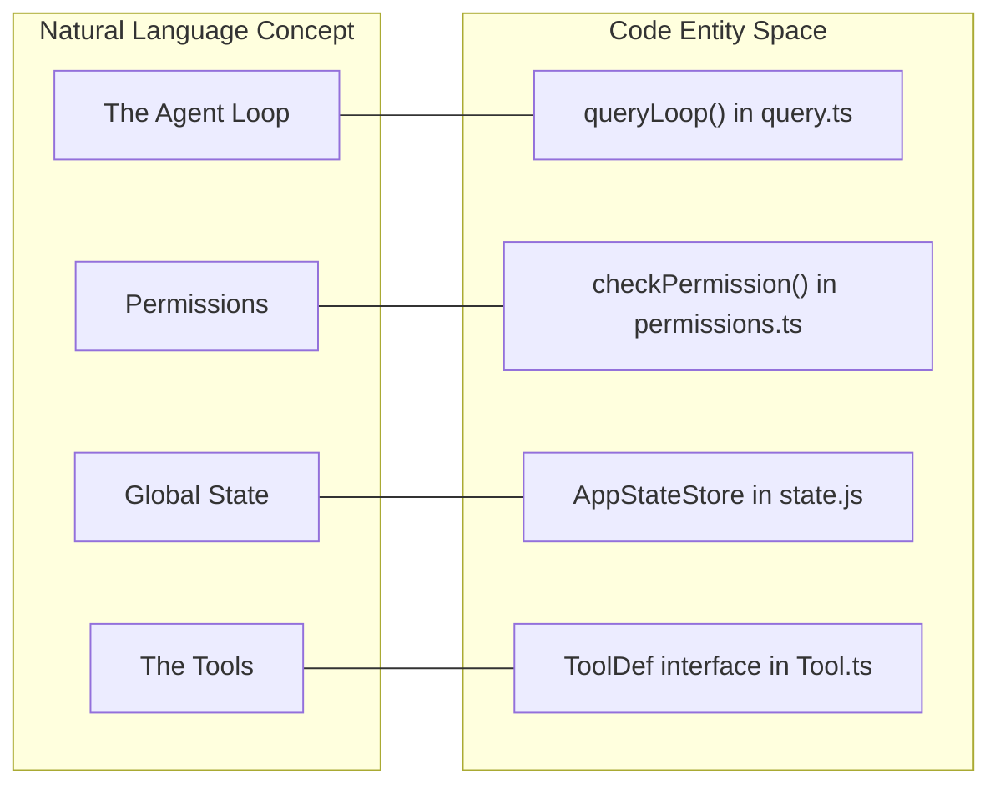
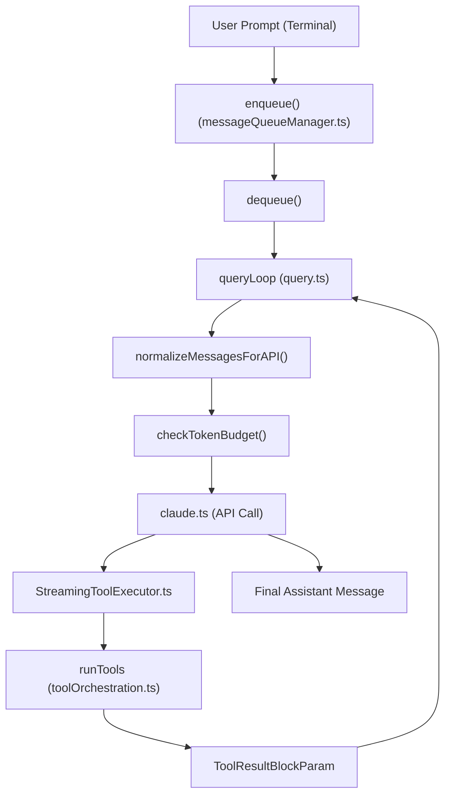
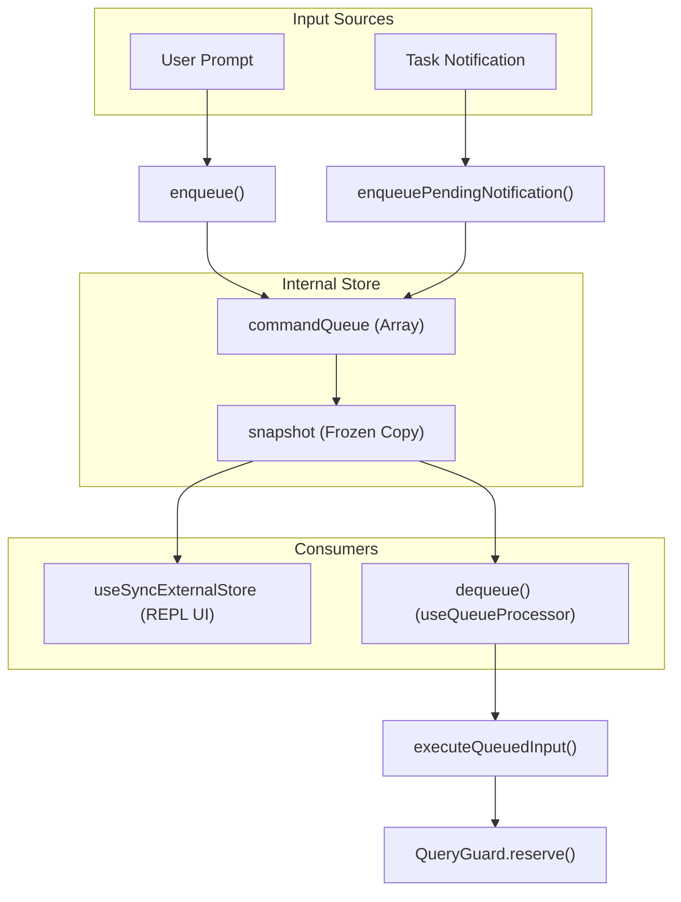
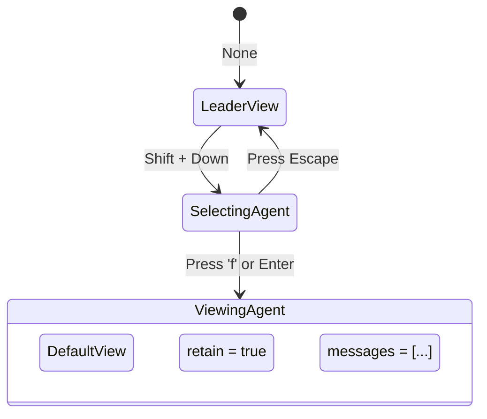
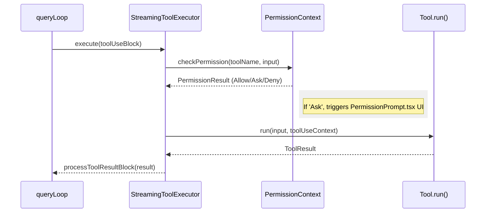
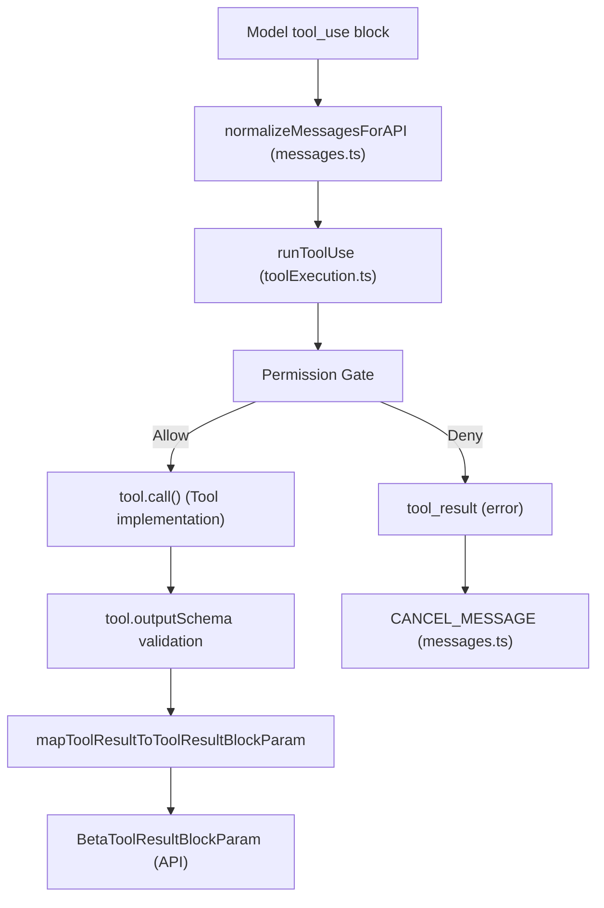

---
tags:
  - claude-code
  - architecture
  - memory-system
  - ai-agents
---
# Core Architecture 

## Table of Contents
1. [[#Concept Definitions]]
2. [[#What is an AI Agent?]]
3. [[#Claude Code Overview]]
4. [[#Architecture Deep-Dive]]
5. [[#Execution Flow]]
6. [[#Core Components]]
7. [[#File Structure Guide]]
8. [[#Key Design Patterns]]
9. [[#Detailed Subsystem Architecture]]
    1. [[#1. Query Loop & Agentic Turn Lifecycle]]
    2. [[#2. AppState & Global State Management]]
    3. [[#3. Tool Execution Pipeline]]

---
## Concept Definitions

Understanding the Claude Code architecture requires familiarity with several core concepts:

- **AI Agent**: A system that perceives its environment (reads files, gathers context), reasons about actions using an LLM, acts on the environment via tools, and iterates this process until a goal is met.

- **Query Loop**: The continuous agentic loop that bridges high-level natural language intent with low-level system operations. It manages the iterative process of sending messages to the API, parsing responses, executing tools, and looping back.

- **Turn Lifecycle**: A single iteration within the Query Loop, encompassing user input, context assembly, API processing, and tool execution.

- **Context Window / Compaction**: The memory limit of the LLM. "Compaction" refers to the strategies (Microcompact, Autocompact, Session Memory) used to shrink, summarize, or truncate historical conversation data to stay within token limits.

- **AppState**: The centralized global state management system. It tracks session-wide token usage, active tasks, directory paths, permission contexts, and viewer configurations using a store/selector pattern.

- **Command Queue**: A module-level queue independent of React state that processes user input, CLI commands, and task notifications to ensure no events are dropped during asynchronous gaps.

- **Tool Execution Pipeline**: The safety and orchestration layer that intercepts an LLM's request to use a tool, validates permissions, executes pre/post hooks, runs the tool logic, and formats the output back for the API.

- **Speculation State**: The pre-computation of potential model responses while the user is typing or tasks are running, enabling real-time prompt suggestions.

- **Teammate (Swarm) State**: In multi-agent scenarios, this manages which sub-agent (or "teammate") transcript the user is currently viewing, preventing their memory from being evicted from the AppState.

---

## What is an AI Agent?

### Definition
An AI agent is a dynamic application capable of:
1. **Perceiving** its environment (reading files, retrieving context).
2. **Reasoning** about the next best action (using an LLM).
3. **Acting** upon the environment (executing tools like Bash, FileWrite).
4. **Iterating** until the objective is achieved.

### The Tool-Calling Loop

This fundamental pattern powers all actions within Claude Code:

```text
┌─────────────────────────────────────────────────────────┐
│                  AI AGENT LOOP                          │
├─────────────────────────────────────────────────────────┤
│                                                         │
│  1. User Input: "Fix the bug in app.ts"                 │
│          |                                              │
│  2. LLM Reasoning:                                      │
│     "I need to read the file first"                     │
│          |                                              │
│  3. Tool Call: Read("app.ts")                           │
│          |                                              │
│  4. Tool Result: [file contents...]                     │
│          |                                              │
│  5. LLM Reasoning:                                      │
│     "Found the bug on line 42, need to fix it"          │
│          |                                              │
│  6. Tool Call: Edit("app.ts", line=42, ...)             │
│          |                                              │
│  7. Tool Result: "Success"                              │
│          |                                              │
│  8. LLM Response: "Fixed the bug!"                      │
│                                                         │
└─────────────────────────────────────────────────────────┘
```

### Contrast: Agent vs Simple Chatbot
- **Simple Chatbot**: Takes input -> Generates text. Single request-response with no environment interaction.
- **AI Agent**: Takes input -> Calls tools -> Interacts with OS/Network -> Evaluates -> Generates text. Multi-turn loops with agency and verification capabilities.

---
## Claude Code Overview
Claude Code is a production-grade AI coding assistant running locally in the terminal.

### Tech Stack
- **Runtime**: Bun (Fast JS runtime with native TypeScript)
- **Language**: TypeScript (Type safety for the complex agent logic)
- **UI**: React + Ink (Terminal UI with React component lifecycle)
- **CLI**: Commander.js (Argument parsing)
- **Validation**: Zod v4 (Runtime schema validation for tools and state)
- **API**: Anthropic SDK (LLM integration)
- **Protocols**: MCP (Model Context Protocol), LSP (Language Server Protocol)

### Scale
- ~512,000 lines of code
- ~1,900 TypeScript files
- 40+ tools and 50+ slash commands
- 140+ UI components

---
## Architecture Deep-Dive

### High-Level Architecture

```text
                    ┌──────────────┐
                    │     User     │
                    └──────┬───────┘
                           │
                    ┌──────▼───────┐
                    │  main.tsx    │ <─── Entry point (Commander)
                    └──────┬───────┘
                           │
         ┌─────────────────┼─────────────────┐
         │                 │                 │
    ┌────▼─────┐    ┌──────▼──────┐   ┌────▼─────┐
    │ Commands │    │   Tools     │   │   UI     │
    │ Registry │    │  Registry   │   │ (Ink)    │
    └────┬─────┘    └──────┬──────┘   └────┬─────┘
         │                 │                │
         └────────┬────────┴────────────────┘
                  │
          ┌───────▼────────┐
          │  QueryEngine   │ <─── Core orchestration
          └───────┬────────┘
                  │
       ┌──────────┼──────────┐
       │          │          │
  ┌────▼────┐ ┌──▼───┐  ┌───▼────┐
  │ Context │ │ Tools│  │ Claude │
  │ Manager │ │ Exec │  │  API   │
  └─────────┘ └──────┘  └────────┘
```

### System Mapping





---

## Execution Flow

### Startup Sequence (`src/main.tsx`)
The startup leverages parallel processing to reduce boot times (saves ~65ms):
1. **Parallel Prefetch**: Starts background processes for MDM settings and Keychain prefetching before heavy module loading.
2. **Heavy Imports**: Loads `QueryEngine` and tools while background tasks resolve.
3. **Initialization**: Configures auth, telemetry, and loads organization policies.
4. **Registry Load**: Populates command and tool registries.
5. **Render**: Mounts `<App />` via Ink to the terminal.

### Query Execution Flow (`src/QueryEngine.ts`)
The `QueryEngine` operates an async generator loop:
1. **Prepare Context**: Fetches system prompts, working directory context, and normalizes message history.
2. **API Call**: Streams requests to the Claude SDK.
3. **Parse Stream**: Handles chunks. If text, yields to the UI. If `tool_use`, triggers execution.
4. **Tool Execution**: Resolves permissions, runs the tool, and adds the `tool_result` to history.
5. **Loop**: Re-evaluates state and calls the API again until the model returns a terminal state with no tool requests.

---

## Core Components

### 1. Tool System (`src/Tool.ts`, `src/tools/`)
Tools interface bridging the model with the local system.
- Components: Zod schemas (`input_schema`), permissions (`dangerLevel`), and execution logic.
- Example (`BashTool`): Contains `BashToolSchema.ts` and permission routing rules to prevent automated execution of dangerous variants.

### 2. QueryEngine (`src/QueryEngine.ts`)
The orchestration brain responsible for:
- Tool loop management.
- Compaction processing.
- Token budgeting and retry logic.
- State preservation across turns.

### 3. Permission System (`src/hooks/toolPermission/`)
Determines if an action is safe.
- **Modes**: `default` (ask), `plan` (propose multiple), `auto` (approve base matching heuristics).
- **Flow**: Check safety -> Auto-approve or Prompt User -> Return status to execution layer.

### 4. Context System (`src/context.ts`)
Injects `SystemPrompt` containing:
- OS platform (`darwin`, `win32`).
- Working directory and file tree.
- Git state and diffs.

---

## Key Design Patterns

1. **Lazy Loading**: Heavy modules (like `REPLTool`) are conditionally imported at runtime based on environment variables to speed up boot.
2. **Feature Flags**: Uses Bun's `feature()` at compile-time for dead-code elimination.
3. **Parallel Prefetching**: Triggering I/O bound queries before synchronous TS imports.
4. **Streaming Architecture**: Async generators handle API responses for immediate UI updates, keeping the TUI responsive.
5. **Layered Decoupling**: React UI -> Query Orchestration -> Tool Services -> External APIs.

---

## Detailed Subsystem Architecture

### 1. Query Loop & Agentic Turn Lifecycle

This acts as the primary data transformation backbone.

#### Architecture & Data Flow
1. **Input Dequeueing**: Pulls commands from the global message manager.
2. **Normalization**: Strips internal UI-specific metadata to create raw API valid objects.
3. **Compaction Check**: Truncates historical outputs to prevent context overflow.
4. **API Execution**: Sends the state string to Claude.
5. **Tool Orchestration**: Matches `tool_use` signatures to registered binaries.



#### Compaction Strategies
- **Microcompact**: Truncates specific large tool outputs (like search results).
- **Autocompact**: Summarizes historical context into a dense Compaction Boundary.
- **Reactive Compact**: Triggered dynamically when the API throws a length error.
- **Session Memory**: Offloads historical data to specialized state files.

---

### 2. AppState & Global State Management

Claude Code handles synchronization between the backend async processes and the React UI using an internal store pattern.

#### Architecture
`AppStateStore` tracks:
- **Messages**: Conversation arrays.
- **Tasks**: Shell/Network background jobs.
- **View State**: Currently focused teammate terminal.



#### Teammate & Swarm State
Navigation between parallel sub-agent evaluations is maintained to prevent garbage collecting active sub-agents.



---

### 3. Tool Execution Pipeline

Validates model intentions before allowing OS execution.

#### Execution Sequence Diagram


#### Data Transformation & Verification 



#### Pre and Post Hooks
- **runPreToolUseHooks**: Validation checks before side-effects occur.
- **runPostToolUseHooks**: Triggers indexing or LSP refreshes.
- **runPostToolUseFailureHooks**: Cleanup operations following execution exceptions.

#### Telemetry
The pipeline utilizes OpenTelemetry (OTel) for detailed spans during execution tracking. It accounts for execution latency, prompt block duration, and mapping obfuscated runtime errors to standardized strings for observability.

-----
## The Agent Loop (How Claude Code Actually Works)

The QueryEngine takes your prompt (e.g. "Fix auth.ts"), attaches basic context (like your OS and current folder), and sends it to the Claude API.

### LLM Reasoning (Turn 1)
Claude realizes: *"I don't know what the bug is because I haven't seen the code yet. I need to read the file."*

→ **Tool Request**: `Read("auth.ts")`

### The Permission Gate
The Tool Execution Pipeline intercepts Claude’s request and checks the **dangerLevel** of the tool.

- Safe tools (e.g. reading a file) → **Auto-approved**
- Dangerous tools (e.g. running a Bash script) → Paused and asks the user for permission

### Tool Execution
The system reads the file and returns the content of `auth.ts` to Claude as a `tool_result`.

### LLM Reasoning (Turn 2)
Claude analyzes the code, finds the bug, and requests: `Edit("auth.ts", line 42)`

### Execution & Final Answer
The edit is applied (after permission check), and Claude replies:  
*"I found the bug on line 42 and fixed it."*

> **Key Takeaway**:  
> A standard chatbot gives **one prompt → one answer**.  
> An agent like Claude Code runs in a **continuous async generator loop**:  
> Prompt → Tool Request → Tool Result → Next Thought → Repeat until task complete.

---
## The 4 Levels of Compaction

### 1. Microcompact (The Quick Trim)
**What it does**: Truncates *specific, massive tool outputs* before they enter the chat history.

**Example**:  
You run `grep "User"` on a huge project and get 85,000 lines.  
**Microcompact** automatically trims the excessive output so it doesn’t flood the context.

> Best for: Individual tool results that are absurdly large.

### 2. Autocompact (The Chapter Summary)
**What it does**: Summarizes long chunks of conversation history into a dense "Compaction Boundary."

**Example**:  
Instead of keeping 50 turns of "try this → error → fix → error → fixed", it collapses them into:  
*"Spent 50 turns debugging and fixing the Auth routing issue."*

### 3. Reactive Compact (The Emergency Brake)
**What it does**: Triggers **only** when the API returns a "token limit exceeded" error.

It aggressively reduces context on-the-fly until the prompt fits again.

### 4. Session Memory (The Filing Cabinet)
**What it does**: Offloads very old history out of active memory and saves it to specialized state files on disk.

Claude can still retrieve it later if needed, but it no longer costs active tokens.

---

## Tool Execution Pipeline (The Security Guard)

When Claude wants to take an action:

1. **Intercept** – Pipeline catches the tool request (`Edit("app.js")`, `Bash("rm -rf /")`, etc.)
2. **Permission Gate** – Checks `dangerLevel`
3. **Execution & Hooks** – Runs pre-hooks → executes tool → runs post-hooks (e.g. refresh language server)
4. **Format Result** – Cleans up the output and sends it back to Claude

### Human-in-the-Loop for Dangerous Actions

Example: Claude requests `Bash("rm -rf /")`

- Danger level is high → Pipeline **pauses** the agent loop
- Triggers a **PermissionPrompt** in the terminal:
  > "Claude wants to run this potentially destructive command. Do you approve? [y/N]"

- **Deny** → Request is blocked, Claude is told "User blocked this"
- **Allow** → Command executes

This is the **Human-in-the-Loop** safety architecture.

---

## State Management: Command Queue vs React State

### Problem with Standard React State
Using only `React.useState` can cause **dropped events** and race conditions when many things happen simultaneously (user typing, API streaming, background tools, compaction, etc.).

### Solution: Command Queue (The Kitchen Ticket Rail)

All events are placed on an independent **Command Queue** (lives outside React):

- User presses Enter
- Tool finishes
- API chunk arrives
- Auto-compaction runs

React only reads from this queue using `useSyncExternalStore`.  
**Nothing gets dropped**, no matter how chaotic the system becomes.

---

## Lessons & How to Build a Better Agent

### 1. Memory – Ditch Flat Files
**Current Problem**: Relying on `MEMORY.md` + LLM judgment → hard caps, truncation, and amnesia.

**Better Approach**:
- Use **Vector Embeddings** (ChromaDB, SQLite-vec, etc.)
- Semantic search for relevant memories
- Add `UpdateMemory(id, new_fact)` tool for active memory updates

### 2. The Tool Loop – LLM as Driver
Implement the **ReAct Pattern**:
**Thought → Action → Observation** (repeat)

Add `TaskComplete` tool + maximum iteration limit to prevent infinite loops.

### 3. State Management
- Use an **Event/Command Queue** outside the UI framework
- Run LLM calls and tools in **background workers**

### 4. Context Management – Treat Tokens Like Gold
- **Micro-truncation** on all large tool outputs
- **Auto-summarization** using a cheap model (Haiku / Gemini Flash) after N turns

### 5. Safety – Tiered Permissions
Define three tiers:

- **Tier 1 (Auto-Approve)**: Read files, search, math
- **Tier 2 (Ask First)**: Write files, POST requests, send emails
- **Tier 3 (Blocked)**: Destructive commands (`rm`, format, etc.)

Build a middleware that intercepts Tier 2+ tools and asks the user for confirmation.

---
