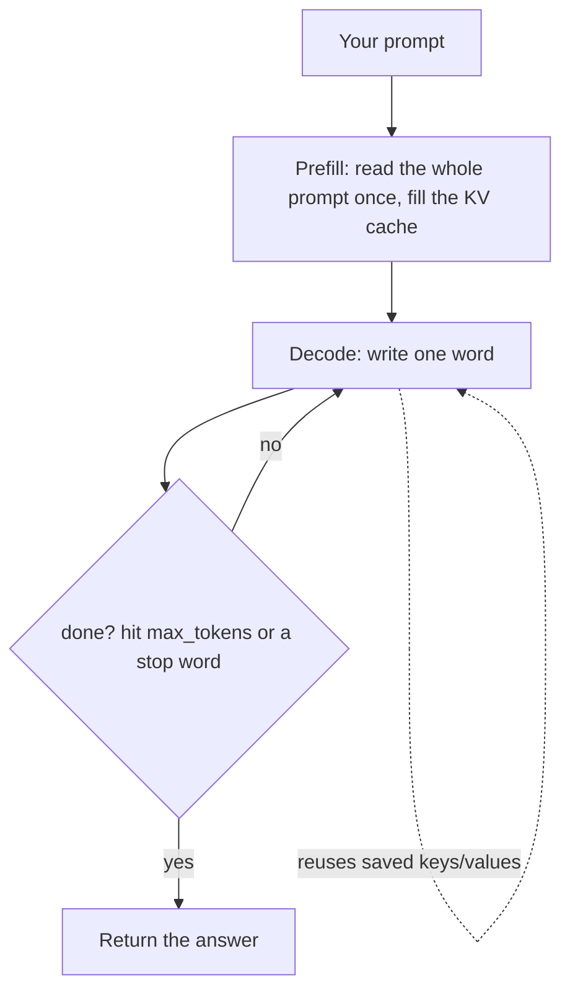

# vLLM — serving a model yourself

These notes come from a hands-on run: a free Colab T4 GPU serving `Qwen2.5-1.5B-Instruct` with vLLM. All numbers below are real measurements from that run.

## What "serving a model" means

When you call an API (OpenRouter, Cohere, OpenAI), that company is doing two things for you: it keeps the model's weights loaded on a GPU, and it runs the software that turns your text into an answer.

"Serving it yourself" means you do that: you load the weights onto a GPU and run the engine (vLLM) that does the math. vLLM is that engine.

---

## Load a model and run one request

```python
from vllm import LLM, SamplingParams

llm = LLM(
    model="Qwen/Qwen2.5-1.5B-Instruct",
    dtype="half",                 # older GPUs (T4) don't do bfloat16 well -> use 16-bit half
    max_model_len=2048,           # cap context length to save GPU memory
    gpu_memory_utilization=0.9,   # let vLLM use most of the GPU; the spare becomes the KV cache pool
)

params = SamplingParams(temperature=0.7, max_tokens=64)
out = llm.generate(["Explain what an operating system is, in one sentence."], params)
print(out[0].outputs[0].text)
```

The `LLM(...)` line is the moment you serve the model: it downloads the weights and loads them onto the GPU.

---

## Concept 1 — KV cache (always on)

A model writes one word at a time. To write each new word, it needs its internal notes (called **keys and values**) for **every earlier word**.

- **Without a cache:** it redoes those notes for all earlier words at every step. Repeated work that grows each step.

- **With a KV cache:** it saves each word's notes the first time and reuses them. A new word only costs the work for that one word.

Worked example — a 5-word prompt, then generate 5 words. "Work" = how many words it processes each step:

| Generated word | Without cache (redo all) | With cache (only the new one) |
| --- | --- | --- |
| 1 | 6 | 1 |
| 2 | 7 | 1 |
| 3 | 8 | 1 |
| 4 | 9 | 1 |
| 5 | 10 | 1 |
| **Total** | **40** | **5** |

Key point: the reuse happens **inside one answer**, across the words it is generating right now. It is not about the same prompt coming again (that is prefix caching, below).

**In vLLM: the KV cache is always on. There is no switch, and you cannot turn it off.** It is core to how vLLM works.

---

## Concept 2 — continuous batching

A GPU is built to do thousands of math operations at the same time. One request uses only a small slice of it, so most of the GPU sits idle. Batching many requests together fills that idle space.

vLLM batches automatically when you hand it a list of prompts. "Continuous" means it swaps requests in and out as they finish, so the GPU stays full instead of waiting for a whole group.

Real numbers from the T4 run (same GPU, same model, 64-token answers):

| How | Result |
| --- | --- |
| 64 requests handed over at once (batched) | ~1378 tokens/sec |
| 16 requests one at a time (sequential) | ~28 tokens/sec |

The only difference is that batching kept the GPU busy. (The sequential number is partly the overhead of many separate calls, so the exact ratio is rough — but the lesson holds.)

---

## Concept 3 — latency vs throughput

- **Latency** = how long *one* answer takes. What a single user feels. (One request above took ~2.3s.)

- **Throughput** = how many answers/tokens per second across *many* users.

The trade-off: packing more requests together raises throughput but makes each single answer wait a little longer. Chat apps care about latency; batch jobs care about throughput.

---

## Concept 4 — prefix caching (this one has a switch)

Different from the KV cache. Prefix caching reuses the saved notes for a **shared beginning** across many requests — for example, the same long system prompt sent every time.

```python
llm = LLM(
    model="Qwen/Qwen2.5-1.5B-Instruct",
    dtype="half",
    max_model_len=2048,
    gpu_memory_utilization=0.9,
    enable_prefix_caching=True,   # reuse a shared prompt start across requests
)
```

- KV cache (always on): reuse earlier words *within one answer*.

- Prefix caching (opt-in): reuse a shared prompt start *across requests*.

---

## The request pipeline (how a served answer flows)



Prefill = read the prompt once and store its notes. Decode = write the answer one word at a time, reusing those notes (the KV cache) each step.

---

## Best practices (small GPU / T4)

**Pick a model that fits.** A T4 has ~15 GB. A 1–3B model fits comfortably; a 7B model needs quantization and is tight. Start small when learning.

```python
llm = LLM(model="Qwen/Qwen2.5-1.5B-Instruct")   # small, open, fits a T4
```

**`dtype="half"` on older GPUs.** T4 does not do bfloat16 well; 16-bit half works.

```python
llm = LLM(model="Qwen/Qwen2.5-1.5B-Instruct", dtype="half")
```

**Cap `max_model_len`.** Longer context needs more KV cache memory per request. Only allow what you need.

```python
llm = LLM(model="Qwen/Qwen2.5-1.5B-Instruct", max_model_len=2048)
```

**Tune `gpu_memory_utilization`.** Higher lets vLLM hold more requests at once (bigger KV cache pool). ~0.9 is a good start.

```python
llm = LLM(model="Qwen/Qwen2.5-1.5B-Instruct", gpu_memory_utilization=0.9)
```

**Batch your requests.** Hand vLLM a list, not a loop of single calls. This is where the speed is.

```python
prompts = ["Explain a process", "Explain a thread", "Explain paging"]   # a list
outs = llm.generate(prompts, params)          # GOOD: one call, vLLM batches internally

for p in prompts:                             # BAD: GPU idles between calls
    llm.generate([p], params)
```

**Turn on `enable_prefix_caching`** when many requests share a long, fixed start (a system prompt, a shared document).

```python
llm = LLM(model="Qwen/Qwen2.5-1.5B-Instruct", enable_prefix_caching=True)
```

**Shrink the cache if memory is tight:** `kv_cache_dtype="fp8"` stores the KV cache smaller (GPU support varies).

```python
llm = LLM(model="Qwen/Qwen2.5-1.5B-Instruct", kv_cache_dtype="fp8")
```

**Put it together** (the settings you would actually use on a T4):

```python
llm = LLM(
    model="Qwen/Qwen2.5-1.5B-Instruct",
    dtype="half",
    max_model_len=2048,
    gpu_memory_utilization=0.9,
    enable_prefix_caching=True,
)
```

**Measure, don't guess.** Time a batched run and a sequential run and read tokens/sec.

```python
import time

# batched: all at once
t = time.time()
outs = llm.generate(prompts, params)
dt = time.time() - t
toks = sum(len(o.outputs[0].token_ids) for o in outs)
print(f"batched: {toks/dt:.0f} tokens/sec")

# sequential: one at a time (for contrast)
t = time.time(); tk = 0
for p in prompts:
    o = llm.generate([p], params)
    tk += len(o[0].outputs[0].token_ids)
dt = time.time() - t
print(f"sequential: {tk/dt:.0f} tokens/sec")
```

## Colab notes

- Free Colab gives a T4 (15 GB). Set it via `Runtime -> Change runtime type -> T4 GPU`.

- Sessions time out (~90 min idle, ~12 h max) and reset. Save the notebook to Drive or GitHub as you go.

- `pip install vllm` brings its own CUDA runtime; the install is the step most likely to complain.
