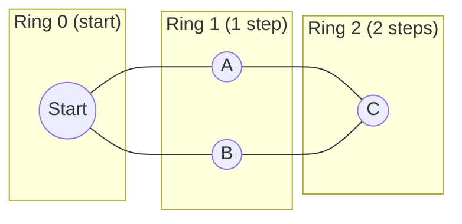
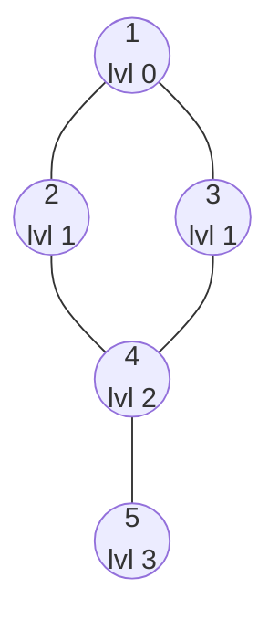
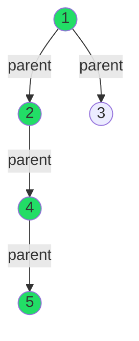
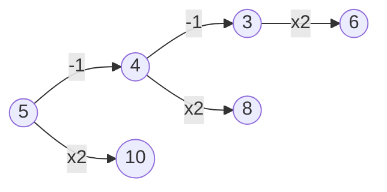
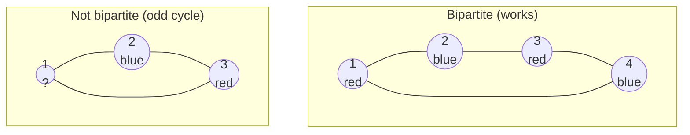
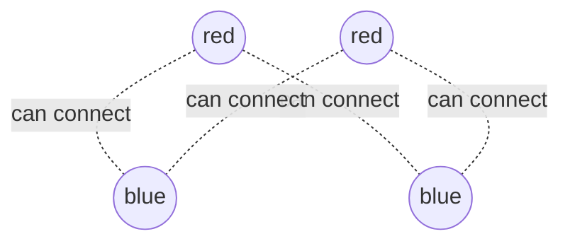
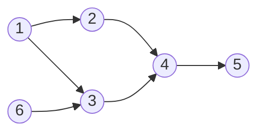
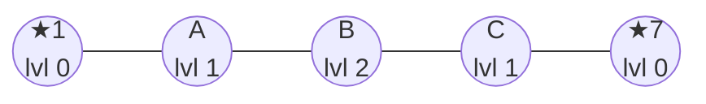

# BFS & Graph Applications

## The one big idea (in plain words)

Imagine you drop a stone in the middle of a pond. The ripple spreads out in **rings**: first the water right next to the stone moves, then the ring after that, then the next. BFS (Breadth-First Search) explores a graph exactly like that ripple.

- You start at one node (the stone).
- You visit **all nodes 1 step away** first.
- Then **all nodes 2 steps away**.
- Then 3 steps away… and so on.

Because BFS always finishes a whole ring before touching the next one, **the first time it reaches a node is always by the shortest route**. That single fact is why BFS is the go-to tool for "shortest number of steps" problems on unweighted graphs.



## The 3 tools BFS always carries

Every BFS uses the same three helpers. Learn them once and every variation below is just a small twist.

| Tool | What it is | Why we need it |
|------|-----------|----------------|
| **Queue** (`queue<int> q`) | A line, first-in-first-out | Guarantees we finish the closer ring before the farther one |
| **Visited** (`vis[]`) | A yes/no flag per node | Stops us from processing the same node twice (and looping forever) |
| **Levels** (`levels[]`) | Distance from the start | This *is* the answer to "how many steps?" |

> [!tip] The golden rule
> **Mark a node as visited the moment you push it into the queue — not when you pop it.** If you wait until you pop it, the same node can get pushed many times and your `levels` become wrong. This one habit prevents most BFS bugs.

---

## 1) Plain BFS — shortest path length

### What the code does, step by step
1. Put the start node in the queue, mark it visited, set its level to 0.
2. While the queue is not empty: take the front node out (`pop`).
3. Look at every neighbour of that node.
4. If a neighbour is unvisited → mark it, give it `level = current + 1`, push it.
5. Repeat until the ripple has covered the whole reachable graph.

### See it happen
Say the edges are: `1-2, 1-3, 2-4, 3-4, 4-5`. Starting from node **1**:



Watch the queue empty out ring by ring:

| Step | Pop | Queue after | Newly discovered (level) |
|------|-----|-------------|--------------------------|
| 1 | 1 | `[2, 3]` | 2 (1), 3 (1) |
| 2 | 2 | `[3, 4]` | 4 (2) |
| 3 | 3 | `[4]` | — (4 already seen) |
| 4 | 4 | `[5]` | 5 (3) |
| 5 | 5 | `[]` | — done |

Notice node 4 was reached from node 2 first (level 2). When we later visit it from node 3, `vis[4]` is already `true`, so we ignore it — that's the shortest path being locked in.

```C++
#include <iostream>
#include <vector>
#include <algorithm>
#include <queue>
using namespace std;

int n, m;
vector<vector<int>> adj;
vector<bool> vis;
vector<int> levels;

void bfs(int start)
{
    queue<int> q;

    // Step 1: Initialize the queue and mark the starting node as visited
    q.push(start);
    vis[start] = true;
    levels[start] = 0;

    // Step 2: Continue until the queue is empty
    while (!q.empty())
    {
        // Step 3: Pop the front element from the queue
        int curr = q.front();
        q.pop();


        // Step 4: Loop through all the neighbors of the current node
        for (auto v : adj[curr])
        {
            if (!vis[v])
            {
                // Step 5: Mark the neighbor as visited and set its level
                q.push(v);
                vis[v] = true;
                levels[v] = levels[curr] + 1;
            }
        }
    }
}

int main()
{
    cin >> n >> m;

    adj.resize(n + 1);
    vis.resize(n + 1, false);
    levels.resize(n + 1, 0);

    for (int i = 0; i < m; i++)
    {
        int u, v;
        cin >> u >> v;

        adj[u].push_back(v);
        adj[v].push_back(u);
    }

    bfs(1);

    cout<<levels[n] + 1<<endl; //shortest number of nodes
    cout<<levels[n]<<endl; //shortest number of edges

    return 0;
}
```

> [!note] Nodes vs edges
> `levels[n]` = number of **edges** (jumps) on the shortest path. The number of **nodes** you pass through is always one more than the number of edges, so `levels[n] + 1`.

---

## 2) Reconstructing the actual path (the `parent` trick)

BFS tells you *how far* a node is. But often you also want the *route itself*: "which nodes do I actually walk through?"

The trick: for every node, remember **who discovered it** — its `parent`. The parent of a node is simply the node that was popped when this node got pushed.



To get the path to node 5, start at 5 and keep hopping to the parent until you hit `-1` (the start's parent): `5 → 4 → 2 → 1`. That's **backwards**, so we push each into a **stack** and pop it — the stack reverses it into `1 → 2 → 4 → 5`.

> [!tip] Why a stack?
> Following parents walks the path from **end to start**. A stack is last-in-first-out, so popping it flips the order back to **start to end**. It's a free reversal.

```C++
#include <iostream>
#include <vector>
#include <algorithm>
#include <queue>
#include <stack>
using namespace std;

int n, m;
vector<vector<int>> adj;
vector<bool> vis;
vector<int> levels,parent;

void bfs(int start)
{
    queue<int> q;

    // Step 1: Initialize the queue and mark the starting node as visited
    q.push(start);
    vis[start] = true;
    levels[start] = 0;
    parent[start] = -1;

    // Step 2: Continue until the queue is empty
    while (!q.empty())
    {
        // Step 3: Pop the front element from the queue
        int curr = q.front();
        q.pop();


        // Step 4: Loop through all the neighbors of the current node
        for (auto v : adj[curr])
        {
            if (!vis[v])
            {
                // Step 5: Mark the neighbor as visited and set its level
                q.push(v);
                vis[v] = true;
                levels[v] = levels[curr] + 1;
                parent[v] = curr; //the parent of the node is the node that pushed it into the queue
            } 
        }
    }
}

int main()
{
    cin >> n >> m;

    adj.resize(n + 1);
    vis.resize(n + 1, false);
    levels.resize(n + 1, 0);
    parent.resize(n + 1, 0);

    for (int i = 0; i < m; i++)
    {
        int u, v;
        cin >> u >> v;

        adj[u].push_back(v);
        adj[v].push_back(u);
    }

    bfs(1);

    int cur = n;

    stack<int> st;
    while(cur != -1) // -1 is the parent of the starting node
    {
        st.push(cur);
        cur = parent[cur]; // go to the parent of the current node
    }

    while(!st.empty())
    {
        cur = st.top();
        st.pop();
        cout << cur << " ";
    }

    return 0;
}
```

---

## 3) BFS with no graph given (implicit graphs)

Here's the mind-bender: **you don't always need a list of edges to run BFS.** Sometimes the "graph" is hidden inside the rules of the problem.

**The problem:** you have a number `n` and want to reach `m`. Each move you can either do `n - 1` or `n * 2`. What's the **minimum number of moves**?

Think of it as a graph where:
- each **number is a node**,
- each **allowed operation is an edge** to another number.

Since minimum moves = shortest path, BFS is perfect. We just *generate* neighbours on the fly instead of reading them from a list.



Because the numbers can be anything, we can't use a fixed-size `vis` array — so we use a `map` instead (grows as needed).

### Before optimization

```C++
#include <iostream>
#include <vector>
#include <algorithm>
#include <queue>
#include <stack>
#include <map>
using namespace std;

//i am given two nums of n and m , i want to reach from n to m using 
//two methods or operations either n - 1 or 2 * n
//here we dont have any graph given or edges so we will use bfs to solve this problemq

int n,m;
map<int,int> vis,levels; //cause the size of the vis is not available

void bfs(int start)
{
    queue<int> q;

    q.push(start);
    vis[start] = 1;
    levels[start] = 0;

    while(!q.empty())
    {
        int curr = q.front();
        q.pop();

        if(curr > 1 && !vis[curr - 1]) //the curr > 1 is to avoid the negative values and avoid the infinity loop it might get into
        {
            q.push(curr - 1);
            vis[curr - 1] = 1;
            levels[curr - 1] = levels[curr] + 1;
        }

        if(curr < m && !vis[2 * curr]) //1e4 is the maximum value of n to end the infinity loop it might get itself into
        //but its still not fully optimized i will make it curr < m
        //since why do we need to go beyond the value of m
        //we are multiplying the curr by 2 so it will always be greater than m
        {
            q.push(2 * curr);
            vis[2 * curr] = 1;
            levels[2 * curr] = levels[curr] + 1;
        }
    }
}

int main()
{
    cin>>n>>m;

    bfs(n);

    cout<<levels[m]<<endl;
}
```

> [!warning] The two guards that stop infinite loops
> - `curr > 1` before doing `-1`: keeps us from marching down into negative numbers forever.
> - `curr < m` before doing `x2`: once you're at or past `m`, doubling only takes you *further* away — pointless. From above `m`, the only useful move is subtracting.

### After optimization
Two clean-ups:
1. **Drop the `levels` map.** Instead, store the level *next to* each node by making the queue hold `pair<int,int>` = `(node, its level)`. The distance travels with the node.
2. **Stop early.** The moment we pop `m`, we return its level immediately — no need to keep exploring.

```C++
#include <iostream>
#include <vector>
#include <algorithm>
#include <queue>
#include <stack>
#include <map>
using namespace std;

//i am given two nums of n and m , iwant to reach from n to m using 
//two methods or operations either n - 1 or 2 * n
//here we dont have any graph given or edges so we will use bfs to solve this problemq

int n,m;
map<int,int> vis; //cause the size of the vis is not available

int bfs(int start)
{
    queue<pair<int,int>> q;

    q.push({start,0});
    vis[start] = 1;

    while(!q.empty())
    {
        int curr = q.front().first;
        int curr_level = q.front().second;
        q.pop();

        if(curr == m) return curr_level;

        if(curr > m && !vis[curr - 1]) //the curr > 1 is to avoid the negative values and avoid the infinity loop it might get into
        {
            q.push({curr - 1,curr_level + 1});
            vis[curr - 1] = 1;
        }

        if(curr < m && !vis[2 * curr]) //1e4 is the maximum value of n to end the infinity loop it might get itself into
        //but its still not fully optimized i will make it curr < m
        //since why do we need to go beyond the value of m
        //we are multiplying the curr by 2 so it will always be greater than m
        {
            q.push({2 * curr,curr_level + 1});
            vis[2 * curr] = 1;
        }
    }

    return -1;
}

int main()
{
    cin>>n>>m;

    cout<<bfs(n)<<endl;
}

///removed the map of levels
//made the queue of pair<int,int> to store the level of the node on the fly
```

---

## 4) Bipartite check — 2-coloring a graph

**Bipartite** means: can I paint every node **red** or **blue** so that no edge ever connects two nodes of the *same* colour? Think of splitting people into **two teams** where every friendship must cross between the teams.

BFS makes this easy: colour the start red, then **every neighbour must be the opposite colour** of the node that discovered it. If you ever find an edge whose two ends already share a colour → it's **impossible**.



The left square works. The right triangle **fails**: 1 is red, 2 is blue, 3 must be red (opposite of 2)… but 3 also touches 1, which is *already red*. Two reds share an edge → impossible. (Rule of thumb: a graph is bipartite **exactly when it has no odd-length cycle**.)

> [!tip] The `3 - team` flip
> If red = 1 and blue = 2, then `3 - 1 = 2` and `3 - 2 = 1`. So `teams[v] = 3 - teams[curr]` is a one-liner that always gives the *opposite* colour. Neat trick.

Also note the `main` loop calls `bfs(i)` for every unvisited node — that handles graphs made of several disconnected pieces.

```C++
#include <iostream>
#include <vector>
#include <algorithm>
#include <queue>
#include <stack>
#include <map>
using namespace std;

int n,m;
vector<int> vis,levels,teams;
vector<vector<int>> adj;

void bfs(int start)
{
    queue<int> q;

    q.push(start);
    vis[start] = 1;
    levels[start] = 0;
    teams[start] = 1; // 1 for red, 2 for blue
    //ebda2 be2ay loon te7ebo

    while(!q.empty())
    {
        int curr = q.front();
        q.pop();

        for(auto v : adj[curr])
        {
            if(!vis[v])
            {
                vis[v] = 1;
                levels[v] = levels[curr] + 1;
                q.push(v);

                // if(teams[curr] == 1) teams[v] = 2;
                // else teams[v] = 1;

                teams[v] = 3 - teams[curr];
            }
            else
            {
                if(teams[v] == teams[curr]) //that means we are on the ssame team
                {
                    cout<<"IMPOSSIBLE"<<endl;
                    return;
                }
            }
        }
    }

    cout<<"POSSIBLE"<<endl;
}

int main()
{
    cin>>n>>m;

    adj.reserve(n + 1);
    vis.resize(n + 1,0);
    levels.resize(n + 1,0);
    teams.resize(n + 1,0);

    for(int i = 0; i < m; i++)
    {
        int u,v;
        cin>>u>>v;

        adj[u].push_back(v);
        adj[v].push_back(u);
    }

    for(int i = 1; i <= n; i++)
    {
        if(!vis[i])
        {
            bfs(i);
        }
    }

    for(int i = 1; i <= n; i++)
    {
        cout<<teams[i]<<" ";
    }
}
```

### Second example — max edges in a bipartite graph
Problem: https://codeforces.com/problemset/problem/862/B

**The idea in words:** You're given a **tree** (connected, no cycles, `n` nodes, `n-1` edges). A tree is always bipartite, so 2-colour it and count how many nodes land in each team.

- In a fully-connected bipartite graph, you can draw an edge between **every red–blue pair**: that's `cnt[red] * cnt[blue]` edges total.
- You already have `n - 1` edges (the tree).
- So the number of **new** edges you can still add = `cnt[1] * cnt[2] - (n - 1)`.


Every dotted line is a legal edge (red↔blue only). Count them all, subtract the ones already in the tree.

```C++
#include <iostream>
#include <vector>
#include <algorithm>
#include <queue>
#include <stack>
#include <map>
using namespace std;

int n,m;
vector<int> vis,levels,teams;
vector<vector<int>> adj;
vector<int> cnt;

void bfs(int start)
{
    queue<int> q;

    q.push(start);
    vis[start] = 1;
    levels[start] = 0;
    teams[start] = 1; // 1 for red, 2 for blue
    //ebda2 be2ay loon te7ebo
    cnt[teams[start]]++;

    while(!q.empty())
    {
        int curr = q.front();
        q.pop();

        for(auto v : adj[curr])
        {
            if(!vis[v])
            {
                vis[v] = 1;
                levels[v] = levels[curr] + 1;
                q.push(v);

                // if(teams[curr] == 1) teams[v] = 2;
                // else teams[v] = 1;

                teams[v] = 3 - teams[curr];
                cnt[teams[v]]++;
            }
            else
            {
                if(teams[v] == teams[curr]) //that means we are on the ssame team
                {
                    cout<<"IMPOSSIBLE"<<endl;
                    return;
                }
            }
        }
    }

    cout<<"POSSIBLE"<<endl;
}

int main()
{
    cin>>n;

    adj.reserve(n + 1);
    vis.resize(n + 1,0);
    levels.resize(n + 1,0);
    teams.resize(n + 1,0);
    cnt.resize(3);

    for(int i = 0; i < n-1; i++)
    {
        int u,v;
        cin>>u>>v;

        adj[u].push_back(v);
        adj[v].push_back(u);
    }

    for(int i = 1; i <= n; i++)
    {
        if(!vis[i])
        {
            bfs(i);
        }
    }

    cout<<(cnt[1] * cnt[2]) - (n - 1)<<endl; //the number of edges that we need to add to make the graph connected

}

//We are given a tree (which is a connected, acyclic graph) with n nodes, and we need to add as many edges as possible while ensuring the graph remains bipartite (i.e., we can divide the nodes 
//into two sets where no two nodes within the same set are connected).

//A bipartite graph is a graph where we can color the nodes using two colors 
//such that no two adjacent nodes have the same color.

//We can only add edges between nodes that are in different partitions.

//we use bfs to color the tree into 2 sets
//count how many nodes are in each set (team)
//the number of edges of bipartite graph = (number of nodes in team 1) * (number of nodes in team 2) - (number of edges in the tree)
//because we can add edges between nodes in different teams only
//the num of max tree edges are n-1
//so max additional edges we an add is = (cnt[1] * cnt[2]) - (n - 1)
```

---

## 5) Topological sort (Kahn's algorithm)

Think of **course prerequisites**: you can't take "Calculus 2" before "Calculus 1". Topological sort finds a valid order to do tasks so that every task comes *after* everything it depends on. It only works on a **directed graph with no cycles** (a DAG).

**Key word: `indegree`** = how many arrows point *into* a node = how many things must finish before it can start.

The algorithm:
1. Start with every node that has `indegree == 0` (nothing blocks it).
2. Process one, then "remove" its outgoing arrows → decrease the `indegree` of its targets.
3. Any target that drops to `indegree == 0` is now unblocked → add it to the queue.
4. Repeat.


Here nodes **1 and 6** have no incoming arrows → they start the queue. A valid order might be `1, 6, 2, 3, 4, 5`.

> [!warning] Detecting a cycle
> If the graph has a cycle, those nodes can *never* reach `indegree 0` (they block each other forever), so they never enter the queue. That's why: if the final `topo` list has **fewer than `n` nodes**, a cycle exists → `IMPOSSIBLE`.

```C++
#include <iostream>
#include <vector>
#include <algorithm>
#include <queue>
#include <stack>
#include <map>
using namespace std;

int n,m;
vector<int> vis,levels,indegree,topo;
vector<vector<int>> adj;

void bfs()
{
    queue<int> q;

    for(int i = 1; i <= n; i++)
    //queue contains all valid nodes 
    {
        if(indegree[i] == 0) //starting node if you dont have any in arrows
        {
            q.push(i);
            vis[i] = 1;
            levels[i] = 1;
        }
    }

    //queue {1,6}

    while(!q.empty())
    {
        int curr = q.front();
        q.pop();

        topo.push_back(curr);

        for(auto v : adj[curr])
        {
            if(!vis[v])
            {
                indegree[v]--;

                if(indegree[v] == 0)
                {
                    q.push(v);
                    vis[v] = 1;
                    levels[v] = levels[curr] + 1;
                }
            }
        }
    }
}

//when does topo sort not exist or fail?
//when there is a cycle in the graph

int main()
{
    cin>>n;

    adj.reserve(n + 1);
    vis.resize(n + 1,0);
    levels.resize(n + 1,0);
    indegree.resize(n + 1,0);

    for(int i = 0; i < n-1; i++)
    {
        int u,v;
        cin>>u>>v;

        adj[u].push_back(v); //directed graph
        indegree[v]++;
    }

    bfs();
    if(topo.size() < n) cout<<"IMPOSSIBLE"<<endl;
    //because topo takes the free nodes and then goes on to the next level
    //if there are no free nodes, then the graph has a cycle

    for(auto i : topo) cout<<i<<" ";
}
```

---

## 6) Multi-source BFS

Normal BFS drops **one** stone. Multi-source BFS drops **many stones at once** and asks: for every node, *how far is the nearest stone?*

Real example: several fire stations on a map — for each house, how far is the closest station?


Nodes ★1 and ★7 are both sources (special nodes). Node B sits in the middle: it's 2 steps from ★1 but only... well here it's 2 from both. Each node just takes the distance to whichever source reaches it **first**.

> [!tip] The only change from normal BFS
> Instead of pushing **one** start node with level 0, you **push all the special nodes** into the queue at the start, each with level 0. The ripples from all of them spread out together, and whichever wave touches a node first wins automatically — because BFS always expands the closest ring first.

```C++
#include <iostream>
#include <vector>
#include <algorithm>
#include <queue>
#include <stack>
#include <map>
using namespace std;

// Global variables
int n, m, t;                      // n = number of nodes, m = number of edges, t = number of special nodes
vector<int> vis, levels;           // vis = visited array, levels = stores the shortest distance from special nodes
vector<vector<int>> adj;           // adjacency list representation of the graph
map<int, int> is_special;          // map to store special nodes

// Multi-source BFS function to compute the shortest distance from special nodes
void bfs()
{
    queue<int> q;

    // Push all special nodes into the queue as starting points
    for (int i = 1; i <= n; i++)
    {
        if (is_special[i])  // If the node is special
        {
            q.push(i);
            vis[i] = 1;      // Mark as visited
            levels[i] = 0;   // Distance from itself is 0
        }
    }

    // Standard BFS traversal
    while (!q.empty())
    {
        int curr = q.front();
        q.pop();

        // Visit all adjacent nodes
        for (auto v : adj[curr])
        {
            if (!vis[v])  // If not visited yet
            {
                q.push(v);
                vis[v] = 1;                  // Mark as visited
                levels[v] = levels[curr] + 1; // Distance is parent's distance +1
            }
        }
    }
}

int main()
{
    cin >> n >> m; // Read number of nodes and edges

    adj.resize(n + 1);  // Initialize adjacency list
    vis.resize(n + 1, 0); // Initialize visited array
    levels.resize(n + 1, 0); // Initialize levels array

    // Read edges and build the adjacency list
    for (int i = 0; i < n - 1; i++)
    {
        int u, v;
        cin >> u >> v;
        adj[u].push_back(v);
        adj[v].push_back(u);
    }

    // Read number of special nodes
    cin >> t;
    int sp;
    for (int i = 0; i < t; i++)
    {
        cin >> sp;
        is_special[sp] = 1; // Mark special nodes
    }

    // Perform BFS from all special nodes
    bfs();

    // Process queries
    int q, x;
    cin >> q;
    while (q--)
    {
        cin >> x;
        cout << levels[x] << endl; // Print shortest distance from any special node
    }
}
```

---

## Cheat sheet — one table to remember it all

| Variation | The twist on plain BFS | Answers the question |
|-----------|------------------------|----------------------|
| **Plain BFS** | — | Shortest # of steps from start |
| **Path reconstruction** | Store `parent[]`, walk back via a stack | *Which* nodes are on the path |
| **Implicit graph** | Generate neighbours from rules; use a `map` for `vis` | Min operations to transform a value |
| **Bipartite** | Colour each neighbour the opposite colour | Can it split into 2 clean teams? |
| **Topological sort** | Start from `indegree == 0`, decrement as you go | Valid order respecting dependencies |
| **Multi-source** | Push *all* sources at level 0 | Distance to the *nearest* source |

> [!summary] If you forget everything else
> BFS = ripples in a pond. **Queue** keeps the rings in order, **visited** stops repeats, **levels** counts the steps. Every problem above is that same loop with one small idea added on top.
