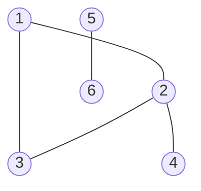
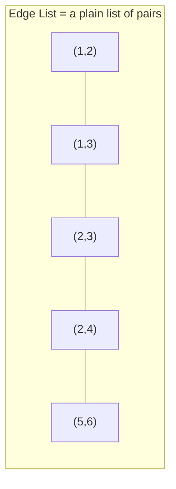
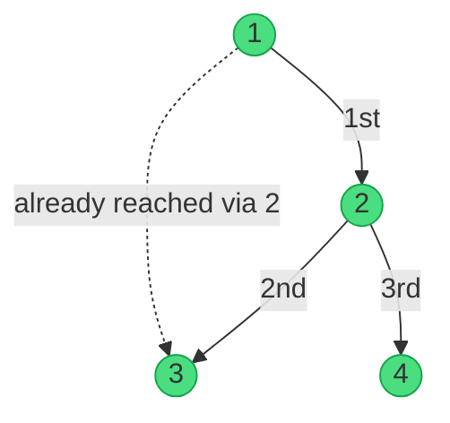
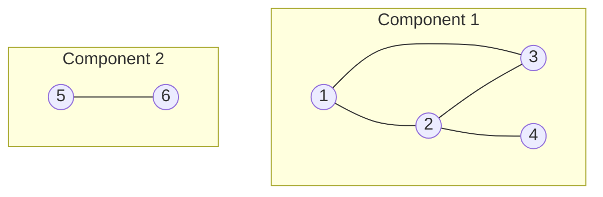
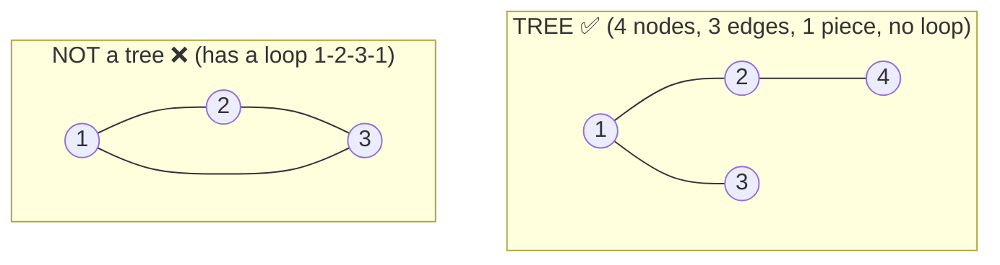
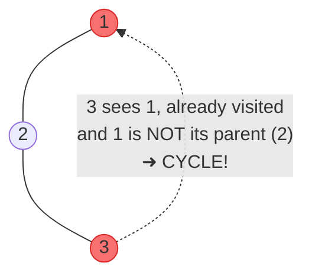
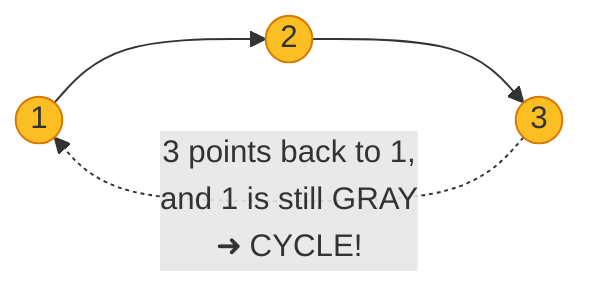
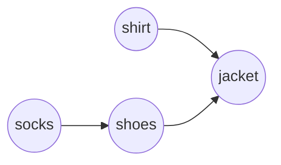
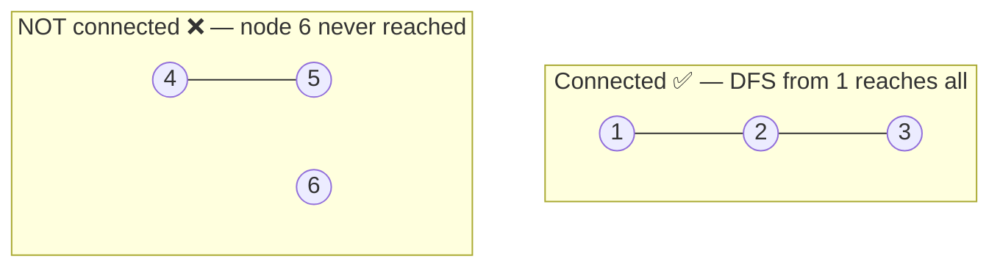

# Graphs & DFS — from zero

> [!abstract] What you'll learn here
> 1. **What a graph even is** (in plain words + pictures)
> 2. **3 ways to store a graph** in code (edge list, matrix, adjacency list)
> 3. **DFS** — the one traversal that powers everything below
> 4. Using DFS to: count components, check for a tree/forest, detect cycles, topologically sort, and test connectivity.
>
> Every code block below is **your original code, unchanged** — I only added the explanations and drawings around them.

---

## 1. What is a graph?

A **graph** is just **dots connected by lines**.

- A **dot** is called a **node** (or *vertex*). Think: a city, a person, a web page.
- A **line** is called an **edge**. Think: a road, a friendship, a link.

That's it. Whenever you have *"things"* and *"connections between things,"* you have a graph.



> [!example] Our running example
> We'll use **this exact graph for the whole note**, so the pictures build on each other.
> - Nodes: `1, 2, 3, 4, 5, 6`
> - Edges: `1–2, 1–3, 2–3, 2–4, 5–6`
> - Notice `5` and `6` are off on their own — they're not connected to the `1-2-3-4` blob. That matters later (see [Connected Components](#4-finding-connected-components)).

### Two flavors of edges

| Type | Meaning | Picture |
|------|---------|---------|
| **Undirected** | The connection goes **both ways**. If 1–2 exists, you can walk 1→2 *and* 2→1. (Like a two-way road.) | `1 --- 2` |
| **Directed** | The connection goes **one way only**. 1→2 does **not** mean 2→1. (Like a one-way street.) | `1 --> 2` |

Most of this note is **undirected**, except [directed cycle detection](#7-cycle-detection-in-a-directed-graph) and [topological sort](#8-topological-sorting), which need **directed** edges.

---

## 2. Reading input

Almost every graph problem starts the same way. The first line gives you:

- `n` = number of **nodes**
- `m` = number of **edges**

Then `m` lines follow, each with two numbers `u v` meaning *"there is an edge between u and v."*

```
6 5        <- n=6 nodes, m=5 edges
1 2        <- edge 1–2
1 3        <- edge 1–3
2 3        <- edge 2–3
2 4        <- edge 2–4
5 6        <- edge 5–6
```

Now the question is: **how do we store these edges in memory?** There are 3 common ways.

---

## 3. Three ways to store a graph

### 3a. Edge List — "just a list of pairs"

The simplest idea: keep a **list of all the edges**, exactly as given. Each edge is a `pair<int,int>`.



> [!tip] When is this good?
> Great for **storing** edges. **Bad** for asking *"is 2 connected to 4?"* because you'd have to scan the whole list. To make that lookup fast, the second half of your code uses a `set` (sorted + fast search).

**📄 Code — Edge list:** read all edges into a list, then use a `set` to answer *"is there an edge between u and v?"* queries fast.

```C++
vector<pair<int,int>> edge_list(m);

for(int i = 0; i < m; i++)
{
	cin>>edge_list[i].first>>edge_list[i].second;
}

for(int i = 0; i < m;i++)
{
	cout<<edge_list[i].first<<" "<<edge_list[i].second<<endl;
}

set<pair<int,int>> edge_set;
for(int i = 0; i < m; i++)
{
	int u , v;
	cin>>u>>v;

	edge_set.insert({u,v});
	edge_set.insert({v,u});
}

int q;
cin>>q;

while(q--)
{
	int u,v;
	cin>>u>>v;

	if(edge_set.find({u,v}) != edge_set.end())
	{
		cout<<"YES"<<endl;
	}
	else
	{
		cout<<"NO"<<endl;
	}
}
```

> [!note] Why insert both `{u,v}` **and** `{v,u}`?
> Because the graph is **undirected**. If you can travel 1→2, you can also travel 2→1. Storing both directions means a query like `find({2,1})` works even though you only read `1 2`.

---

### 3b. Adjacency Matrix — "a yes/no grid"

Imagine an `n × n` table. Cell `[i][j]` is **1 if there's an edge** between `i` and `j`, otherwise **0**.

For our graph:

```
     1  2  3  4  5  6
   +------------------
 1 | 0  1  1  0  0  0
 2 | 1  0  1  1  0  0
 3 | 1  1  0  0  0  0
 4 | 0  1  0  0  0  0
 5 | 0  0  0  0  0  1
 6 | 0  0  0  0  1  0
```

Read row `2`: it has `1`s in columns `1, 3, 4` → node 2 is connected to 1, 3, and 4. ✅

> [!tip] When is this good?
> - ✅ **Instant** "is i connected to j?" — just check `mat[i][j]`.
> - ❌ Wastes memory: always uses `n²` cells even if there are few edges. For `n = 100000` this is impossible.
> - Notice the grid is **symmetric** across the diagonal (mirror image) — again because the graph is undirected.

**📄 Code — Adjacency matrix:** build the `n × n` grid of 0/1 flags from the edges, then print it out.

```C++
vector<vector<int>> mat(n+1,vector<int>(n+1,0));

for(int i = 0;i < m;i++)
{
	int u,v;
	cin>>u>>v;

	mat[u][v] = 1;
	mat[v][u] = 1;
}

for(int i = 1; i <= n;i++)
{
	for(int j = 1; j <= n;j++)
	{
		cout<<mat[i][j]<<" ";
	}
	cout<<endl;
}
```

---

### 3c. Adjacency List — "each node keeps a list of its neighbors" ⭐

This is **the one you'll use 95% of the time.** For every node, store a small list of the nodes it's directly connected to.

```
Node 1 -> [2, 3]
Node 2 -> [1, 3, 4]
Node 3 -> [1, 2]
Node 4 -> [2]
Node 5 -> [6]
Node 6 -> [5]
```

> [!tip] Why it wins
> - ✅ Uses only as much memory as there are edges (fast **and** small).
> - ✅ Looping over "all neighbors of `u`" is trivial — exactly what DFS needs.
> - This is why the matrix is `n²` but the list is roughly `2·m`.

**📄 Code — Adjacency list (the setup template):** read the edges and store each node's neighbors. This exact `main()` is the skeleton every DFS problem below reuses.

```C++
#include <iostream>
#include <vector>
#include <string>
#include <algorithm>
#include <set>
using namespace std;

int n,m;
vector<vector<int>> adj_list;
vector<bool>vis;

int main()
{
    cin>>n>>m;

    adj_list.resize(n + 1);
    vis.resize(n + 1, 0);

    for(int i = 0; i <m;i++)
    {
        int u ,v;
        cin>>u>>v;

        adj_list[u].push_back(v);
        adj_list[v].push_back(u);
    }
}
```

> [!question] What's that `vis` array for?
> `vis` = "visited." It's a list of `true/false` flags, one per node, that we'll use during DFS to remember *"have I already been here?"* — so we don't walk in circles forever. You'll see it in action next.
>
> Also: we `resize(n + 1)` (not `n`) because nodes are numbered `1..n`, and we want to use index `n` directly instead of doing `-1` math everywhere. Index `0` just sits unused.

---

## 4. DFS — Depth First Search

**DFS is the heart of everything below.** It's how you *walk* a graph.

> [!abstract] The idea in one sentence
> Go as **deep** as you can down one path. When you hit a dead end, **back up** to the last spot with an unexplored neighbor, and dive again.

A perfect analogy: **exploring a maze while dragging your hand along the left wall.** You keep going forward; when you're stuck, you retreat to the last junction and try a different turn — until every corridor has been seen.

### Step-by-step trace (starting at node 1)

Using our graph, here's what DFS does. `vis` starts all `false`.

| Step | Where we are | Action | Visited so far |
|------|--------------|--------|----------------|
| 1 | `1` | Mark 1. Neighbors: [2,3]. Go to **2** | `{1}` |
| 2 | `2` | Mark 2. Neighbors: [1,3,4]. 1 seen → go to **3** | `{1,2}` |
| 3 | `3` | Mark 3. Neighbors: [1,2]. Both seen → **dead end, back up** | `{1,2,3}` |
| 4 | `2` | Back at 2. Next neighbor **4** | `{1,2,3}` |
| 5 | `4` | Mark 4. Neighbor [2] seen → **dead end, back up** | `{1,2,3,4}` |
| 6 | — | Everything reachable from 1 is visited. **Done.** | `{1,2,3,4}` |

Notice DFS reached `1,2,3,4` but **never touched 5 or 6** — they aren't connected to node 1. Hold that thought.



*(Green = visited by DFS starting at 1. The solid arrows are the actual path we dove down; the dotted one is a neighbor we skipped because it was already visited.)*

### The code

**📄 Code — DFS (the core function):** mark the current node, then dive into every unvisited neighbor. This tiny function is the engine behind every section that follows.

```C++
void DFS(int u)
{
    vis[u] = 1;
    //cout<<u<<' ';
    for(auto v:adj_list[u])
    {
        if(!vis[v])
        {
            DFS(v);
        }
    }
}
```

Read it in plain English, line by line:

1. `vis[u] = 1;` → *"I'm here now, mark this node as visited so I never come back."*
2. `for(auto v : adj_list[u])` → *"Look at each of my neighbors `v`."*
3. `if(!vis[v])` → *"If I haven't visited this neighbor yet…"*
4. `DFS(v);` → *"…dive into it (recursion). It will handle itself and all its neighbors, then control returns to me."*

> [!warning] The `vis` check is not optional
> Without `if(!vis[v])`, DFS would bounce 1→2→1→2→... **forever** (stack overflow). The visited flag is the *only* thing stopping infinite loops in a graph with cycles.

> [!info] "Recursion" just means "the function calls itself"
> When `DFS(1)` calls `DFS(2)`, node 1's function **pauses** and waits. Once `DFS(2)` (and everything it triggers) fully finishes, we resume node 1 right where it left off. This pause-and-resume behavior is exactly the "back up when stuck" from the maze analogy.

---

## 5. Finding connected components

A **connected component** is *one isolated blob* of the graph — a group where every node can reach every other node, but which is cut off from the rest.

In our graph there are **2 components**: `{1,2,3,4}` and `{5,6}`.



> [!abstract] The trick
> One DFS call visits **exactly one whole component** (remember: DFS from 1 reached 1,2,3,4 and stopped). So:
>
> **Loop through every node. Each time you find an unvisited one, that's a brand-new component → count it, then DFS to "paint" the whole blob as visited.**

**📄 Code — Count connected components:** loop over all nodes; every unvisited node starts a new blob (`ans++`) and one DFS paints that whole blob.

```C++
#include <iostream>
#include <vector>
#include <string>
#include <algorithm>
#include <set>
using namespace std;

int n,m;
vector<vector<int>> adj_list;
vector<bool>vis;

void DFS(int u)
{
    vis[u] = 1;
    
    //cout<<u<<' '; to print the connected components
    
    for(auto v:adj_list[u])
    {
        if(!vis[v])
        {
            DFS(v);
        }
    }
}

int main()
{
    cin>>n>>m;

    adj_list.resize(n + 1);
    vis.resize(n + 1, 0);

    for(int i = 0; i <m;i++)
    {
        int u ,v;
        cin>>u>>v;

        adj_list[u].push_back(v);
        adj_list[v].push_back(u);
    }

    int ans = 0;
    for(int i = 1; i <= n ;i++)
    {
        if(!vis[i])
        {
            ans++;
            DFS(i);
            //cout<<endl; //to print the connected components
        }
    }

    cout<<ans<<endl;
}
```

Walking the main loop on our graph:

| `i` | `vis[i]` before | What happens | `ans` |
|-----|-----------------|--------------|-------|
| 1 | false | New blob! `ans=1`, DFS paints `{1,2,3,4}` | 1 |
| 2,3,4 | true | already painted → skip | 1 |
| 5 | false | New blob! `ans=2`, DFS paints `{5,6}` | 2 |
| 6 | true | already painted → skip | 2 |

Output: **2**. ✅

### Variant: actually collecting each component's nodes

Same idea, but instead of just counting, we save the nodes. `tmp` gathers nodes during one DFS; when that DFS finishes, `tmp` holds one full component, so we push it into `comps` and clear `tmp` for the next blob.

**📄 Code — Collect the nodes of each component:** same loop, but DFS records nodes into `tmp`, which gets saved into `comps` after each blob is finished.

```C++
#include <iostream>
#include <vector>
#include <string>
#include <algorithm>
#include <set>
using namespace std;

int n,m;

vector<vector<int>> adj_list,comps;
vector<bool>vis;
vector<int> tmp;

void DFS(int u)
{
    vis[u] = 1;
    
    tmp.push_back(u);

    for(auto v:adj_list[u])
    {
        if(!vis[v])
        {
            DFS(v);
        }
    }
}

int main()
{
    cin>>n>>m;

    adj_list.resize(n + 1);
    vis.resize(n + 1, 0);

    for(int i = 0; i <m;i++)
    {
        int u ,v;
        cin>>u>>v;

        adj_list[u].push_back(v);
        adj_list[v].push_back(u);
    }

    int ans = 0;
    for(int i = 1; i <= n ;i++)
    {
        if(!vis[i])
        {
            ans++;
            DFS(i);

            comps.push_back(tmp);
            tmp.clear();
        }
    }

    for(auto v : comps)
    {
        for(auto u : v)
        {
            cout<<u<<' ';
        }
        cout<<"\n";
    }

    cout<<ans<<"\n";
}
```

> [!success] Output for our graph
> ```
> 1 2 3 4
> 5 6
> 2
> ```

---

## 6. Checking for trees and forests

Two important vocabulary words first:

> [!note] Definitions
> - **Tree** = a connected graph with **no cycles** (no loops). Exactly **one** blob, and it has precisely `n - 1` edges.
> - **Forest** = a bunch of trees sitting next to each other (several separate blobs, none with a loop).

**The magic rule for a tree:** a graph is a tree **⇔** it is (a) all one piece (`1` component) **and** (b) has exactly `n − 1` edges.



The two output lines use these counts:
- **Tree?** → `ans == 1` (one component) **AND** `m == n - 1` (right number of edges).
- **Forest?** → `m == n - ans`. (Each of the `ans` trees uses one fewer edge than it has nodes, so a forest of `ans` trees has exactly `n - ans` edges total.)

**📄 Code — Tree / forest check:** count components with DFS, then compare the edge count `m` against `n-1` (tree) and `n-ans` (forest).

```C++
#include <iostream>
#include <vector>
#include <string>
#include <algorithm>
#include <set>
using namespace std;

int n,m; // n is the number of nodes and m is the number of edges

vector<vector<int>> adj_list,comps;
vector<bool>vis;
vector<int> tmp;

void DFS(int u) 
{
    vis[u] = 1;

    for(auto v:adj_list[u])
    {
        if(!vis[v])
        {
            DFS(v);
        }
    }
}

int main()
{
    cin>>n>>m;

    adj_list.resize(n + 1);
    vis.resize(n + 1, 0);

    for(int i = 0; i <m;i++)
    {
        int u ,v;
        cin>>u>>v;

        adj_list[u].push_back(v);
        adj_list[v].push_back(u);
    }


    int ans = 0;
    for(int i = 1; i <= n ;i++)
    {
        if(!vis[i])
        {
            ans++;
            DFS(i);
        }
    }

    cout<<(ans == 1 && m == n - 1 ? "YES" : "NO")<<endl; 
    //to check if this graph was a tree or not
    cout<<(m == n - ans ? "YES" : "NO")<<endl;
    //to check if this graph was a forest or not
}
```

---

## 7. Cycle detection (undirected): "Not cyclic"

A **cycle** is a loop — a path that leaves a node and comes back to it. This code answers *"is the graph loop-free?"*

> [!abstract] The core insight
> While walking with DFS, if you ever bump into a node that's **already visited** — and it's **not** the node you just came from — you've found a shortcut back, which means a loop exists.
>
> That "not the node you just came from" part is why we pass `p` (parent). In an undirected graph, every edge looks like a back-edge to your parent (since 1–2 stores both 1→2 and 2→1). We must ignore that one, or DFS would scream "cycle!" on every single edge.



**📄 Code — Undirected cycle detection:** DFS carries a `parent`; if it meets an already-visited neighbor that *isn't* the parent, there's a loop.

```C++
#include <iostream>
#include <vector>
#include <string>
#include <algorithm>
#include <set>
using namespace std;

int n,m; // n is the number of nodes and m is the number of edges

vector<vector<int>> adj_list,comps;
vector<bool>vis;
vector<int> tmp;
bool not_cyclic = 1;

void DFS(int u,int p) //p is the last node i last visted
{
    vis[u] = 1;

    for(auto v:adj_list[u])
    {
        if(v == p) continue;

        if(!vis[v])
        {
            DFS(v,u);
        }
        else
        {
            not_cyclic = 0;
        }
    }
}

int main()
{
    cin>>n>>m;

    adj_list.resize(n + 1);
    vis.resize(n + 1, 0);

    for(int i = 0; i <m;i++)
    {
        int u ,v;
        cin>>u>>v;

        adj_list[u].push_back(v);
        adj_list[v].push_back(u);
    }
    DFS(1,1); //just an invalid value to make the not_cyclic be 1 not zero

    cout<<(not_cyclic?"YES":"NO")<<endl;
}
```

Reading the important lines:
- `if(v == p) continue;` → *"Skip the neighbor I literally just came from — that's not a real cycle."*
- `else { not_cyclic = 0; }` → *"This neighbor is visited AND isn't my parent → I found a loop."*
- `DFS(1,1)` → we start at node 1 and pretend its parent is also 1 (a harmless dummy, since no node is its own neighbor).

> [!tip] Note on this specific version
> This starts DFS only from node 1, so it assumes the graph is one connected piece. To handle a disconnected graph, you'd wrap it in the `for i = 1..n` loop like the earlier examples and call `DFS(i, i)` for each unvisited `i`.

---

## 8. Cycle detection in a **directed** graph

Directed graphs (one-way arrows) need a smarter trick, because the parent shortcut doesn't apply. Here we use **three colors** instead of a simple visited/not-visited:

> [!note] The 3-state `vis` array
> - `0` = **white** — never touched.
> - `2` = **gray** — currently on the path I'm exploring *right now* (started, not finished).
> - `1` = **black** — completely done, backed out of.
>
> **A cycle exists if DFS reaches a GRAY node** — that means the path looped back onto itself.



Why gray-vs-black matters: hitting a **black** node is fine (it's a finished side-branch you happen to point at, not a loop). Only hitting a **gray** node — one still open in your current chain — is a true cycle.

**📄 Code — Directed cycle detection:** uses a 3-state `vis` (white/gray/black); if DFS ever reaches a **gray** node, the path looped back → cycle.

```C++
#include <iostream>
#include <vector>
using namespace std;

int n, m; // n is the number of nodes, m is the number of edges
vector<vector<int>> adj_list;
vector<int> vis; // 0 = unvisited, 1 = visited, 2 = in current DFS path
bool not_cyclic = true;

void DFS(int u)
{
    vis[u] = 2; // Mark as being visited in the current DFS path

    for (auto v : adj_list[u])
    {
        if (!vis[v])
        {
            DFS(v); // Recursively visit unvisited neighbors
        }
        else if (vis[v] == 2)
        {
            not_cyclic = false; // Found a back edge (cycle)
        }
    }

    vis[u] = 1; // Mark as fully visited
}

int main()
{
    cin >> n >> m;

    // Resize adj_list and vis to accommodate n+1 vertices
    adj_list.resize(n + 1);
    vis.resize(n + 1, 0);

    // Read edges and build adjacency list
    for (int i = 0; i < m; i++)
    {
        int u, v;
        cin >> u >> v;

        adj_list[u].push_back(v); // Directed edge from u to v
    }

    // Perform DFS for all unvisited vertices
    for (int i = 1; i <= n; i++)
    {
        if (!vis[i])
        {
            DFS(i);
        }
    }

    // Output result
    cout << (not_cyclic ? "YES" : "NO") << endl;
}
```

> [!important] One-directional edge
> See how we only do `adj_list[u].push_back(v);` here — **no** `push_back(u)` for `v`. That's what makes it *directed*: the arrow goes `u → v` only.

---

## 9. Topological Sorting

**Only makes sense for a directed graph with no cycles** (a "DAG").

> [!abstract] What it does, in real life
> Imagine tasks with prerequisites: *"put on socks before shoes,"* *"wake up before commuting."* A topological sort gives you a **valid order to do everything so no task comes before its prerequisite.**


*A valid order: `socks, shirt, shoes, jacket`. Notice shoes always come after socks, jacket always after both shirt and shoes.*

> [!abstract] The trick (post-order + reverse)
> It's the **directed cycle-detection DFS**, plus one line: after a node is **fully finished** (all its downstream stuff done), push it onto a list. Then **reverse** that list at the end.
>
> Why reverse? Because a node finishes *after* everything it points to. So the finish-order is "deepest dependency first" — the exact opposite of what we want, hence the flip. And if a cycle is found, there's no valid order at all → print `-1`.

**📄 Code — Topological sort:** the directed-cycle DFS plus two lines — record each node when it *finishes*, then reverse the list (print `-1` if a cycle exists).

```C++
#include <iostream>
#include <vector>
#include <algorithm>
using namespace std;

int n, m; // n is the number of nodes, m is the number of edges
vector<vector<int>> adj_list;
vector<int> vis; // 0 = unvisited, 1 = visited, 2 = in current DFS path
bool not_cyclic = true;
vector<int> topo;

void DFS(int u)
{
    vis[u] = 2; // Mark as being visited in the current DFS path

    for (auto v : adj_list[u])
    {
        if (!vis[v])
        {
            DFS(v); // Recursively visit unvisited neighbors
        }
        else if (vis[v] == 2)
        {
            not_cyclic = false; // Found a back edge (cycle)
        }
    }

    vis[u] = 1; // Mark as fully visited
    topo.push_back(u); // Add to topological order (post-order)
}

int main()
{
    cin >> n >> m;

    // Resize adj_list and vis to accommodate n+1 vertices
    adj_list.resize(n + 1);
    vis.resize(n + 1, 0);

    // Read edges and build adjacency list
    for (int i = 0; i < m; i++)
    {
        int u, v;
        cin >> u >> v;

        adj_list[u].push_back(v); // Directed edge from u to v
    }

    // Perform DFS for all unvisited vertices
    for (int i = 1; i <= n; i++)
    {
        if (!vis[i])
        {
            DFS(i);
        }
    }

    if (not_cyclic)
    {
        // Reverse the topo vector to get the correct topological order
        reverse(topo.begin(), topo.end());

        // Output the topological order
        for (auto i : topo)
        {
            cout << i << " ";
        }
    }
    else
    {
        cout << -1; // Output -1 if the graph contains a cycle
    }

    cout << endl;
}
```

> [!note] It's just cycle-detection + 2 extra lines
> Compare this with [§8](#8-cycle-detection-in-a-directed-graph): identical DFS, we only added `topo.push_back(u)` (record finish order) and the `reverse` at the end. If you understood cycle detection, you already understand topo sort.

---

## 10. Checking if the whole graph is connected

*"Connected"* = **one single blob**, every node reachable from every other.

> [!abstract] The trick
> Run **one** DFS from any starting node (here, node 1). Afterward, look at `vis`. If **even one** node is still `false`, DFS couldn't reach it → the graph is in pieces → **not connected.**



**📄 Code — Connectivity check:** run one DFS from node 1; if any node stayed unvisited afterward, the graph isn't all one piece.

```C++
//check if graph is connected
    dfs(1); //to start from any place
		
    for(int i = 1; i<= n ; i++)
    {
        if(!vis[i]) //if not visited then not connected
        {
            cout<<"NO"<<endl;
            return 0;
        }
    }
```

> [!tip] Shortcut
> This is really just [connected components](#5-finding-connected-components) in disguise: **connected ⇔ exactly 1 component**. If you already counted components, just check `ans == 1`.

---

## 11. Cheat sheet — it's all the same DFS

Every single problem above is the **same tiny DFS** with a small twist. Once you see this, graphs get a lot less scary:

| Problem | The one small addition to DFS |
|---------|-------------------------------|
| **Traverse** | (the base DFS itself) |
| **Count components** | Wrap DFS in a `for i=1..n` loop; count each fresh start |
| **Collect components** | `tmp.push_back(u)` inside DFS |
| **Tree / forest** | Count components + compare edge count to `n-1` / `n-ans` |
| **Undirected cycle** | Pass a `parent`; visited neighbor ≠ parent ⇒ cycle |
| **Directed cycle** | 3-color `vis`; reaching a **gray** (2) node ⇒ cycle |
| **Topological sort** | Directed-cycle DFS + `topo.push_back(u)` at the end + `reverse` |
| **Connected?** | One DFS, then check if any node stayed unvisited |

> [!success] The mental model to keep
> **DFS = "mark where I am, then dive into each unvisited neighbor, backing up when stuck."** The `vis` array is what makes it safe. Everything else is just *what you record while walking.*

---

## Quick complexity note

Building the adjacency list and running DFS both take about **`O(n + m)`** time — you touch every node once and every edge twice. That's as fast as it gets for these problems, and it's why the **adjacency list** ([§3c](#3c-adjacency-list--each-node-keeps-a-list-of-its-neighbors-)) is the default choice.

## Related
- [[Problem Solving/PS Level 1/BFS]] — DFS's sibling (explores level-by-level instead of deep-first)
