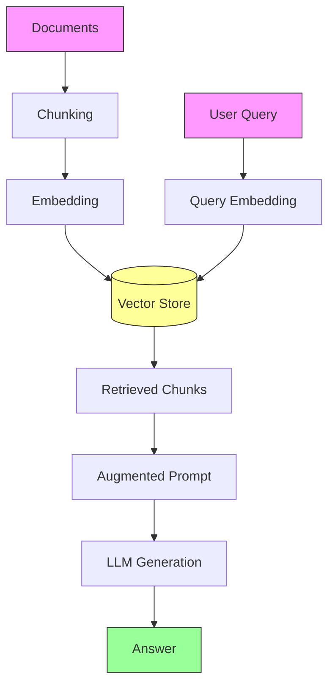

# RAG (Retrieval-Augmented Generation)

> [!info] What is RAG?
> Retrieval-Augmented Generation is a technique that combines **information retrieval** with **large language models** to produce more accurate, grounded, and context-aware responses. Instead of relying solely on the LLM's internal knowledge, RAG fetches relevant documents or chunks from an external knowledge base and inserts them into the prompt before generation.

RAG helps solve key limitations of standalone LLMs:
- **Knowledge cut‑off**: access to up‑to‑date, proprietary, or private data.
- **Hallucination**: grounded answers reduce fabricated facts.
- **Domain specificity**: inject expert documents without fine‑tuning.
- **Transparency**: retrieved sources can be cited.

---

## The RAG Pipeline


Let’s break down each concept in the pipeline.

---

## Core Concepts

### 1. Ingestion
Loading raw documents from various sources (PDFs, web pages, databases, APIs). This step normalises formats, extracts text (e.g., OCR, parsing), and prepares content for chunking. Clean, well‑structured ingestion avoids “garbage in, garbage out”.

### 2. Chunking
**Splitting long documents into smaller, semantically meaningful pieces (chunks).** Common strategies:

| Strategy | Description | Use Case |
|----------|-------------|----------|
| **Fixed‑size** | Split by character/token count with overlap | Simple, predictable |
| **Recursive** | Split by paragraphs, then sentences, then characters | Balanced, works well for general text |
| **Semantic** | Split based on embedding similarity or NLP boundaries (e.g., sentence transformers) | Better relevance, but more expensive |
| **Document structure** | Split by headings, sections, or page breaks | Structured docs like manuals |

Chunks are stored with metadata (source, page number, etc.) to enable later citation.

> [!important] Why Chunking is Crucial
> - **Context window limits**: LLMs have limited token capacity. Chunks that are too large may not fit alongside the prompt; too small may lack context.
> - **Retrieval precision**: Smaller, focused chunks improve similarity matching against the query. A huge chunk may contain a relevant sentence but be diluted by irrelevant content, hurting retrieval scores.
> - **Cost & latency**: Embedding and retrieving smaller chunks is faster and cheaper. Overly large chunks also force the LLM to process more tokens, increasing generation time and cost.
> - **Semantic integrity**: Poor chunking breaks ideas mid‑thought; good chunking preserves coherent units, improving answer quality.

[[Chunking Strategies]] deeply influence downstream performance – it’s often the most underestimated but impactful step.

### 3. Embedding
Transform each chunk into a dense vector (embedding) using an embedding model (e.g., `text-embedding-3-small`, `bge‑large`). Embeddings capture semantic meaning so that similar chunks cluster in vector space. The same model must be used for queries and documents to keep the space consistent.

### 4. Indexing (Vector Store)
Store embeddings in a [[Vector Database]] (Chroma, Pinecone, Weaviate, FAISS, etc.) that enables fast **approximate nearest neighbour (ANN)** search. The index supports metadata filtering and often hybrid search (combining sparse/dense retrieval).

### 5. Retrieval
When a user query comes in, the system:
1. Embeds the query using the same model.
2. Searches the vector store for the `k` most similar chunks (e.g., using cosine similarity or dot product).
3. Optionally re‑ranks candidates with a cross‑encoder to improve relevance.

> [!important] Why Retrieval is Crucial
> - **Relevance:** Retrieval decides which facts the LLM sees. Noisy or missing chunks lead to wrong or incomplete answers.
> - **Grounding:** High‑quality retrieval is the backbone of factuality. Without it, RAG reverts to a plain LLM hallucination risk.
> - **Efficiency:** The retrieval step filters thousands of documents down to a handful, keeping the prompt small and avoiding “lost‑in‑the‑middle” issues where LLMs ignore middle content.
> - **Versatility:** Advanced retrieval techniques (hybrid search, query rewriting, multi‑hop) dramatically extend RAG capabilities, but all depend on solid base retrieval.

[[Retrieval Methods]] include dense (vector), sparse (BM25), and hybrid. Many production systems combine them for robustness.

### 6. Augmentation
Construct the final prompt by inserting the retrieved chunks and the user’s question into a template. A typical template:

```
Use the following context to answer the question.
If you don’t know, say “I don’t know.”

Context:
{chunk1}
{chunk2}
...

Question: {user_query}
Answer:
```

Prompt engineering at this stage (e.g., ordering chunks by relevance, adding source citations, instructing the model to refrain from guessing) significantly affects output quality.

### 7. Generation
The augmented prompt is sent to the LLM (GPT‑4, Claude, Llama, etc.). The model generates an answer conditioned on the provided context. Because the relevant knowledge is right in the prompt, the LLM can synthesise an accurate, cited response without relying on parametric memory.

---

## Why Chunking and Retrieval Matter So Much

These two steps form the **bridge between raw documents and the language model’s reasoning**. If either is done poorly, the entire RAG system fails.

| Challenge | Impact |
|-----------|--------|
| Chunks too large | Embeddings lose focus; retrieval brings back irrelevant information; prompt overflows context window. |
| Chunks too small | Lost context; answer may require multiple chunks that aren’t all retrieved. |
| Overlap missing | Ideas get cut in half; next chunk may not contain the needed continuation. |
| Poor retrieval | Hallucination, out‑of‑scope answers, or “I don’t know” even when the answer exists. |
| No re‑ranking | The top‑k chunks may be similar to each other but not the best answer; diversity suffers. |
| Ignoring metadata | Cannot filter by date, source, or user permissions → irrelevant or unauthorised content. |

> [!tip] Best Practice
> Treat chunking and retrieval as **iterative optimization loops**. Evaluate retrieval recall and precision on a test set, adjust chunk size/overlap, try different embedding models, and implement re‑ranking before tuning prompts.

---

## Related Notes
- [[Chunking Strategies]]
- [[Vector Databases]]
- [[Retrieval Methods (Dense, Sparse, Hybrid)]]
- [[Embedding Models Comparison]]
- [[Prompt Augmentation Templates]]
- [[Evaluating RAG Systems]]

*RAG is not a single magic recipe – it’s a flexible architecture where each concept can be tuned and swapped. Mastering chunking and retrieval will give you the greatest leverage over output quality.*